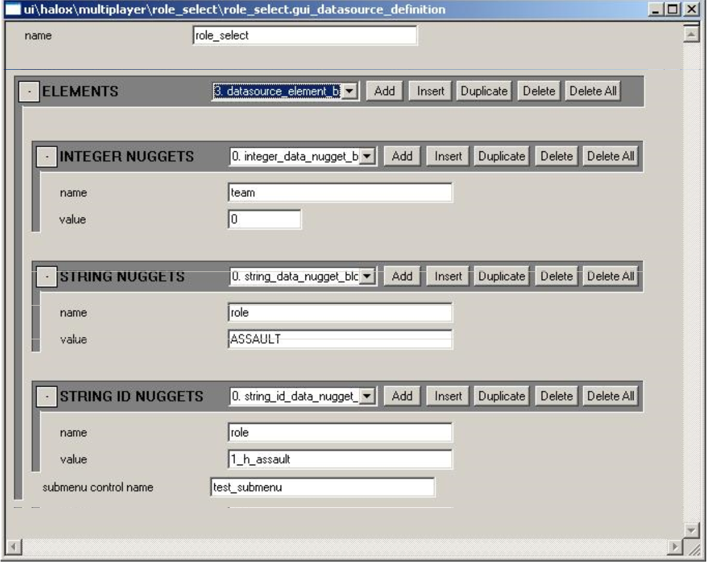

# **Gameshell UI**

This document provides an overview of the Halo3 gameshell UI system. It contains information describing the core components, the tag structures, and useful debug commands and variables. It's intended for UI designers and developers who want a high-level overview of the system.

## **Core Components**

The central structure is the *widget*. All gameshell UI is built by assembling one or more widgets in a hierarchy, with the widgets being responsible for rendering and running simple logic (responding to external messages such as controller inputs and generating other messages based on current state or inputs into the UI system).

### **Widgets**

Widget is the term used since Halo1 to describe an element of the gameshell UI. There are various types of widgets, but they all share some common properties. The common attributes of a widget include:

- A name
- A type (or class)
- Linkage with other widgets in a hierarchy. All widgets can have a parent and any number of children. Widgets also have knowledge of their siblings
- The ability to render itself
- The ability to animate its render properties
- The ability to run logic at game update time

The widget's name is important for identifying a particular widget. In conjunction with the widget's type, it's used for locating a particular widget within a given hierarchy of widgets for things such as messaging (either with other widgets or with external game systems). Therefore, an important guideline to keep in mind when authoring UI is that if a widget is ever going to perform any interesting work, you should give it a unique name. In the Halo3 UI system, these names are string_ids.

The widget's type refers to what kind of widget it is. The widget's type determines what general properties and functionality it has. Types of widgets include: text widgets, bitmap widgets, model widgets, group widgets, list item widgets, list widgets and screen widgets. The following sections will drill down into more detail on these different types of widgets.

All widgets share a common set of animated rendering properties. Some of these properties are relevant only to specific types of widgets. These animatable attributes are:

- 2D rectangular boundary (in screen-space)
- Rotation applied to the rectangular boundary
- 2D scale applied to the rectangular boundary
- 32-bit color (including transparency)
- 3D positional offset applied to the rectangular bounds as well as the origins for rotation and scaling, if applicable (the animation of depth here can produce similar effects to the 2D scaling due to the perspective projection with which the UI is rendered in a simulated 3D space)
- 2D texture coordinate offsets (applicable only for bitmap widgets)
- Sprite sequence and frame (applicable only for bitmap widgets)
- Font (applicable only to text widgets)
- Render depth bias (not animated)— used to give rendering depth priority to widgets at the same three-dimensional depth

### **Text Widgets**

A text widget is needed any time you want to render a block of text in the gameshell UI. In addition to the common widget properties, text widgets also have the following custom properties (these may or may not all be exposed in tags):

- Font
- Horizontal and vertical justification
- Drop shadow style (none, standard drop shadow, or full outline)
- 32-bit color and shadow color (including transparency)
- Scale
- Height adjustment
- Independent render and clipping bounds
- Configurable tab stops
- Configurable initial and paragraph indents
- Scroll amount
- Can pulsate
- Can have wrapping brackets applied to the contents when the widget has input focus

The contents of a text widget can come from one of three sources:

- The text string corresponding to the parent screen's string list tag entry with the same name as this text widget's **value identifier** field (this is the default behavior)
- The text string corresponding to the parent screen's string list tag entry with the same name as this text widget's parent list item widget label
- The text string corresponding to the parent screen's string list tag entry with the same name as the string_id value exported by this text widget's parent list item widget for the key value named by the text widget's **value identifier** field

The contents of text can be changed inline due to XML tags inserted in the text stream. Additionally, certain text properties such as color and font can also be changed inline via XML tags.

> [!NOTE]
> Due to the use of XML parsing, care should be taken to avoid inserting raw < and > characters into text strings used by the gameshell UI.

In debugging builds, if the game is unable to determine the contents for a text widget, the text widget will display #unknown# as its contents field. This will enable you to quickly identify improperly configured text widgets.

### **Bitmap Widgets**

A bitmap widget is needed any time you wish to display a bitmap in the gameshell UI. In addition to the common widget properties, bitmap widgets also have the following custom properties (some of which may or may not be exposed in tags):

- Tag reference to a bitmap tag. This is the tag from which sprite bitmaps will be pulled when rendering this widget as a sprite
- Tag reference to a shader tag (currently unused)
- Render blend mode. This is the color blending method used when rendering this widget as a sprite
- Initial sprite sequence. This is the initial sprite sequence used prior to any animation (the sprite sequence derived from animation and used when rendering uses this as the baseline value)
- Initial sprite frame. This is the initial sprite frame used prior to any animation (the sprite frame derived from animation and used when rendering uses this as the baseline value)

### **3D Model View Widgets**

Model view widgets are not presently implemented. However, the plan is for them to consist of a group of models positioned relative to a local origin in space, along with a group of similarly positioned lights. This group of objects and lights will then be rendered into the widget bounding area.

### **Group Widgets**

A group widget is a container for a collection of other widgets. Its primary purpose is to act simply as an organizational tool. In and of themselves, they do not render anything to the screen, however they are able to respond to inputs and perform simple logic. For example, they are able to trigger responses to common messages (this is described in more detail later in the section covering the group widget tags).

Some common uses of group widgets in the UI system include:

- Skins, used for graphically skinning UI lists
- Assembling together the primary top level UI objects for a UI screen
- Assembling groups of display widgets together to be swapped in & out as the user scrolls through a UI list widget

### **List Item Widgets**

List item widgets are used to provide a selection window into a list of items. They are analogous to the items in a drop-down menu in a Windows GUI for example. A list item may also invoke a submenu (this occurs if the datasource element referenced by a list item exports a valid value for the **submenu control name** key). These items are contained in a UI screen datasource object (more on this later) which is the core object used to tie the gameshell UI to game data. Like group widgets, list item widgets can respond to inputs and perform simple logic. The visual appearance of a list item is dictated by the list skin used by the list item's parent list widget. In addition to the common widget properties, a list item widget has the following custom properties:

- item label (string_id)— Child text widgets can reference this value to set their string contents using this value
- Event handlers

### **List Widgets**

List widgets are the primary control widget in the gameshell UI. A list widget contains one or more list item widgets to provide a visible window into one of the UI screen's datasources. In addition to the common widget properties, a list widget has the following custom properties:

- **datasource name**— This is the name of the datasource contained in the parent screen widget to which this list refers
- **Tag reference to a skin collection**. This is a reference to the skin tag which will be applied to the list's item widgets for display pruposes
- One or more list item widgets
- Optional bitmap indicators which are used when there are more available items in the list than can be displayed at once in the list widget. They're used to indicate the existence of additional data items ahead and/or behind the currently displayed selection

### **Screen Widgets**

The screen is the top level widget in the hierarchy. They will need to contain one or more group widgets in order to do anything interesting. It's through the screen widget that the rest of the game interacts with the gameshell UI (primarily through the UI message passing system and the UI window manager). In addition to the common widget properties, a screen widget has the following custom properties:

- Tag reference to a string list tag. This is used to contain any text strings that this UI screen might need to display specific to this UI screen (meaning that global or dynamic text strings could come from another location potentially)
- One or more datasource objects
- One or more button keys
- Tag references to sound tags which can be used to override the default gameshell UI sound effects
- Event handlers

### **Datasources**

Datasources are the means by which a collection of interesting game data is stored and made available for display and interaction with the gameshell UI.

Conceptually a datasource can be thought of as a one-dimensional list of objects, each of which can have multiple interesting properties which it might want to make known to the UI.

Examples include:

- A list of players in the game
- The available control settings for a player profile
- All of the slayer game variants stored on a memory card
- The list of actions that a user can take at the main menu screen

Each element in a datasource can export named properties of itself in the following formats:

- A signed integer number
- A string_id
- Raw Unicode text string
- A string_id value used to indicate a submenu (in this case, the string_id name refers to the name assigned to a list widget in the active group)

An element may also export a string_id control name, meaning that if this element in the datasource is selected, the named UI control (submenu) should be invoked. The names associated with a datasource element property are string_ids. By hooking up other display widgets' properties to be driven by exported properties of a datasource, widgets can display a wide variety of dynamic content with very little effort required.

## **Animation**

While gameshell UI is active and the user is interacting with it, various elements can change state (focused/unfocused, transitioning, finished transitioning). Widgets can also be in multiple states at the same time (e.g. transitioning into the screen while changing focus). The UI widget animation system has been designed to facilitate authoring animation tracks to be applied to widgets as they change states. The possible states that a widget can acquire include:

- **focused-ambient**— Widget is not transitioning between states and has input focus
- **unfocused-ambient**— Widget is not transitioning between states and does not have input focus
- **transition-from-screen**— This UI is transitioning away from the screen, going forward
- **transition-to-screen**— This UI is transitioning into the screen, going forward
- **transition-back-from-screen**— This UI is transitioning away from the screen, going backward
- **transition-back-to-screen**— This UI is transitioning into the screen, going backward
- **cycle-in-previous-display-pane**— This UI is on a pane that is previous to the currently active one, and is now being cycled in
- **cycle-in-next-display-pane**—This UI is on a pane that follows the currently active one, and is now being cycled in
- **cycle-out-previous-display-pane**—This UI is on the currently active pane, and is being cycled out to load the previous pane
- **cycle-out-next-display-pane**— This UI is on the currently active pane, and is being cycled out to load the next pane
- **list-display-group-transition-in**—This UI is in a group loaded as a list display group, and is being transitioned in
- **list-display-group-transition-out**— This UI is in a group loaded as a list display group, and is being transitioned out
- **control-received-focus**— This UI is part of a control which just received input focus
- **control-lost-focus**— This UI is part of a control which just lost input focus
- **indicator-ambient-additional-item**—This is used for a list's additional-items-indicator-bitmap widget, when not cycling through the list and there are additional items in its direction
- **indicator-ambient-no-additional-items**— This is used for a list's additional-items-indicator-bitmap widget, when not cycling through the list and there are no more additional items in its direction
- **indicator-activated-additional-items**— This is used for a list's additional-items-indicator-bitmap widget, when cycling through the list and there are more items in its direction
- **indicator-activated-no-additional-items**— This is used for a list's additional-items-indicator-bitmap widget, when cycling through the list and there are no more items in its direction
- **load-submenu**— This widget is part of a list which has just invoked a submenu
- **unload-submenu**— This widget is part of a list which has just unloaded a submenu
- **load-as-submenu**— This widget is part of a list that is being loaded as a submenu
- **unload-as-submenu**— This widget is part of a list loaded as a submenu which is now being unloaded
- **child-submenu-active-ambient**— This widget is part of a list who has a submenu active which has finished transitioning into view

For each of the above widget animation states, the following widget properies can be animated:

- **Color**
- **Position**
- **Rotation about a point local to the widget**
- **Scale about a point local to the widget**
- **Texture coordinates (applicable to bitmaps only)**
- **Sprite sequence and frame (applicable to bitmaps only)**
- **Font (applicable to text only)**

The animation of any particular property is performed by interpolating between a series of keyframes for that property, keyframes being defined by a property value and a time offset (from the time that the animation started).

The method of interpolation between keyframes is determined from the component animation. The animation has as "default" interpolation function which is applied to all keyframe interpolations, unless a keyframe has a custom interpolation function defined for it— in which case the animation will use that interpolation function when interpolating from that keyframe to another.

When defined in the animation tags, the initial (default) function for interpolations is an un-scaled (0-1) linear interpolation from the first keyframe value to the second keyframe value. Figure 1 depicts the color component animation tag for an animation using the default linear function, and no custom transition functions for the keyframes. By using the provided function types and curves, it's possible to get very complex and interesting animations with only a single pair of keyframes representing the starting and ending component values.

Figure 1 - Animation definition

The property values for a widget authored in tags is considered the baseline state. Animation of the widget applies the provided animations for any applicable states to this widget baseline state to provide the final animated, rendered state used when displaying the widget on screen.

## **Tag Structures**

Presented here is a breakdown of the gameshell UI tag structures, beginning at the top with the UI globals tags and working down.

### **UI Globals Tag**

There is a UI globals tag required for each of the three different scenario (map) types: main menu, single player, and multiplayer. At the bottom of this tag is a tag block where you add tag references to the UI screens that are to be made available for the respective scenario type. In order for a UI screen to properly load in a given scenario, a reference to its screen widget tag must be present in the corresponding UI globals tag. The **Halo 3** screen widget tags section is used for Halo3 UI screen widget tag references.

### **GUI Screen Widget Definition Tag**

The screen widget definition tag is the top level tag for defining a UI screen. Here is a description of each of the fields in this tag:

Figure 2 - GUI Screen Widget Defintion

- **flag**s— Various behavioral properties
    - **override template flags**— If set, the flags here will override all template flags. Otherwise, they are combined with any template flags
    - **position relative to parent**— Ignored for screens
- **blback shouldn't dispose screen**— If set, automatic backing out of a screen via the B or Back buttons is disabled
- **name** — String_id name for this screen — must be set to some non-empty value in order for the screen tag to be usable
- **scaled positioning**— Defines how screen is automatically positioned for non-default display resolutions. This works as follows:
- If there is no authored bounds for the widget in the current display resolution, the bounds defined for the default authoring resolution (720 widescreen) are used.
- Next, the height and width are scaled horizontally and vertically by the ratio of the current display resolution to the default authoring resolution, respectively.
- Finally, based on the scaled positioning setting, the following happens:
    - **centered (default)**— Nothing else is done
    - **top edge**— The scaled bounds are aligned to the top edge of the default-authored bounds
    - **bottom edge**— The scaled bounds are aligned to the bottom edge of the default-authored bounds
    - **left edge**— The scaled bounds are aligned to the left edge of the default-authored bounds
    - **right edge**— The scaled bounds are aligned to the right edge of the default-authored bounds
    - **top-left**— The scaled bounds are aligned to the top and left edges of the default-authored bounds
    - **top-right**— The scaled bounds are aligned to the top and right edges of the default-authored bounds
    - **bottom-right**— The scaled bounds are aligned to the bottom and right edges of the default-authored bounds
    - **bottom-left**— The scaled bounds are aligned to the bottom and left edges of the default-authored bounds
- **render depth bias** — Ignored for screens
- **bounds 720p** — Absolute bounds for widget at 720p resolution
- **bounds 480p** — Custom bounds for widget at 480p resolution. Unused if 0
- **bounds 480i** — Custom bounds for widget at 480i resolution. Unused if 0
- **animation collection** — Tag reference to animations used for screen. Although these won't directly affect rendering, they can impact timing of transitions at the screen level, so it will be useful to use a set of dummy animations here in order to set time durations for transitions
- **global offset 720p** — A 2D global offset applied to all screen elements at 720p resolution
- **global offset 480p** — A 2D global offset applied to all screen elements at 480p resolution
- **global offset 480i** — A 2D global offset applied to all screen elements at 480i resolution
- **string list** — Reference to the multilingual unicode string list tag to be used for this screen's text
- **screen template** — Optional reference to a gui_screen_widget_definition tag to be used as a template for the screen
- **debug datasources** — Tag block of references to datasource tags, used for populating screen lists when testing a UI screen
- **groups** — Tag block of group widget definitions (see below for more details)
- **button keys** — Tag block of references to button key definition tags used for defining button key groups for use by the screen
- **sound overrides** — Optional tag references to sound tags which can be used to override the default UI sound effects

### **Datasource Tag**

The datasource tag is used to populate a screen's lists when running in the debugging/test mode. They provide a means for the designer to populate a UI screen with virtual game data, so as to enable testing without any requirement for special code to provide actual game data to the screen elements. Following is a description of each of the fields in this tag:

Figure 3 - Datasource Tag

- **name** — The string_id name for the datasource — must be an non-empty string in order for the datasource to be used
- **elements** — A tag block of entries for the datasource. Each element can have the following properties:
    - **integers** — A tag block of signed integer values. Each entry has a string_id name and a signed integer value
    - **strings** — A tag block of ASCII string values. Each entry has a string_id name and an ASCII string value
    - **string_ids** — A tag block of string_id values. Each entry has a string_id name and a string_id value
    - **submenu control name** — A string_id name of a list widget defined in the screen's primary group block definition which should be invoked if the list item representing this datasource element is selected by the user

### **Group Widget Definition**

Group widgets can be defined as an instance in a screen widget definition, as well as a separate tag for use as a group widget instance template. The data fields in the tag for both are identical with the exception that in the separate tag used for templating, there is no field for a template tag reference (there is no recursive templating of widget definitions). Below is a description of the fields in a group widget tag definition:

Figure 4 - Group Widget

- **template reference** — Found in the instance definition, this is an optional reference to a group widget definition tag to be used as a template for this group widget instance
- **flags**:
    - **override template flags** — If set, the flags here will override all template flags. Otherwise, they are combined with any template flags
    - **position relative to parent** — If set, the widget will position itself relative to the parent widget's position. Otherwise, it will be positioned in absolute window space
    - **don't load on initialization** — If this is set, the group and its children will not automatically load when the parent screen is loaded. Otherwise, the group and its children will load when the screen is loaded. The purpose of this flag is to allow the designer to author flavor groups for use when scrolling through a list menu
- **name** — This is the string_id name for the widget
- **scaled positioning** — Defines how widget is automatically positioned for non-default display resolutions
- **render depth bias** — Ignored for groups
- **bounds 720p** — Absolute bounds for widget at 720p resolution
- **bounds 480p** — Custom bounds for widget at 480p resolution. Unused if 0
- **bounds 480i** — Custom bounds for widget at 480i resolution. Unused if 0
- **animation collection** — Tag reference to animations used for the widget. Although these won't directly affect rendering, they can impact timing of transitions at the screen level, so it will be useful to use a set of dummy animations here in order to set time durations for transitions
- **lists** — A tag block of list widget definitions. Any lists defined here and not flagged as being submenus are loaded when the group is loaded
- **text items** — A tag block of text widget definitions. Any text widgets defined here are loaded when the group is loaded
- **bitmaps** — A tag block of bitmap widget definitions. Any bitmap widgets defined here are loaded when the group is loaded
- **models** — A tag block of model widget definitions. Any model widgets defined here are loaded when the group is loaded
- **event handlers** — A tag block of event handlers. Any handlers defined here will be used by the group widget as appropriate

### **Text Widget Definition**

Text widgets can be defined as an instance in a group, button key, or list skin, as well as a separate tag for use as a text widget instance template. The data fields in the tag for all cases are identical with the exception that in the separate tag used for templating, there is no field for a template tag reference (there is no recursive templating of widget definitions). Below is a description of the fields in a text widget definition:

Figure 5 - Text Widget

- **template reference** — Found in any of the instance definitions, this is an optional reference to a text widget definition tag to be used as a template for this text widget instance
- **flags
    - **override template flags** — If set, the flags here will override all template flags. Otherwise, they are combined with any template flags
    - **position relative to parent** — If set, the widget will position itself relative to the parent widget's position. Otherwise, it will be positioned in absolute window space
    - **left justify** — If set, text is left justified (default is centered)
    - **right justify** — If set, text is right justified (default is centered)
    - **pulsate** — If set, text will automatically pulsate
    - **scrollable** — Currently not implemented
    - **string from exported text** — If set, the text widget will attempt to set its contents according to the string value exported from its parent list item for the value name specified in the text widget's "value identifier" field
    - **string from list item label** — If set, the text widget will attempt to set its contents according to the string id value for its parent list item "item label" field
    - **use brackets to indicate focus** — If set, when the widget has focus, its text contents will be wrapped by a pair of square bracket characters
    - **large text buffer** — Set this flag if you want the widget to accommodate strings up to 255 characters (the default limit is 31 characters)
    - **single drop shadow** — Set this flag if you want the text to render with a single drop shadow offset down and to the right one texel (default is to be outlined by 1 texel)
    - **no drop shadow** — Set this flag if you want the text to render with no drop shadow at all
- **name** — This is the string_id name for the widget
- **scaled positioning** — Defines how widget is automatically positioned for non-default display resolutions
- **render depth bias** — A biasing value used when rendering, if there are multiple widgets at the same exact three-dimensional depth
- **bounds 720p** — Absolute bounds for widget at 720p resolution
- **bounds 480p** — Custom bounds for widget at 480p resolution— unused if 0
- **bounds 480i** — Custom bounds for widget at 480i resolution— unused if 0
- **animation collection** — Tag reference to animations used for the widget
- **value identifier** — This is the string_id key used when setting the text string from either an exported datasource value, or from the screen's string list tag (the default behavior). This will always need to be set in order for any text to display
- **color** — The baseline color for the text glyphs
- **custom font** — The baseline font for the text glyphs

### **Bitmap Widget Definition**

Bitmap widgets can be defined as an instance in a group, button key or list skin, as well as a separate tag for use as a bitmap widget instance template. The data fields in the tag for all cases are identical with the exception that in the separate tag used for templating, there is no field for a template tag reference (there is no recursive templating of widget definitions). Below is a description of the fields in a bitmap widget definition:

Figure 6 - Bitmap Widget

- **template reference** — Found in any of the instance definitions, this is an optional reference to a bitmap widget definition tag to be used as a template for this bitmap widget instance
- **flags**:
    - **override template flags** — If set, the flags here will override all template flags. Otherwise, they are combined with any template flags
    - **position relative to parent** — If set, the widget will position itself relative to the parent widget's position. Otherwise, it will be positioned in absolute window space
    - **scale to fit bounds** — If set, the bitmap will be stretched to conform to the animated, defined bounds. Otherwise, it will prefer it's actual pixel bounds
    - **sprite from exported integer** — If set, the bitmap will try to set its sprite frame index to the integer value exported from a parent list item for the value with the key name with the same string_id value as this bitmap widget's "name" field
    - **attach shader to exported integer** — Unused
- **name** — This is the string_id name for the bitmap, also used for retrieving exported values if necessary
- **scaled positioning** — Defines how widget is automatically positioned for non-default display resolutions
- **render depth bias** — A biasing value used when rendering, if there are multiple widgets at the same exact three-dimensional depth
- **bounds 720p** — Absolute bounds for widget at 720p resolution
- **bounds 480p** — Custom bounds for widget at 480p resolution— unused if 0
- **bounds 480i** — Custom bounds for widget at 480i resolution— unused if 0
- **animation collection** — Tag reference to animations used for the widget
- **bitmap tag** — Tag reference to a bitmap widget containing the sprites to be used when rendering
- **shader tag** — Presently unused
- **bitmap blend method** — The render blending method used when rendering sprites
- **initial sprite sequence** — The baseline sprite sequence to use when rendering sprites
- **initial sprite frame** — The baseline sprite frame to use when rendering sprites

### **List Widget Definition**

List widgets can be defined as an instance in a group as well as a separate tag for use as a list widget instance template. The data fields in the tag for both cases are identical— with the exception that in the separate tag used for templating, there is no field for a template tag reference (there is no recursive templating of widget definitions). Below is a description of the fields in a list widget definition:

Figure 7 - List Widget

- **template reference** — Found in the instance definitions, this is an optional reference to a list widget definition tag to be used as a template for this list widget instance
- **flags**:
    - **override template flags** — If set, the flags here will override all template flags. Otherwise, they are combined with any template flags
    - **position relative to parent** — If set, the widget will position itself relative to the parent widget's position. Otherwise, it will be positioned in absolute window space
    - **scale to fit bounds** — If set, the bitmap will be stretched to conform to the animated, defined bounds. Otherwise, it will prefer it's actual pixel bounds
    - **horizontal list** — If set, tabbing left/right cycles through the list items. Otherwise, tabbing up/down cycles through list items
    - **list wraps** — If set, the list wraps around when scrolling. Otherwise, the list does not wrap
- **name** — This is the string_id name for the list
- **scaled positioning** — Defines how widget is automatically positioned for non-default display resolutions
- **render depth bias** — Ignored for lists
- **bounds 720p** — Absolute bounds for widget at 720p resolution
- **bounds 480p** — Custom bounds for widget at 480p resolution— unused if 0
- **bounds 480i** — Custom bounds for widget at 480i resolution — unused if 0
- **animation collection** — Tag reference to animations used for the widget. Although these won't directly affect rendering, they can impact timing of transitions, so it will be useful to use a set of dummy animations here in order to set time durations for transitions
- **datasource name** — String_id name of the desired screen datasource to use
- **skin** — Reference to a UI list skin tag, which is used to populate list items
- **items** — Tag block where the list's item widgets are defined. The parameters for list items are as follows:
    - **flags** —
        - override template flags: Unused for list item widgets (these cannot be templated)
        - position relative to parent: If set, the widget will position itself relative to the parent widget's position. Otherwise, it will be positioned in absolute window space
    - **name** — This is the string_id name for the list item widget
    - **scaled positioning** — Defines how widget is automatically positioned for non-default display resolutions
    - **render depth bias** — Ignored for list items
    - **bounds 720p** — Absolute bounds for widget at 720p resolution
    - **bounds 480p** — Custom bounds for widget at 480p resolution — unused if 0
    - **bounds 480i** — Custom bounds for widget at 480i resolution — unused if 0
    - **animation collection** — Tag reference to animations used for the widget. Although these won't directly affect rendering, they can impact timing of transitions, so it will be useful to use a set of dummy animations here in order to set time durations for transitions
    - **item label** — **String_id** value that can be used by child text widgets for the purpose of labelling the item
    - **event handlers** — A tag block of event handlers. Any handlers defined here will be used by the list item widget as appropriate
- **previous indicator bitmap** — Reference to a bitmap widget tag which is used for indicating additional menu items preceeding the visible selection
- **next indicator bitmap** — Reference to a bitmap widget tag which is used for indicating additional menu items following the visible selection

### **List Skin Definition**

List skin definitions are used to specify how a list item will populate itself with rendered flavor widgets such as text and bitmaps. Below is a description of the fields in a list widget definition:

Figure 8 - List Skin

- **flags** — Currently unused
- **text blocks** — These are definitions for text widgets that will be added as part of the skin
- **bitmaps** — These are definitions for bitmap widgets that will be added as part of the skin

### **Component Animation Definition**

Widget animation component definitions (see Figure 1) are used to define how to animate a single component of the widget's rendered appearance. There are component animation definitions for the following animatable propertes: color, position, scale, rotation, texture coordinates, sprite frame, and text font. Below is a description of the fields in a widget component animation definition:

- **flags** — Use to specify the looping style for the animation (all unchecked means play through once)
- **keyframes** — Tag block for the animation keyframes. There need to be at least two keyframes for the animation to be valid. Keyframes consist of a time offset in milliseconds (should be increasing each keyframe) and a property value for that keyframe. Additionally, there is a tag block where you can define a custom interpolation function to be used when interpolating from this keyframe value to the next keyframe value. If no custom interpolation function is defined for a keyframe, it uses the animation's default interpolation function
- **default function** — This is an editable function which allows you to define how to interpolate between keyframe values for keyframes that do not have a custom interpolation function. By default, this function will be a simple linear interpolation with no scaling

### **Widget Animation Definition**

Widget animation definitions are used to collect all the desired component animations for a single widget state animation together into one tag. Below is a description of the fields in a widget animation definition:

Figure 9 - Animation Definition

- **name** — Currently unused
- **flags** — Currently unused
- **color animation** — Optional tag reference to color component animation tag
- **position animation** — Optional tag reference to position component animation tag
- **rotation animation** — Optional tag reference to rotation component animation tag
- **scale animation** — Optional tag reference to scale component animation tag
- **texture coordinate animation** — Optional tag reference to texture coordinate component animation tag
- **sprite animation** — Optional tag reference to sprite component animation tag
- **font animation** — Optional tag reference to font component animation tag

### **Widget Animation Collection Definition**

Widget animation collection definitions are used to collect together all of the desired widget animations for each animation state into a single tag. This is the animation tag referenced by widgets. A widget's animations are determined by the animations referenced in the widget's animation collection. Below is a description of the fields in a widget animation collection definition:

Figure 10 - Animation Collection

- **ambient-focused** — Optional animation to be applied when widget has input focus and is idle
- **ambient-unfocused** — Optional animation to be applied when widget does not have input focus and is idle
- **transition-from** — Optional animation to be applied when widget's screen is transitioning out, going forward
- **transition-to** — Optional animation to be applied when widget's screen is transitioning in, going forward
- **transition-back-from** — Optional animation to be applied when widget's screen is transitioning out, going backward
- **transition-back-to** — Optional animation to be applied when widget's screen is transitioning in, going backward
- **cycle-in-previous-pane** — Optional animation to be applied when widget's screen is cycling in as a preceding pane (screen)
- **cycle-in-next-pane** — Optional animation to be applied when widget's screen is cycling in as a following pane (screen)
- **cycle-out-previous-pane** — Optional animation to be applied when widget's screen is cycling out to a preceding pane (screen)
- **cycle-out-next-pane** — Optional animation to be applied when widget's screen is cycling out to a following pane (screen)
- **display-group-trans-in** — Optional animation to be applied when widget is part of a list display group that is transitioning in
- **display-group-trans-out** — Optional animation to be applied when widget is part of a list display group that is transitioning out
- **control-recv-focus** — Optional animation to be applied when widget is part of a control which has received input focus
- **control-lost-focus** — Optional animation to be applied when widget is part of a control which has lost input focus
- **indicator-ambient-more-items** — Optional animation to be applied when widget is an indicator bitmap for a list, the list is idle, and there are more items in the direction of the indicator
- **indicator-ambient-no-more-items** — Optional animation to be applied when widget is an indicator bitmap for a list, the list is idle, and there are no more items in the direction of the indicator
- **indicator-activated-more-items** — Optional animation to be applied when widget is an indicator bitmap for a list, the list is being scrolled in the indicator's direction, and there are more items in the direction of the indicator
- **indicator-activated-no-more-items** — Optional animation to be applied when widget is an indicator bitmap for a list, this list is being scrolled in the indicator's direction, and there are no more items in the direction of the indicator
- **load-submenu** — Optional animation to be applied when widget is part of a list, and the list is invoking a submenu control
- **unload-submenu** — Optional animation to be applied when widget is part of a list, and the list has a submenu control which is closing
- **load-as-submenu** — Optional animation to be applied when widget is part of a list which is being loaded as a submenu control
- **unload-as-submenu** — Optional animation to be applied when widget is pare of a list which was loaded as a submenu control, and is now being unloaded
- **child submenu active ambient** — Optional animation to be applied when widget is part of a list which has a submenu control loaded, and the submenu control is not transitioning in or out

## **How Templating Works**

Templating of widgets is a powerful way to reuse common widget properties among several instances of like-typed widgets which, in their respective instances, differ in only a couple of ways from each other. All widget types support templating except for list items (that is the purpose of list skins, whose building blocks can themselves be templated). When a widget instance uses a template tag, the widget constructs itself in the following manner:

1. It reads the properties of the template tag.
1. Next it looks at each tag field property in the templated instance.
1. If the instanced property is anything different than the baseline (initial, zeroed) state, then the instanced property value is used in place of the template property value.

Figure 11 is an example of a text widget instance in a list skin which uses a text widget template. The template has been setup with some flags, a render depth bias, positioning, animations, color, and font. Notice that there has been nothing set here which will cause a text widget constructed with this definition to actually populate itself with any text string (it is not being set by any exported data, and its value identifier property has not been set).

Figure 11 - Text Widget Instance Example

Figure 12 is an instance of a text widget in a list skin which is referencing the above text widget definition as a template (the template reference field has been set to the text widget definition described above). In the instance, only one flag has been set: **string from exported text**. As described earlier, this flag value will be combined with the flag values from the template. Therefore, this text widget instance is going to attempt to set its string contents according to data exported by its parent list item. The only other property which has been specified in this instance is the value identifier string_id, which has been set to role. Therefore, the datasource property that this text widget instance will attempt to extract has the property name role.

Figure 12 - Text Widget Instance Example

The benefit of using a template here is that several list skins could be quickly constructed to have a similar appearance, with the only difference in each instance being the source of the label text.

## **Debugging Commands and Variables**

Below is a list of debugging/console commands pertaining to the gameshell UI and a description of their functionality.

- **ui_time_scale [numeric value]** — Use this to alter the speed with which time passes in the UI (e.g. 0.5 to run the UI at half-speed)
- **ui_display_memory [true|false]** — If set to true, the gameshell UI system's memory usage is displayed in real time on the screen
- **gui_debug_text_bounds_global [true|false]** — If set to true, debug outlines of all text widgets will be rendered
- **gui_debug_bitmap_bounds_global [true|false]** — If set to true, debug outlines of all bitmap widgets will be rendered
- **gui_debug_list_item_bounds_global [true|false]** — If set to true, debug outlines of all list item widgets will be rendered
- **gui_debug_list_bounds_global [true|false]** — If set to true, debug outlines of all list widgets will be rendered
- **gui_debug_group_bounds_global [true|false]** — If set to true, debug outlines of all group widgets will be rendered
- **gui_debug_screen_bounds_global [true|false]** — If set to true, debug outlines of all screen widgets will be rendered
- **ui_debug_text_bounds [true|false]** — If set to true, debug outlines of all interface text will be rendered (more inclusive than gui_debug_text_bounds_global)
- **ui_debug_text_font [true|false]** — If set to true, all interface text renders the name of the font it is setup to use, rather than the normal string contents
- **ui_debug_show_title_safe_bounds [true|false]** — If set to true, the title safe boundaries are displayed in real time on the screen
- **ui_memory_dump [file name]** — Run this command to write the current UI memory useage information to the specified file (information includes details on all current allocations)
- **gui_test_screen [name]** — Run this command to load the specified UI screen in test mode
- **gui_load_screen_with_support_code [name]** — Run this command to load the specified UI screen using its custom support code
- **gui_print_active_screens** — Run this command to print a list of active UI screens to the display
- **gui_debug_screen_name [name] [on|off]** [recursive true|false] — Toggle display of given screen widget's name, optionally recursive
- **gui_debug_screen_animation [name] [on|off]** [recursive true|false] — Toggle display of given screen animations, optionally recursive
- **gui_debug_screen_bounds [name] [on|off]** [recursive true|false] — Toggle display of given screen's bounds, optionally recursive
- **gui_debug_screen_rotation [name] [on|off]** [recursive true|false] — Toggle display of given screen's rotation, optionally recursive
- **gui_debug_group_name [name] [on|off]** [recursive true|false] — Toggle display of given group's name, optionally recursive
- **gui_debug_group_animation [name] [on|off]** [recursive true|false] — Toggle display of given group's animations, optionally recursive
- **gui_debug_group_bounds [name] [on|off]** [recursive true|false] — Toggle display of given group's bounds, optionally recursive
- **gui_debug_group_rotation [name] [on|off]** [recursive true|false] — Toggle display of given group's rotation, optionally recursive
- **gui_debug_list_name [name] [on|off]** [recursive true|false] — Toggle display of given list's name, optionally recursive
- **gui_debug_list_animation [name] [on|off]** [recursive true|false] — Toggle display of given list's animations, optionally recursive
- **gui_debug_list_bounds [name] [on|off]** [recursive true|false] — Toggle display of given list's bounds, optionally recursive
- **gui_debug_list_rotation [name] [on|off]** [recursive true|false] — Toggle display of given list's rotation, optionally recursive
- **gui_debug_list_item_name [name] [on|off]** [recursive true|false] — Toggle display of given list item's name, optionally recursive
- **gui_debug_list_item_animation [name] [on|off]** [recursive true|false] — Toggle display of given list item's animation, optionally recursive
- **gui_debug_list_item_bounds [name] [on|off]** [recursive true|false] — Toggle display of given list item's bounds, optionally recursive
- **gui_debug_list_item_rotation [name] [on|off]** [recursive true|false] — Toggle display of given list item's rotation, optionally recursive
- **gui_debug_text_name [name] [on|off]** — Toggle display of given text widget's name
- **gui_debug_text_animation [name] [on|off]** — Toggle display of given text widget's animation state
- **gui_debug_text_bounds [name] [on|off]** — Toggle display of given text widget's bounds
- **gui_debug_text_rotation [name] [on|off]** — Toggle display of given text widget's rotation
- **gui_debug_bitmap_name [name] [on|off]** — Toggle display of given bitmap widget's name
- **gui_debug_bitmap_animation [name] [on|off]** — Toggle display of given bitmap widget's animation state
- **gui_debug_bitmap_bounds [name] [on|off]** — Toggle display of given bitmap widget's bounds
- **gui_debug_bitmap_rotation [name] [on|off]** — Toggle display of given bitmap widget's rotation

## **Miscellaneous**

The following are some miscellaneous user interface related items that might be useful to know.

### **The UI Coordinate System**

The coordinate system for the UI has its origin at the center of the render window (which is the entire display for full-screen windows, half of the display for 2-way split screen, and a quarter of the display for 4-way split screen). X is positive to the right, Y is positive down, and Z is positive going into the screen.

### **Inline Text Formatting**

Text displayed in the UI is run through an XML parser prior to rendering. One of the things you can do is to apply inline formatting and color changes to text through the use of HTML-like tags. Below is a list of the XML text formatting tags currently supported:

- **HTML comment, format** — \<!-- comment text --> Anything inside of an HTML comment tag is ignored for rendering purposes.
- **line break, format** — \  The line break tag causes a line break to be inserted at this point in the text string.
- **paragraph tag, format** — \
 The paragraph tag causes a double line break to be inserted at this point in the text string. If the align sub-tag is used, it causes the text justification to be changed as specified (left = left-justified, center = center-justified, right = right-justified).
- **paragraph close tag, format** — \
 The paragraph close tag causes a double line break to be inserted at this point in the text string, and also reverts any justification changes caused by a previous formatting tag.
- **division tag, format** — \
 The division tag causes a line break to be inserted at this point in the text string. If the align sub-tag is used, it causes the text justification to be changed as specified (left = left-justified, center = center-justified, right = right-justified).
- **division close tag, format** — \
 The division close tag causes a line break to be inserted at this point in the text string and also reverts any justification changes caused by a previous formatting tag.
- **font tag, format** — \ The font tag causes the text font to be changed to the specified font at this point in the text string. The valid font names are: terminal, body_text, title, super_large, large_body, split_screen_hud_message, full_screen_hud_message, english_body_text, hud_number, subtitle, and main_menu.
- **font close tag, format** — \ The font close tag causes the text font to be restored to the setting prior to the last \ tag encountered, at this point in the text string.
- **color tag, format** — \<color argb=#AARRGGBB> The color tag causes the text color to be changed to the specified 32-bit hexidecimal ARGB value at this point in the text string.
- **color close tag, format** — \</color> The color close tag causes the text color to be restored to the setting prior to the last \<color> tag encountered, at this point in the text string.

### **Binding UI Screens to Classes in Source Code**

The following describes how screen tags are bound to custom gui screen classes in the source code.

- First, define the custom screen class which will be used to drive this UI screen. All custom screen classes must derive from c_gui_screen_widget.
- Once the screen class has been defined, it can be bound to drive a specific screen tag by adding an entry to the screen binding list found in the header file c_gui_screen_widget_registration.h. This header file is self-explanatory, but for completeness' sake the steps to adding a new binding are:
    1. Include the header file for the custom screen class
    1. Add a registration entry for the custom screen class to a string_id (the string_id being the screen tag's name)
- With these changes, the game will now always use the corresponding custom screen class to drive the tags for the correspondingly named screen tag whenever it is loaded by the game (with the exception of loading screens in test-mode, in which case the generic test screen class is used to drive the UI screen).
