# Quick Start Process Step 5 - Modification of Tags in Guerilla

Now, you are ready to modify some properties of your level in Guerilla. Guerilla works with Tag files of the game/level and allows you to modify them.

> [!NOTE]
> For general info on Tag files, see the [Quick Start Overview](../QuickStartOverview.md) doc.

When you first open **guerilla.exe**, which is located at the root directory of Halo 3 Editing Kit, you will see the contents of the **tags** folder in the left navigation panel. This folder contains all tags of the game, nicely categorized by folder hierarchy.

Since you have already converted your level into tags, it contains the tags of your level too. So you can open, view, and modify them.


Fig 1. View of the Guerilla navigation.

Currently, your level lacks textures, so let's assign them first. Roughly speaking, we will need two textures, one for the **+sky** material (it's the special case) and one for the **ground** material, but we will use the provided textures for simplicity.

> [!NOTE]
> Creating a custom sky and the full process of assigning or creating a texture (shader) is out of the scope of this basic tutorial.

## Selection of Sky
Let's begin with the **+sky**:

1. In Guerilla, in the left navigation panel, expand the hierarchy and locate the **.scenario** file of your level (see the picture above). E.g. **my_level_1.scenario**

2. Double-click it and wait a little bit until it opens.

3. You will see a vast dialog with a lot of sections and properties. This dialog displays the properties of your level. (Its full description is obviously out of scope.)

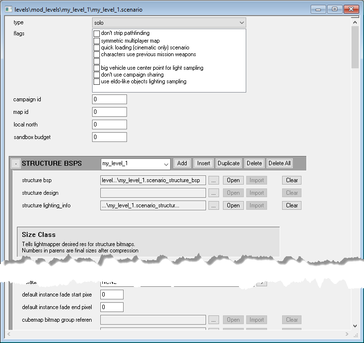

Fig 2. View of the scenario tag within Guerilla.

4. However, there is the **SKIES** section in this dialog.

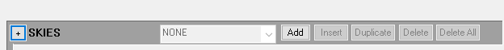

Fig 3. The Skies section in the scenario tag.

5. Click **Add** in the heading of this section. After that, the new sky object will be added and its **name** and **sky** fields will appear.

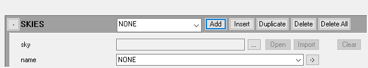

Fig 4. The Skies section with a new entry added.

6. Currently, the name of this sky is **NONE**, which is the default value. Let's keep it so since we just want to add a texture.

7. To add a sky texture (**.scenery** tag of the sky to be more correct):

    - Next to the **sky** field, click the browse button ().

    - In the appearing dialog, proceed to the **tags** folder and find there the **.scenery** tag file with the "**sky**" as part of the name. The easiest way to do it is to search for the **sky** subfolder in the folders of other levels in the **tags** folder. For example, you can select the **…\tags\levels\solo\020_base\sky\sky_01\sky_01.scenery**.

    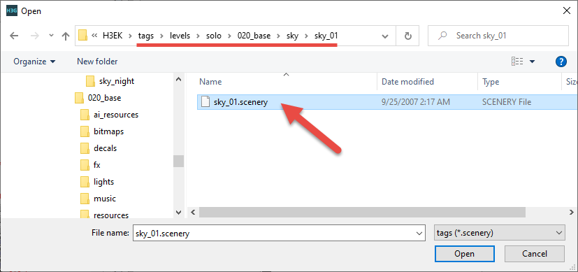

    Fig 5. The sky_0101.scenery file in the 020_base level.

    - Now you have assigned a sky to the surfaces of your level with the **+sky** material and your **SKIES** section will look like the following:

    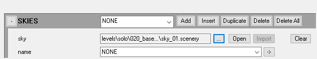

    Fig 6. The Skies section with the sky_01.scenery file added.

8. Save your changes to the .scenario file (File > Save or CTRL + S).

As you can see, the sky is a special case (and its internal mechanics is rather complicated, we will not cover it here).

## Assignment of Texture for Material via Creation of Shader Tag

Now, let's assign a texture to the **ground** material. We will do this by creating a **.shader** tag for this material.

Your level does not need any **.shader** tags to be playable, but without them, you will not have any textures. Also, you can have many, many **.shader** tags to specify different shaders for your environment, but for this demonstration we will only be creating one - for the ground.

> [!NOTE]
> As with skies, we will do it as simply as possible, just to illustrate the process. We will not cover the details that can be necessary for the high-quality levels. E.g., we will not cover the details of creating a shader, or UV maps that need to be created in Blender for surfaces to be appropriately wrapped with textures, or other details.

To create a simple shader with one diffuse texture and link it to your material specified in Blender, you can do the following:

1. In Guerilla, use the file tree to navigate to your folder with the .scenario tag (if you have not already done so). 

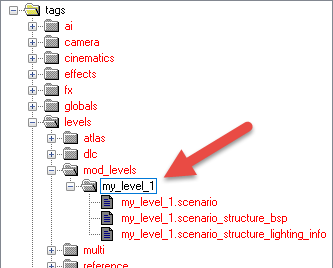

Fig 7. Scenario folder structure.

> [!WARNING]
> All **.shader** tags of your level need to be saved in a folder called "shaders". To be more precise, all shader tags, except the shared ones.

2. In the main menu of Guerilla, select **File > New**. This will bring up the **New Tag** dialog.

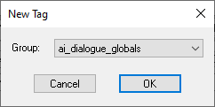

Fig 8. New Tag Dialog.

3. In this dialog, select **shader** as Group (type) and click **OK**. This will create a new **.shader** tag.

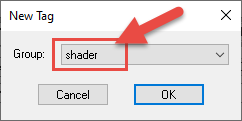

Fig 8. Shader type selected.

4. In the appearing shader tag dialog, scroll down to the **ALBEDO** section.

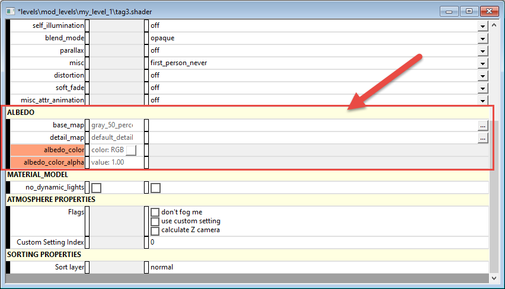

Fig 9. The Albedo section of the shader tag.

5. In the **base_map** field, click the browse button () and select the **.bitmap** tag file (texture) to be used as the base texture for this shader. By default, the browse dialog will display default textures of shaders located in **tags\shaders\default_bitmaps\bitmaps**.

    However, let's select another texture for our material, e.g. one of the **.bitmap** tag textures that are provided with the levels.

    For example, let's use the following texture for our **ground** material: **tags\levels\solo\020_base\bitmaps\hb_ground_dirt_b.bitmap**

    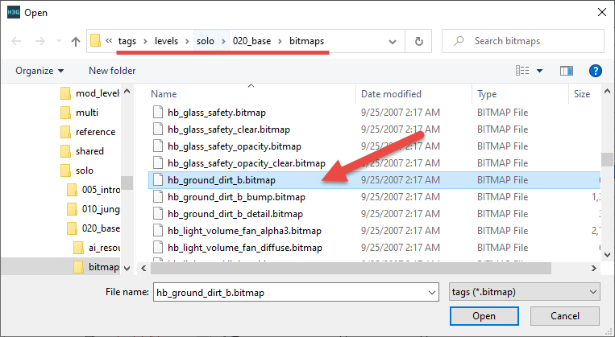

    Fig 10. The hb_ground_dirt_b.bitmap to be used for the ground material.

    > [!NOTE]
    > Without UV-maps assigned to geometry and models these textures will rarely look very pretty. UV-maps are assigned to geometry and models in Blender and are part of the resulting FBX. However, the process of creating UV maps is not covered by this simple guide.

6. After selection of the shader base texture, you need to save the new **.shader** tag. This is done in a standard way (**File > Save** or CTRL + S).

    However, there are two **very important** nuances here

    - The name of the **.shader** tag needs to be exactly the same as the name of the material that you created in Blender.

        In our case, the material in Blender was called **ground**, so our name of the shader tag will be "**ground.shader**".

    > [!WARNING]
    > If you name the shader incorrectly, it will not work for your level in the game engine.

    - You need to create a "**shaders**" subfolder in the folder of your level and save your shader tag file there. This is absolutely necessary since all .shader tags of your level need to be saved in a folder called "shaders". (To be more precise, all shader tags, except the shared ones.) In the **Save As** dialog, you can create a new folder by clicking **New Folder** on the toolbar.

    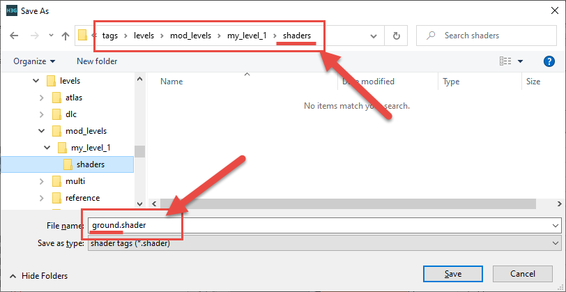

    Fig 11. The ground.shader being saved in the shaders folder.

7. After saving your shader tag, close its window in Guerilla. After that, if you press **F5** to refresh the navigation tree and expand the shaders folder, you will see the created file of the shader in the hierarchy.

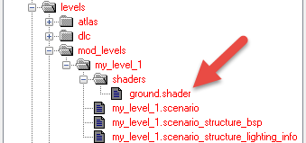

Fig 12. ground.shader file in the Guerilla hierarchy.

After that, you can close Guerilla, since we have selected a sky texture and, via the shader tag, assigned a texture to the Blender material. However, before proceeding to the next step, you need to rebuild your main scenario tag files (**.scenario** and others) to link the level to the assigned shader texture.

## Rebuilding Main Scenario Tag Files

To rebuild the main scenario tag files from the ASS file, you will need to execute again the same **structure** command of the **tool_fast.exe**.

For example, in our case:

```
tool_fast.exe structure levels\mod_levels\my_level_1\structure\my_level_1.ass
```

For details, see [Step #4](../Process/Step4.md).

After regenerating these tag files, you can proceed to the [Calculation of Lighting](../Process/Step6.md) step.

> [!NOTE]
> Moreover, if you are eager to view the geometry of your level with textures (but still without lighting), you can simply open the generated **.scenario** tag file (e.g. **my_level_1.scenario**) using Sapien.
