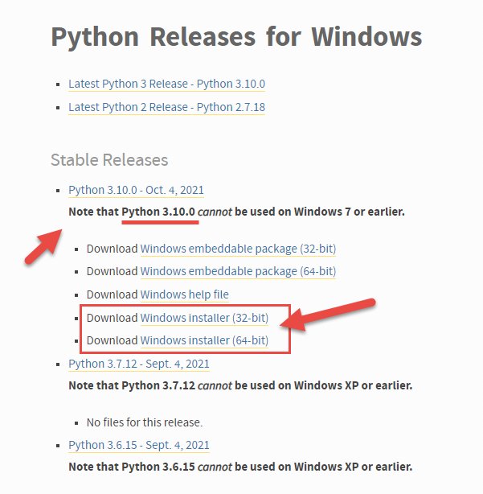
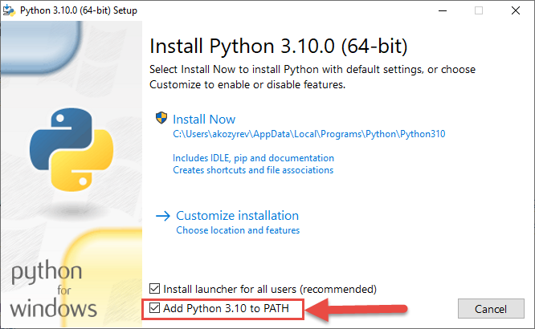
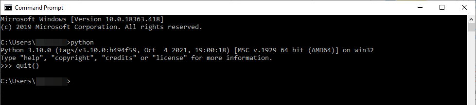
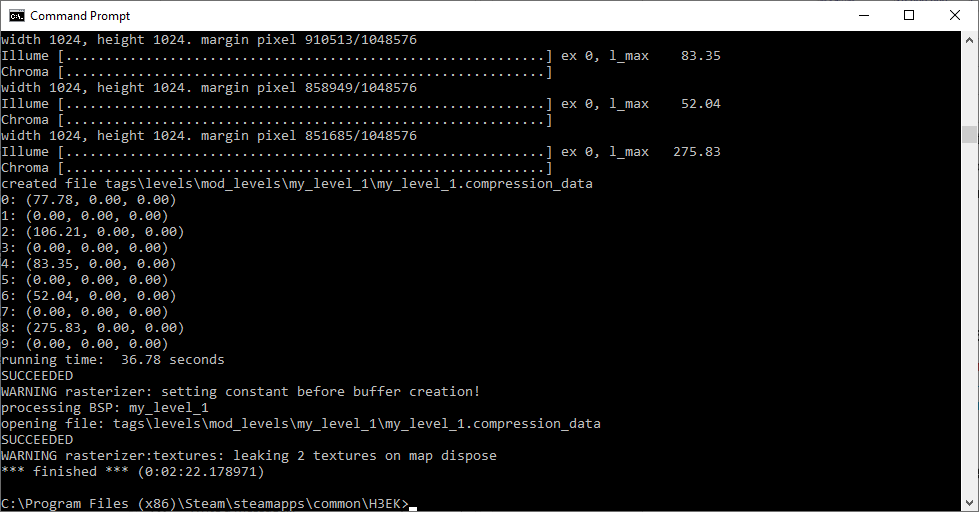
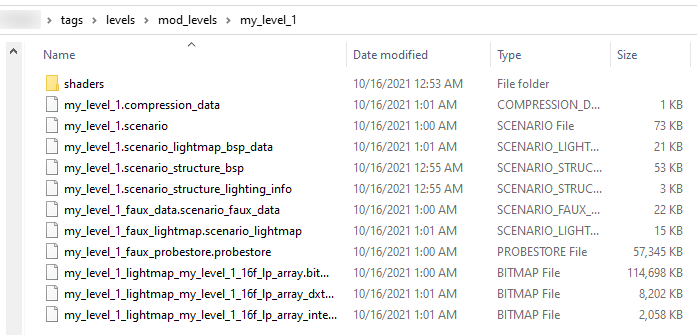

# Quick Start Process Step 6 - Calculation of Lighting

The lighting of your level needs to be calculated using the **calc_lm_farm_local.py** Python script, which is located at the root directory of the Halo 3 Editing Kit. To launch this script, you will need to install Python.

> [!NOTE]
> Versions greater than **Python 3.6** should be used for launching this script.

To install python:

1. Open https://www.python.org/downloads/windows/

2. In the **Stable Releases** section, using notes on that page as a source of info, select a version of Python that works on your version of Windows (for example, Python **3.10.0 will not work on Windows 7 or earlier**). For example, we will choose to install **Python 3.10.0**, which is appropriate for **Windows 10**.

3. By clicking the corresponding link, download the **Windows installer** of this version. It's not very important whether you select the 32-bit or 64-bit version of Python.



Fig 1. Download the Windows Installer for Python.

4. Launch the downloaded installer.

5. While installing, we recommend you to enable the **Add Python … to PATH** option, which will add the path to your python executable to the PATH environment variable. This will allow you to execute python scripts by simply typing **python \<name_of_script.py>** from any directory.



Fig 2. Install Python and make sure Add Python 3.10 to PATH is checked.

6. Select either the default install (**Install Now**) or customize your python installation, if you like.

7. After installation, open a new command prompt window (see [Step #3](../Process/Step3.md) for details) and execute the **python** command without the parameters. If the installation has been successful, Python will display its version and start a Python Interpreter in the same command prompt window.

    To exit the Interpreter and return to the original command prompt, type **quit()** and press ENTER.

    

    Fig 3. The Python Intepreter command prompt.

8. Now you can execute python scripts from the command line.

After Python is installed, you will be able to launch the **calc_lm_farm_local.py** script and calculate lighting by executing a single command in the command prompt.

> [!NOTE]
> Typically, to be able to omit the path to the **calc_lm_farm_local.py** script itself, this command is executed from the root directory.

The format of the command is the following:

```
python calc_lm_farm_local.py <scenario tag file, w/o .ext> <bsp name> <quality> (<light_group>)
```

Where the parameters are the following:

- **\<scenario tag file, w/o .ext>** – The path to the **.scenario** tag file in this command is specified relative to the **tags** folder. The name of the **.scenario** tag file is specified without the file extension. E.g., in our case, **levels\mod_levels\my_level_1\my_level_1**

- **\<bsp name>** – The name of the BSP (Binary Space Partition) for which the light is calculated. In our case, we have a simple level and this name equals to the name of its ASS file. E.g. **my_level_1**

> [!NOTE]
> A level can be divided into multiple BSPs (Binary Space Partitions) during its creation in the 3D modelling program. However, most of the custom levels have a single BSP only. Large campaign levels may have multiple BSPs. The BSP concept is out of the scope of this tutorial.

- **\<quality>** – the quality of the calculated lighting. Please note that the higher the quality is, the more time the calculations do require. The possible values here are:

    - **high**

    - **medium**

    - **low**

    - **direct_only**

    - **super_slow**

    - **draft**

    - **debug**

- **\<light_group>** – optional parameter, can be omitted. This is the name of the light group, if it is specified, the light will be calculated not for the whole level but for its part. In our tutorial, we will omit this parameter.

For example, in our case, the command can be the following:

```
python calc_lm_farm_local.py levels\mod_levels\my_level_1\my_level_1 my_level_1 low
```

This command will be executed in the command prompt for some time, you will see a lot of debug info displayed in the command prompt at this time (errors, warnings, etc.). Please wait until the program finishes.



Fig. 4. Execution of the script.

The execution of this command will result in the calculation of lightmaps and other light data. As a result, a lot of tag files related to lighting will appear in the folder of your level in the **tags** folder:



Fig 5. Lighting files output.

After that, you can proceed to the [Populating the Level in Sapien](../Process/Step7.md) step.
