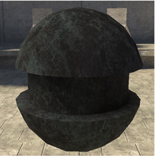
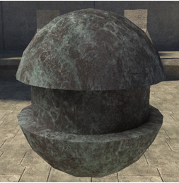
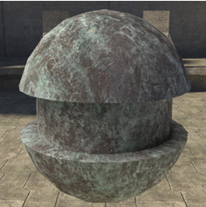
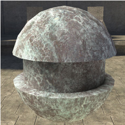
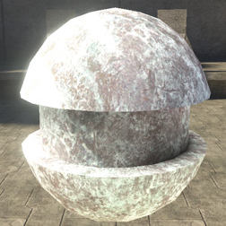

# Diffuse Coefficient

Makes the diffuse color brighter or darker.

Defined by a value from 0-1, but higher numbers can be entered for special effects. A value of zero will render the object completely black.

Figure 1 -  Diffuse_coefficient: 0.1.

Figure 2 -  Diffuse_coefficient: 0.5.

Figure 3 -  Diffuse_coefficient: 1.

Figure 4 -  Diffuse_coefficient: 2.

Figure 5 -  Diffuse_coefficient: 5.
