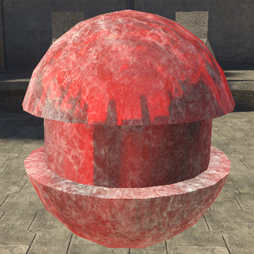
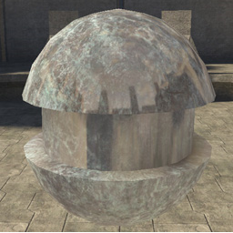

# Environment Tint Color Properties

Tints the reflection map.

> [!NOTE]
> Can also be used to adjust the strength of the reflection if you set it to a grayscale color value, black being no reflection and white being full reflection. This lets you set the material_model to diffuse_only and still have control over reflection strength.

Figure 1 - env_tint_color: red.

Figure 2 - env_tint_color: dark gray.
