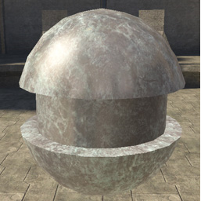

# Order 3 Area Specular

Uses more of the lighting information in the scene to generate the specular component, so it's more accurate but also more expensive.

Figure 1 - order3_area_specular: off

Figure 2 - order3_area_specular: on
