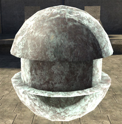
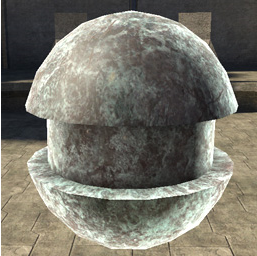
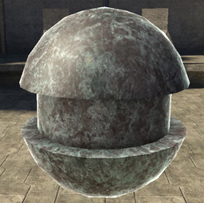

# Rim Power

Controls the overall balance of size and intensity in rim highlights. High numbers (5+) make small, hot highlights; lower numbers are broader and softer. Typical human values 1.5-3. Numbers lower than 1 are not advised.

Figure 1 - rim_power: 0.5

Figure 2 - rim_power: 1

Figure 3 - rim_power: 2 (default)

Figure 4 - rim_power: 4
