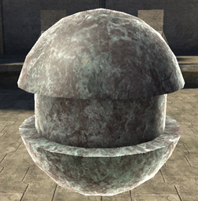
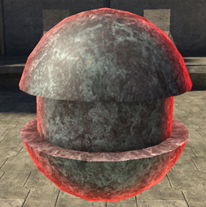

# Rim Tint

Tints the rim.

> [!Note]
> The default of black needs to be changed to something else before you'll see any rim spec, regardless of what the other settings are

Figure 1 - rim_tint: white

Figure 2 - rim_tint: [0,255,0]
