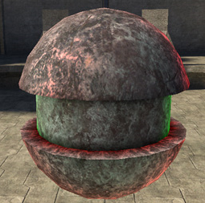
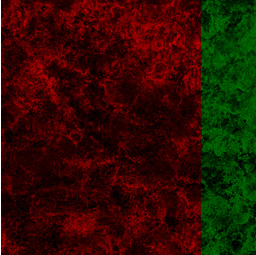
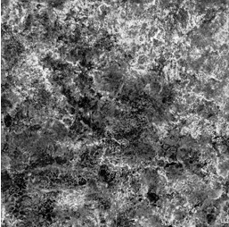
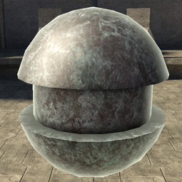

# Specular Map

Gives you per-pixel control over both specular strength and color. If the map is greyscale, it only affects strength, not color. Use and RGBA map to control color (and in this case, the alpha channel would control strength).

Figure 1 - with specular_map

Figure 2 - specular_map

Figure 3 - specular_map alpha

Figure 4 - without specular_map
