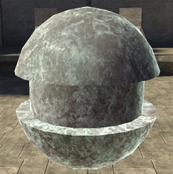
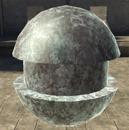
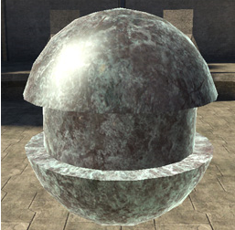
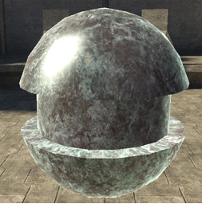

# Specular Power

Similar to [roughness](/Roughness.md), except in reverse.

Controls the overall balance of size and intensity in specular highlights. High numbers (15+) make small, hot highlights— lower numbers are broader and softer. Typical human values are 4-9.

Figure 1 - specular_power: 1

Figure 2 - specular_power: 5

Figure 3 - specular_power: 10 (default)

Figure 4 - specular_power: 20
