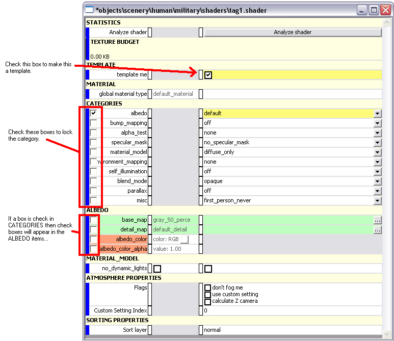
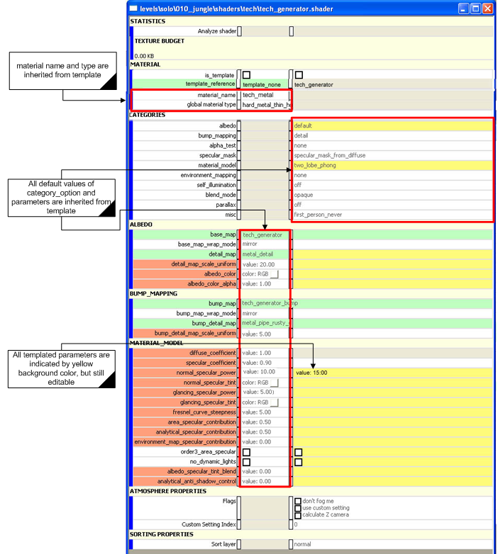
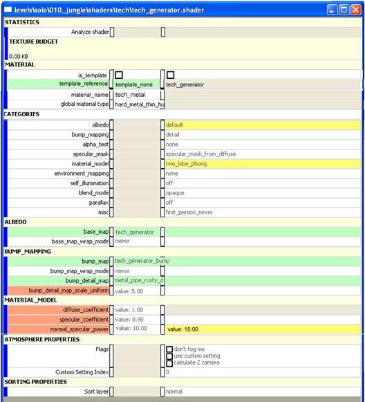

# Templates

## **Create Shader Template**

A shader tag can reference another shader tag and inherit values from it. Part of this process includes letting artists freely decide which category_options and parameter values of a shader will be inherited by other shaders.

Here is the process:

Check the template me checkbox (see Figure 1).

A column of checkboxes will show up in the Categories block. Check the category_options which you want to lock in the template.

If one category is locked, a column of checkboxes will show up in corresponding parameter lists (like categories of albedo and material_mode shown in Figure 1).

Check the parameters you wish to lock.

Figure 1 - Creating a shader template

## **Refer to Shader Template**

The shader refers to a template by the template_reference line in the Material block.

The following are inherited from the template (see Figure 2):

material_name

global_material_type

All default values of catergory_options (including both locked and unlocked fields)

## **Shader Views**

There are two different views of shaders: Full and compact (see Figures 2 and 3). Compact view is the default view of a derived shader. In compact view, all locked parameters are hidden, except those which have been modified. In full view, all fields are displayed but the locked fields are indicated by yellow background color.

> [!NOTE]
> The locked fields are still editable if the shader tag is checked out.

Figure 2 - Refer to a shader template

Figure 3 - Compact view of Shader

## **Notes About Templates**

- We only support one layer of inheritance of shader templates to simplify the system, which means one template can not refer to another - template

- The shader template can also act as a normal shader which can be directly applied to objects for rendering

- Template data becomes the default values in the shader tag, so to revert back to the template value delete your shader override value
