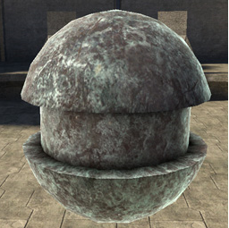
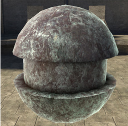
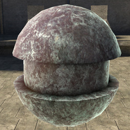
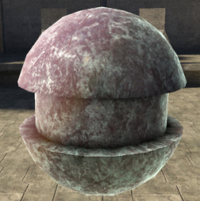

# Transparence Coefficient

Turns "transparence" lighting on and off. Transparence lighting uses reversed surface normals, so it lights through the model.

- 0.0 = no effect

- 1.0 = transparence lighting as strong as the diffuse lighting.

Figure 1 - transparence_coefficient: 0.1

Figure 2 - transparence_coefficient: 0.5

Figure 3 - transparence_coefficient: 1

Figure 4 - transparence_coefficient: 2
