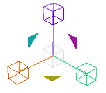
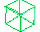
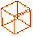
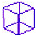
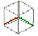
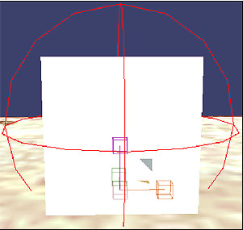
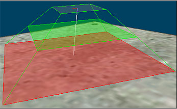

# Asset Manipulation Gizmo

The Asset Manipulation gizmo in Sapien accomplishes a variety of tasks: It can move, rotate, resize, and reshape various elements within your scenario. The operation of the Asset Manipulation Gizmo is closely tied to the [*Tool Window*](ToolWindow.md). Refer to that article for more information on changing properties of the manipulate gizmo.

Figure 1 - Sapien's Asset Manipulation Gizmo

## Use

**Rotate**— You can rotate an asset with the manipulate gizmo along 3 different axes, represented by the three colored triangles (yellow, magenta, and turquoise). To rotate an object, mouse over it until it enlarges, then click and drag to your desired rotation. The rotation function can also be slightly contextual. For example, when placing a light object, you'll need to press the SHIFT key to access the rotate handles.

-  — The yellow triangle rotates the asset around its **Y** axis (Y = Yaw). This results in sort of spinning the asset.
-  — The magenta triangle rotates the asset along its **R** axis (R = Roll). It tilts the object from side to side (or front-back depending on the direction you're looking at it from).
-  — The turquoise triangle rotates the asset along its **P** axis (P = Pitch), resulting in a tilt from forward-back (or side-to-side depending on the direction you're looking at it from).

**Move** (also known as Translation)— You can move assets along their X, Y, and Z axes by mousing over one of the gizmo's four cubes until it turns a semi-solid color, then click and drag to move the asset along that particular axis.

-  — Click the green cube and drag to move the asset along the Y axis.
-  — Click the orange cube and drag to move the asset along the X axis.
-  — Click the purple cube and drag to move the asset along the Z axis.
-  — Click the grey cube in the center of the gizmo and drag to enter free move mode. This allows you to move the asset along all axes at once and simply place it wherever you want in your scenario.

**Scale** (Resize)— The Scale/resize function of the manipulation gizmo is accessed by pressing the ALT key (and in some cases the CTRL key) and changes based on the type of asset selected. For objects (such as a simple box), the scale tool creates a sphere that matches the bounding sphere of the object (See Figure 2). When moused over, the sphere turns red. Then, you can click and drag to scale the object larger or smaller. For other objects, such as a custom light, there can be more than one scale implementation and you need to use either ctrl or alt to access them— this is so you can resize various planes of the light. See Figure 3 for an example of the scale function on a custom light object.

Figure 2 - The scale function of the gizmo with a box scenery object selected

Figure 3 - The scale function of the gizmo on a custom light object

On a final note, while the asset manipulation gizmo provides a visual reference for making changes to assets, it is also important to note that the changes can be made with more precision via the position, rotation, and scale attributes in the [*Properties Palette*](PropertiesPalette.md) window.
