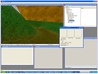
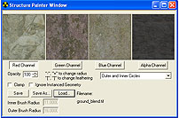
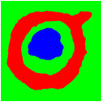
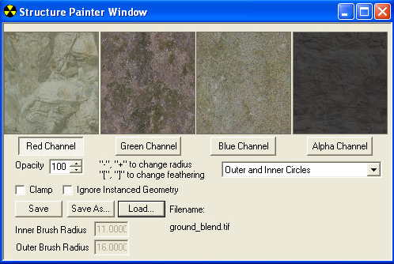

# Structure Painter

The Structure Painter tool is used to dynamically create or edit a blend map for your scenario while in Sapien. It gives you the ability to paint bitmaps where you want them in the scenario (while creating the blend map for you).

## How it Works

| Scenario is opened in Sapien.| -- |Paint in the Game Window| -- | Structure Painter writes to a .tif file (blend map)|
|:-----------------------------:|:-:|:---------------------:|:-:|:-------------------------------------------------:|
||||||

- The structure painter loads up the .tif files referenced by the terrain shader attached to your mesh. The structure painter writes in the red, green, blue, and alpha channels of the .tif file— just as if you were painting it manually in Photoshop.
- Anything you paint in the game window using the structure painter gets written out to a blend_map .tif file. The Structure painter has no effect on your shader tags, or the .tif files referenced by them (unless you choose to save over the top of a blend map you were previously using).
- The structure painter doesn't save or change anything automatically! You have to create a blend_map .tif file and link that to a .shader_terrain before you'll be able to paint with the structure painter.
- The structure painter saves to a .tif file. It will need to be imported as a .bitmap tag manually.

## User Interface

Figure 2 - The Structure Painter Tool inside Sapien

- **Image Previews**— The image previews show the bitmap that will be painted in the game window when the corresponding channel button is selected. The bitmap files are loaded from those in the terrain shader in Guerilla. If you have more than one terrain shader in your scenario, the image previews will change when you move the mouse over the different shaders in Sapien.
- **Channels**— When clicked, the channel button selects the color channel to paint (Red, Green, Blue, or Alpha) in the .tif file. It will paint the image loaded into the image preview (above the button) in the game window.
- **Opacity**— The Opacity spinner (and text box) lets you set the opacity of the brush for the currently selected channel.
- **Clamp**— Unchecking the clamp checkbox allows you to paint over the top of an area without replacing what is already there. This would be akin to painting a value in more than one channel of the blend map — thus over-saturating it if you don't use this in conjunction with lowering the opacity. If you're not careful, it's an easy way to end up with a big black mess.
- **Ignore Instanced Geometry**— When this is checked, the structure painter will ignore any instanced geometry.
- **Radius**— The size of the brush. In the inner circle, the brush will paint with 100% opacity (unless overridden by the opacity setting). Use the + and - keys on the keyboard to change the size of the Radius.
- **Feathering**— The feather radius (the outside circle) is a gradient from 100% value (of whatever the inner radius is) to 0%. The size of the feather radius can be adjusted using the [ and ] (bracket) keys.
- **Save**— Saves the current blend map.
- **Save As**— Presents the user with a dialog which allows them to choose the name and location of the blend map .tif file and then save it.
- **Load**— The load button presents you with a dialog that allows you to load a previously created blend map for editing.
- **Brush Display Drop-down**— Allows you to change the way the brush is displayed in the game window. You can choose Preview (shows no rings), Outer Circle (only shows outer edge), or Outer and Inner Circles (shows both the brush radius and the feathering radius).

## Step-By-Step

Here's how to create a blend map using the Structure Painter Tool:

1. Create a new blend map .tif file in Photoshop (it needs at least a small bit of information in it or it won't import correctly). Name it with _blend on the end and then import the bitmap.
1. Create a new .shader_terrain shader and set the blend map you just created and imported as the blend_map.
1. Assign bitmaps to the material slots in your shader_terrain as necessary.
1. Launch your scenario in Sapien.
1. In the Hierarchy View, expand **Scenario -> Structure Data**, then click on **Structure Painter**. This will open the Structure Painter window. If the bitmaps you want to use are not loaded automatically into the image preview slots, you need to change them in the shader in guerilla.
1. Once you've got the images loaded, click on one of the Channel (red, green, blue, or alpha) buttons to select it.
1. Go to the game window and begin painting. If you want to increase or decrease either brush radius size, use the [ or ] key (or shift + [ or ] for the outer brush radius).
1. When you're finished painting, click the **Save** button.
1. Switch to **Guerilla** and **import** the blend map .tif file to refresh your .bitmap tag. If you skip this step, you will paint over the top of your blend_map without realizing it! Always remember: the Structure Painter is painting the .tif file and gives you a preview on the screen of what the imported .bitmap will look like - it doesn't make changes until you save and re-import.
1. Xsync and check out your new detail blend!
