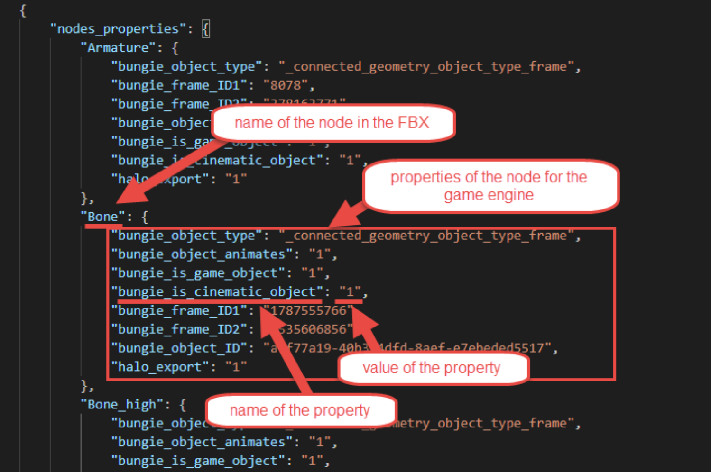
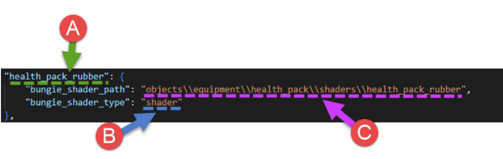
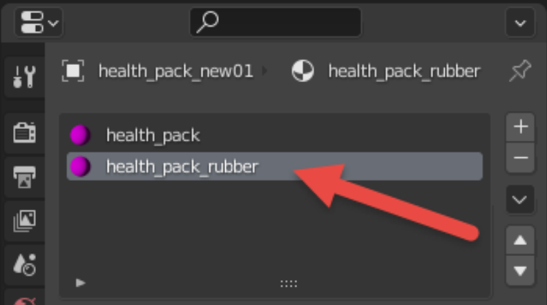

# Halo Reach FBX to GR2

## Overview

This manual covers conversion from the **.fbx** format to the **.gr2** format that needs to be done for custom models and levels when adding them to Halo Reach. And, also, it covers the import of the resulting **.gr2** file to tag files used by the game. 

**FBX** is treated here as an initial format. I.e., it is assumed that you create your custom model or level in 3D editing software – Autodesk 3ds Max, Autodesk Maya, or Blender – and then export it to the FBX file. And, after that, use this FBX file as the source file for your model or level in Halo Reach.

**GR2** is an intermediate format. You will use your GR2 files to convert them to the regular tag files (.model, scenario, etc.). This can be done using the **import** command of **tool.exe** or **tool_fast.exe**, with the help of an additional sidecar file (**\<name_of_tag>.sidecar.xml**).

Conversion from FBX to GR2 is performed via the **tool.exe** or **tool_fast.exe** apps, using the **fbx-to-gr2** command. Along with an initial FBX file, this conversion also needs an auxiliary file in the **JSON** format, which will contain the meta-information about the model or level that is absent in the initial FBX.

After converting FBX to GR2 and GR2 to tag files, you will be able to use these tag files in regular Halo Reach modding pipelines.

## FBX to GR2 Conversion

### The “fbx-to-gr2” Command

Conversion is performed by the **fbx-to-gr2** command of **tool.exe** or **tool_fast.exe**. 

The syntax of this command is the following: 

```
tool_fast.exe fbx-to-gr2 <fbx-model> <json-file> <gr2-model>
```

Where:

- **\<fbx-model>** – The path to the source FBX file, including its name. You can specify here either the full path to the FBX file or a relative path.

- **\<json-file>** – The path to the auxiliary JSON file, including its name. This file is necessary to provide the meta-information about the model or level that is absent in the initial FBX. The value of this parameter is required for the correct conversion; *however, the existence of the file itself is not required*. I.e., at the first launch, you can specify the path to the *non-existing file* – to the location where you want to create it – and the system *will create a valid JSON file at this location automatically*, will fill it with some valid data, and will perform conversion with this (default) info. After that, you can modify this file and add necessary additional info to it, to receive a more “exact” GR2 file as a result of next conversions. For details, see [JSON File](#json-file) below.

- **\<gr2-model>** – The path to the output GR2 file, including its name. 

For example:

```
tool_fast.exe fbx-to-gr2 "C:\Program Files (x86)\Steam\steamapps\common\HREK\data\levels\example_level\example_level.fbx" "C:\Program Files (x86)\Steam\steamapps\common\HREK\data\levels\example_level\example_level.json" "C:\Program Files (x86)\Steam\steamapps\common\HREK\data\levels\example_level\example_level.gr2"
```

> [!NOTE]
> If your paths contain folders with spaces inside names, you need to put these paths in the double-quotes when executing the **fbx-to-gr2** command. 

Or, you can use relative paths, if you execute this command from the root folder of Halo Reach Editing Kit (HREK):

```
tool_fast.exe fbx-to-gr2 data\levels\example_level\example_level.fbx data\levels\example_level\example_level.json data\levels\example_level\example_level.gr2
```

Or, you can use **tool.exe** instead of **tool_fast.exe** and some temporary folder outside HREK:

```
tool.exe fbx-to-gr2 "C:\temp folder\example_level.fbx" "C:\temp folder\example_level.json" "C:\temp folder\example_level.gr2"
```

### Requirements for Rigged 3D Models

There is a specific requirement for rigged 3D models (models with a skeleton made from bones; these models have an Armature in Blender).

Particularly, when creating these models, you need to ***store all transforms in the nodes of the skeleton***, not in their meshes. See the FBX file in the [example_tentacle](#appendix-a-samples) sample.

### JSON File

The **fbx-to-gr2** command requires a JSON file for successful conversion. This file is necessary to provide the meta-information about the model or level that is absent in the initial FBX, but still required by the game engine.

For example, if your FBX file contains some meshes and you want to generate correct tag files based on it, these tag files need to contain information on the *types* of these meshes from the point of view of game engine. E.g., you need to mark water surfaces as water surfaces, portals as portals, and so on. Otherwise, your model or level may appear or behave in the engine incorrectly.

However, at the first conversion, the initial JSON file is created by **tool.exe** or **tool_fast.exe** automatically. All you need to specify at the first conversion is the preferable location of this JSON that will be created. 

If you do, the system will create it for you and will fill it with the *default* values of the properties of objects in your FBX. For example, it will use “**_connected_geometry_mesh_type_default;**” as the type for all meshes. And, after that, the system will use it for conversion, so you will still get a target GR2 file (based on these default values).

After that, to obtain a better GR2, you can tune the properties specified in the JSON file, assign the necessary values to them, and reconvert your GR2 file using the modified JSON file and the same FBX file. 

Modifications to the JSON file can be done in any textual editor. For example, to better handle the JSON formatting and avoid syntax errors, you can use Visual Studio Code editor, available freely at https://code.visualstudio.com

The structure of this JSON file is the following:

- **nodes_properties** – this section contains the list of all nodes from the FBX file. (Roughly speaking, a “node” here is a single item that can be selected in the **Outliner** of a 3D Editing Tool and that may correspond to a bone, marker, mesh, and so on.) Every node in this list has a set of properties that you can modify. For example:

    

    Fig 1. View of the node properties for an FBX file.

- **meshes_properties** – this section contains the list of all meshes from the FBX file. Similarly to the list of nodes, every mesh in this list has a set of properties that you can modify.

- **material_properties** – this section contains the list of materials from the FBX file used by your model and allows you to specify properties of these materials. Particularly, here you can define the shader tag files that correspond to every material. For details, see [Material Properties](#material-properties-the-material_properties-section).

> [!NOTE]
> If your model contains [Regions](#regions-and-global-material-overrides-string-table-string_table-in-json) or you want to specify some overrides of global materials, you will also need to add the **string_table** section to the JSON file. In this case the order of sections will be the following: **string_table**, **nodes_properties**, **mesh_properties** and **material_properties**.

Names of all possible properties, types (format) of their values, and, for some properties, the list/range/format of their possible values are listed in the [Appendix B: JSON Parameters](#appendix-b-json-parameters).

Most of these properties and values have self-explaining names, e.g. the **mesh_type** property can have the **_connected_geometry_mesh_type_collision** value, which specifies that this mesh needs to be treated as a collision mesh by the game engine.

> [!NOTE]
> Most of these fields need to be specified with the “**bungie_**” prefix in JSON file, please note that this prefix is omitted in the names of properties in [Appendix B](#appendix-b-json-parameters).

> [!NOTE]
> Some parameters used in the samples (e.g. “**bungie_is_cinematic_object**”, “**halo_export**”, etc.) are currently not used in the game engine and are legacy parameters. They are used in samples, since they are used in Halo 4 and Halo 2 Anniversary. However, they are not used in Halo Reach and are not listed in [Appendix B](#appendix-b-json-parameters).

> [!NOTE]
> In the future, we will generate and publish a pack of original JSON files for all in-game models that are used in the Halo Reach title. This will probably help modders to modify them, since there will be an original JSON that can be used as a base.

> [!NOTE]
> You can use JSON files from the provided samples as a basis for your own JSON files, see [Appendix A: Samples](#appendix-a-samples).

Some properties (**object_type**, **object_ID**, **object_animates**) are the main properties of an object and are used for both for node objects in the "**nodes_properties**" section and, separately, for mesh objects in "**meshes_properties**".

Most properties in the [Appendix B](#appendix-b-json-parameters) can be specified for objects of particular type only. The type of object is specified for every object in the **object_type** property. The type of the object that the property relates to typically can be identified by the suffix in its name. E.g, properties with the “**mesh”** suffix typically correspond to the objects with **object_type** equal to **_connected_geometry_object_type_mesh**. Along with that, you can find the correct object type for every property in the [Appendix B](#appendix-b-json-parameters), in the **Additional Info** column.

> [!NOTE]
> Moreover, due to the legacy components of the system, there is an additional requirement for nodes that are meshes (i.e. **_connected_geometry_object_type_mesh** as the type of the node), if they are listed in both **nodes_properties** and **meshes_properties**. In this case, properties with the “**mesh**” suffix need to be duplicated in both descriptions of an object (both in **nodes_properties** and **meshes_properties**). However, this applies only to objects that are defined as meshes in both these sections. If, in fact, there are two different objects (e.g. a frame in **nodes_properties** that contains a mesh in **meshes_properties**), this is not necessary.

For example, using the list of properties in [Appendix B](#appendix-b-json-parameters) you can add a Hinge constraint with 180° and -180° angle limits between two nodes of a FBX file. If you want to do this with the two nodes (e.g. **Parent_Node** and **Child_Node**), you will need to modify their properties in the **nodes_properties** section as follows:

```
{
    "nodes_properties": {
        ...,
        "Parent_Node": {
            ...,
            "bungie_physics_constraint_child": "Child_Node",
            "bungie_physics_constraint_hinge_min": "-180",
            "bungie_physics_constraint_hinge_max": "180"
        },
        "Child_Node": {
            ...,
            "bungie_physics_constraint_parent": "Parent_Node"
        }
    },
    ...
}
```

However, since usage of constraints is possible for physical objects only, this code needs to be specified in the JSON file for the physical model (e.g. typically a separate FBX that needs to be also converted to GR2 and then to the **.physics_model** tag file). And, along with the code above, you will also need to modify the **object_type** of these nodes. The physics engine in Halo Reach supports two types of physical objects:

- A physical mesh, i.e., the **_connected_geometry_mesh_type_physics** type of the mesh.

- A marker with the physics constraint, i.e. either **_connected_geometry_marker_type_physics_hinge_constraint** or **_connected_geometry_marker_type_physics_socket_constraint** types of markers. For the specified parameters, we can use markers, so the final code will be similar to the following:

```
{
    "nodes_properties": {
        ...,
        "Parent_Node": {
            "bungie_object_type": "_connected_geometry_object_type_marker",
            "bungie_marker_type": "_connected_geometry_marker_type_physics_hinge_constraint",
            ...,
            "bungie_physics_constraint_child": "Child_Node",
            "bungie_physics_constraint_hinge_min": "-180",
            "bungie_physics_constraint_hinge_max": "180"
        },
        "Child_Node": {
            "bungie_object_type": "_connected_geometry_object_type_marker",
            "bungie_marker_type": "_connected_geometry_marker_type_physics_hinge_constraint",
    
    
            ...,
            "bungie_physics_constraint_parent": "Parent_Node"
        }
    },
    ...
}
```

#### Regions and Global Material Overrides. String Table ("string_table") in JSON

If your model contains Regions or you want to specify some overrides of global materials, your JSON file will need to be a bit different.

> [!NOTE]
> A Region is a homogeneous and somewhat independent section of a model. Regions are set up so that different areas of the same model can have different properties. For example, the head of a marine is one region of the model, while the body is another. Creating regions allows us to have variations between parts of the model (without having to load or create separate models). Each region can have different permutations and states than other regions of the model.

> [!NOTE]
> Not all models need to be split into Regions. If your model does not need it (and you do not want to make overrides to global materials), you can skip this section. It is totally optional.

***If your model needs Regions***:

Particularly, in the **meshes_properties** section of JSON, you will need to mark all meshes of your model that correspond to regions with the face_region property and specify the name of the corresponding region as a value of this property. The syntax is the following:

```
"bungie_face_region": "<name_of_region>"
```

For all meshes that are not marked with the **face_region** property, the system will assume that they correspond to the "**default**" region, which exists for every model.

For example, if you want your model to have two separate regions ("**body**" and "**head**") along with the "**default**" region, your **meshes_properties** section in JSON may look like the following:

```
"meshes_properties": {
    ...,
    "Cube1": {
        "bungie_object_type": "_connected_geometry_object_type_mesh",
        ..., // there is no "bungie_face_region" property for this mesh, so it will be
        ... // automatically assigned to "default" region, which always exists for a model. 
    },
    "Cube2": {
        "bungie_object_type": "_connected_geometry_object_type_mesh",
        ...,
        "bungie_face_region": "body",
        ...
    },
    "Cube3": {
        "bungie_object_type": "_connected_geometry_object_type_mesh",
        ...,
        "bungie_face_region": "head",
        ...
    },
    ...,

}
```

But that’s not all. Along with that, you will need to specify a ***string table*** for your regions. The string table is the mapping (key-value) table between names and indices. It is necessary, since, regardless of the fact that most of the tag files use names, indices corresponding to these names are actually passed to the game engine and processed by it (to determine what to render). Along with that, some tag files also explicitly use indices. 

> [!NOTE]
> Indices also define the order of the particular region in the list of regions in various tag files opened in Foundation. I.e., you can identify the index (starting with "**0**") of the particular region by its position in these lists. Needless to say, if you are importing a new model that does not exist in the game, you may define indices (and order of regions) as you wish. However, when you create a substitution for an existing model, you will need to define indices of regions exactly as they are defined in the original model. 

This string table can be defined either in the JSON file or in the sidecar XML file. However, if you specify its values both in JSON and sidecar XML, the sidecar XML version will have more priority and its values will overwrite the values of the JSON version. Overwriting will be performed by the comparison of names, if they match, the system will overwrite corresponding indices. For clarity, we recommend you to define this table either in sidecar XML, or in JSON.

If you want to define the string table in JSON, you will need to add the supplemental **string_table** section to your JSON file, before the **nodes_properties** and **meshes_properties** sections.

Then, in this **string_table** section, you will need to add two properties:

- **regions_names** – the collection of names of regions. This collection must contain the default region (named "**default**") and names of all other regions that you used when you were marking meshes of regions with **face_region** property (see above). Except the "**default**" region, names within this collection and names defined by **face_region** property must be exactly the same.

- **regions_values** – the collection of indices that correspond to these names of region. 

For example, if you want to define indices for regions used in the previous example, your string table may be defined like this:

```
{
    "string_table": {
        "regions_names": ["default", "head", "body"], 
        "regions_values": ["0", "1", "2"]
    },
    "nodes_properties": {
        ...
    },
    "meshes_properties": {
        ...
    }
}
```

> [!NOTE]
> Values of indices start with **0**. The "**default**" region is mandatory.

If necessary, the values of indices assigned to region names may be overwritten in the sidecar XML, using the corresponding \<FaceCollection> tag containing a set of \<FaceCollectionEntry> tags with Index and Name values, see below for details.

***If your model needs Global Material Overrides***:

If your model needs Global Material Overrides, you can define them in the String Table too. The mechanics here is the same, you add two properties to the **string_table** section:

- **global_materials_names** – the collection of names of global materials.0

- **global_materials_values** – the collection of indices corresponding to specified global materials.

For example:

```
{
    "string_table": {
        "global_materials_names": ["skin", "hair"],
        "global_materials_values": ["0", "1"],
        "regions_names": ["default", "head", "body"],
        "regions_values": ["0", "1", "2"]
    },
    "nodes_properties": {
        ...
    },
    "meshes_properties": {
        ...
    }
}
```
However, in this case, there is one important nuance: global materials cannot be defined in sidecar XML. You can specify an absolutely correct \<FaceCollection> tag for them there (our examples contain this code), but all global material values specified in sidecar XML will be ignored during importing due to the legacy code. Thus, global materials overrides can be specified in JSON only.

#### Material Properties (the "material_properties" section)

If you want to correctly set up the materials used by your model, you need to add one more section to the JSON file. 

Particularly, you will need to add the "**material_properties**" section on the same level as "**nodes_properties**" and "**meshes_properties**"and after them.

This section should contain entries corresponding to all materials from the FBX file that you want to use in Halo Reach for your model. These entries will allow you to specify properties of these materials, particularly, the type of shader that needs to be used for this material and the path to it.

For example:

```
{
    "nodes_properties": {
        ...
    },
    "meshes_properties": {
        ...
    },
    "material_properties": {
        "health_pack_rubber": {
            "bungie_shader_path": "objects\\equipment\\health_pack\\shaders\\health_pack_rubber",
            "bungie_shader_type": "shader"
        },
        "health_pack": {
            "bungie_shader_path": "objects\\equipment\\health_pack\\shaders\\health_pack",
            "bungie_shader_type": "shader"
        }
    }
}
```

The structure of every entry here is the following:



Fig 2. Structure of the material property entry.

- The name of the entry (**A** above) – this is the name of the material. It must be absolutely the same as the name of the material in the FBX file. 

     For example, "**health_pack_rubber**".

    - **shader_type** – the value of this property (**B** above) is the type of the shader that will be used for this material. For shader files, this corresponds to the extension of the shader tag file.

        For example, "**shader**". Or, "**shader_water**".

    You can refer to the [Appendix B: JSON Parameters](#appendix-b-json-parameters) for the full list of possible values of the **shader_type** property.

    - **shader_path** – the value of this property (C above) is the path to the shader tag file (of the specified **shader_type**). This path needs to be specified relative to the **tags** folder, without file extension, and with double backslashes as path delimiters.

        For example, "**objects\\\equipment\\\health_pack\\\shaders\\\health_pack_rubber**"

As you can see, the general use of the "**material_properties**" section is to map materials from the FBX file to appropriate shader tag files.

> [!WARNING]
> If you miss some materials from FBX or will not add the "**material_properties**" section at all, the system will assign the default invalid shader (**tags\shaders\invalid.shader**) to all materials from FBX that were not specified in JSON.

However, there is also a special case. Using a material entry in the "**material_properties**" section, you can also override properties of the mesh that this material is assigned to, in the area of the mesh covered with this material. 

> [!NOTE]
> The case described below is a workaround that is intended for special situations. Please, use it accurately and avoid it when possible. We recommend you to define the mesh properties in a typical way, without such overriding.

If you specify "**override**" as a value of **shader_type**, you will be able to assign a special value to **shader_path** property. Particularly, you will be able to specify a new value of the particular mesh property that will override its initial value in this area

For example, if you want to set up a particular part of the mesh surface as a sky in Halo Reach and, in your FBX, this part of the surface is covered with the material named "sky_material", you can specify the following in the properties of this material in the JSON file:

```
    "sky_material": {
        "bungie_shader_type": "override",
        "bungie_shader_path": "bungie_face_type=_connected_geometry_face_type_sky"
    }
```

Where "**bungie_face_type=_connected_geometry_face_type_sky**" value of **shader_path** will set **face_type** property *of this part of the surface* of this mesh to “**_connected_geometry_face_type_sky**”, which means that it will be treated as sky by Halo Reach.

The syntax here is rather simple: 

```
"bungie_shader_path": "<name_of_mesh_property>=<value_of_this_property>"
```

Please note that syntax does not support delimiters between properties and, because of that, you cannot override more than one mesh property by a single material.

However, in a rare case when it is necessary to override multiple mesh properties for the particular part of the mesh at once, you can create multiple materials in 3d editing software, cover the same part of the mesh surface with them, and add all of these materials to the "**material_properties**" section, overriding every necessary mesh property on a per material basis.

### Compatibility with FBX Files Made for Previous Versions of the Game

In general, FBX files made for previous Halo titles are compatible with the FBX-to-GR2 conversion and can be imported to Halo Reach.

However, the limitation for rigged 3D models ([see above](#requirements-for-rigged-3d-models)) should also be taken into account

## Using GR2 for Importing Tags

To import a GR2 file to the game engine format (set of tag files), you need to create a sidecar XML file for it and use it during import.

### Creation of Sidecar XML file

To create a sidecar XML file for your GR2 file, we recommend you to use samples provided with this manual – see [Appendix A: Samples](#appendix-a-samples).

Particularly, you can take one of the sidecar XML files from these samples, rename it to **\<name_of_your_model>.sidecar.xml**, modify some fields in it to match your GR2 file, and use it while importing. The process of these modifications is briefly described below.

> [!NOTE]
> The full process of the creation of a sidecar XML from scratch is a separate topic and is out of the scope of this guide.

> [!NOTE]
> The main idea of the sidecar XML in the current pipeline is ***not*** in providing the *full* description of a model/level. Its main idea here is to provide a ***minimum*** description of the model/level that is required for the successful import. After the successful import, all other necessary properties of the model/level tag files can be set in Foundation. 

Typically, the process of adaptation of existing sidecar XML to your needs is the following:

- Browse [samples](#appendix-a-samples) and, for simplicity, locate the sample that is closer to the type of the 3d model you need to import. For example, choose **example_level.sidecar.xml**, if you have a level. Or, choose **example_tentacle.sidecar.xml**, if you have a model with multiple nodes. Or, choose **example_health_pack.sidecar.xml**, if you have a model with custom textures. 

> [!NOTE]
> If necessary, you can combine samples as you need, by copy-pasting and changing necessary parts of sample sidecar XML files.

- Rename selected sample sidecar XML into **\<name_of_your_model>.sidecar.xml**. The name of this file affects the import process. It must be the same as the name of the model folder (same as the model name).

- For your convenience and to match default paths to folders in the sample sidecar XML files, organize the folder structure for your files:

    - Create a folder for your model/level somewhere within the **data** folder of the HREK directory. For example, **data\levels\custom_levels\example_level\\**

    - Put your sidecar XML into this folder. E.g. **data\levels\custom_levels\example_level\example_level.sidecar.xml**.

    - In this folder, create two subfolders: **models** – for the source of your model, and the **export** folder with a **models** subfolder –for its GR2 file.

    - Put your FBX and JSON files into the **models** directory and GR2 file into **export\models**.

    - If you have image files and textures that are used by your model, put them into the **bitmaps** folder.

- In your sidecar XML file:

    - Do not modify the description of the sidecar XML file in the \<Header> section. You can modify it, but we do not recommend that.

    ```
    <Header>
        <MainRev>0</MainRev>
        <PointRev>6</PointRev>
        <Description>created by SidecarFile 0.6</Description>
        <Created>4/16/2009</Created>
        <By>jrodgers</By>
        <DirectoryType>TAE.Shared.NWOAssetDirectory</DirectoryType>
        <Schema>1</Schema>
    </Header
    ```

    - In the \<Asset> section, specify the name of your object to be imported, its type, and specify the output tag files that need to be generated as a result of import. For details, see [\<Asset> tag](#asset-tag) and [\<OutputTagCollection> and \<OutputTag> tags](#outputtagcollection-and-outputtag-tags) below.

    ```
    <Asset Name="example_level" Type="scenario">
        <OutputTagCollection>
            <OutputTag Type="scenario_lightmap">levels\example_level\example_level_faux_lightmap</OutputTag>
            <OutputTag Type="structure_seams">levels\example_level\example_level</OutputTag>
            <OutputTag Type="scenario">levels\example_level\example_level</OutputTag>
        </OutputTagCollection>
        <SharedAssetCollection />
    </Asset
    ```

    - If necessary, in the \<Folders> section, modify the folders that will be used during import for various data of the imported object, see [\<Folders> tag](#folders-tag) for details. For a folder of every type, the path is specified relative to the folder where the sidecar XML is located. 

    > [!NOTE]
    > Default paths to folders that are specified in the sample files assume that the source files of your model are located in **models**, **export\models**, and **bitmaps** folders, as specified above. Typically, if your files are located as described in previous steps, you do not need to modify anything in the \<Folders> section. We recommend you to organize files this way and do not change the \<Folders> section.

    > [!NOTE]
    > The set of child-tags (particular folders) may be different here, depending on the type of the model (whether it is a model or a level).

    > [!NOTE]
    > Not all of these folders will be used during import, since some data may be not necessary for your model. However, we recommend you to do not remove unnecessary folders since they may be necessary for import of other models, so it is a good idea to have a list of all of them somewhere. 

    ```
    <Folders>
        <Reference>\reference</Reference>
        <Temp>\temp</Temp>
        <SourceModels>\models\work</SourceModels>
        <GameModels>\models</GameModels>
        <GamePhysicsModels>\models</GamePhysicsModels>
        <GameCollisionModels>\models</GameCollisionModels>
        <ExportModels>\export\models</ExportModels>
        <ExportPhysicsModels>\export\models</ExportPhysicsModels>
        <ExportCollisionModels>\export\models</ExportCollisionModels>
        <SourceAnimations>\animations\work</SourceAnimations>
        <AnimationRigs>\animations\rigs</AnimationRigs>
        <AnimationTransplants>\animations\transplants</AnimationTransplants>
        <GameAnimations>\animations</GameAnimations>
        <ExportAnimations>\export\animations</ExportAnimations>
        <SourceBitmaps>\bitmaps</SourceBitmaps>
        <GameBitmaps>\bitmaps</GameBitmaps>
        <CinemaSource>\cinematics</CinemaSource>
        <CinemaExport>\export\cinematics</CinemaExport>
        <ExportBSPs>\export\models</ExportBSPs>
        <GameBSPs>\models</GameBSPs>
        <SourceBSPs>\models\work</SourceBSPs>
        <RigFlags>\flags</RigFlags>
        <RigPoses>\poses</RigPoses>
    </Folders>
    ```

    - If necessary, in the \<FaceCollections> section, specify the **String Table for regions**. If you have already done this in JSON, the values specified in sidecar XML will overwrite the JSON version. See [\<FaceCollections>, \<FaceCollection>, \<FaceCollectionEntries>, and \<FaceCollectionEntry> tags](#facecollections-facecollection-facecollectionentries-and-facecollectionentry-tags) for details

    ```
    <FaceCollections>
        <FaceCollection Name="regions" StringTable="connected_geometry_regions_table" Description="Model regions">
            <FaceCollectionEntries>
                <FaceCollectionEntry Index="0" Name="default" Active="true" />
            </FaceCollectionEntries>
        </FaceCollection>
    </FaceCollections>
    ```

    - In the \<Contents> section, define the content of the main tag files (listed in the \<Asset> section) we want to create. And, also, specify what additional tag files need to be created and linked to the fields of main tag files. For details, see [\<Contents>, \<Content>, \<ContentObject>, \<ContentNetwork>, \<InputFile>, and \<IntermediateFile> tags](#contents-content-contentobject-contentnetwork-inputfile-and-intermediatefile-tags) below.

    > [!NOTE]
    > Textures for your models need to be defined in the source FBX file of the model, with names corresponding to the existing/to-be-created **.shader** tag files. These **.shader** tag files are created in Foundation (separately from the import process). See [Importing Materials (Shaders)](#importing-materials-shaders) for details.
 
- Save your sidecar XML file and proceed to importing GR2 to tag files, as described in [Import to Tags](#import-to-tags).

#### \<Asset> tag
The \<Asset> tag sets the main object to be imported and, via child-tags (see below), the *main* output tag files that need to generated as a result of the import. It may contain the \<OutputTagCollection> tag and \<SharedAssetCollection> tag (tag for the list of shared assets, not covered by this guide).

> [!NOTE]
> Additional output tag files can also be created when you will be specifying contents of the main files using the children of the \<Contents> tag, see below.

For example:

```
<Asset Name="example_health_pack" Type="model">
    <OutputTagCollection>
        <OutputTag Type="model">objects\equipment\example_health_pack\example_health_pack</OutputTag>
        <OutputTag Type="crate">objects\equipment\example_health_pack\example_health_pack</OutputTag>
    </OutputTagCollection>
    <SharedAssetCollection />
</Asset>
```

Attributes:

- Name – the name of the asset to be imported. Must be the same as the name of the tag file(s).

- Type – the type of the asset to be imported. The type specified in this field does affect the import process. For example, in our samples the following asset types are used:

    - "model" – corresponds to models of objects (not levels).

    - "scenario" – corresponds to models of levels.

#### \<OutputTagCollection> and \<OutputTag> tags

The \<OutputTagCollection> tag groups the \<OutputTag> tags and is used as a container for them. This tag can be used within the \<Asset> and \<ContentObject> tags and allows you to set the tag files that will be generated for this asset or content object as a result of import. 

For example:

```
<Asset Name="example_level" Type="scenario">
    <OutputTagCollection>
        <OutputTag Type="scenario_lightmap">levels\example_level\example_level_faux_lightmap</OutputTag>
        <OutputTag Type="structure_seams">levels\example_level\example_level</OutputTag>
    <OutputTag Type="scenario">levels\example_level\example_level</OutputTag>
    </OutputTagCollection>
    <SharedAssetCollection />
</Asset>
```

The \<OutputTag> tag specifies the particular tag file that needs to be generated during the import for an asset or content object. This tag can be used within the \<OutputTagCollection> tag.

For example:

```
<OutputTagCollection>
    <OutputTag Type="scenario_lightmap">levels\example_level\example_level_faux_lightmap</OutputTag>
    ...
</OutputTagCollection
```

Attributes:

- Type – the type of the tag file to be generated, which corresponds to the file extension of this tag file. For example, the Type="scenario_lightmap" will generate the **.scenario_lightmap** tag file. The name of this file is set by the value of this tag. (However, lightmaps for levels need to be additionally calculated after the import, see below). 

Value:

- The value of this tag sets the path to tag file to be generated and its name. This path is set relative to **tags** folder of the HREK directory. The name of the tag file is set in the end of this path. For example, the levels\example_level\example_level_faux_lightmap value, in combination with Type="scenario_lightmap" will create the **example_level_faux_lightmap.scenario_lightmap** in the **tags\levels\example_level** directory.

#### \<Folders> tag

The \<Folder> tag defines the set of folders that will be used during import for various data of the imported object. It contains multiple child-tags that correspond to data of theparticular type. Every such child-tag tells the system where it needs to look for data of the particular type.

For example, the \<GameCollisionModels> child-tag tells the system where to look for the source files of the collision models (FBX and JSON) and the \<ExportCollisionModels> child-tag – where to look for intermediate (converted) files of the collision models (GR2).

For a folder of every type, the path is specified relative to the folder where the sidecar XML is located.

The set of child-tags (particular folders) may be different here, depending on the type of the model (whether it is a model or a level).

For example, for a model:

```
<Folders>
    <Reference>\reference</Reference>
    <Temp>\temp</Temp>
    <SourceModels>\models\work</SourceModels>
    <GameModels>\models</GameModels>
    <GamePhysicsModels>\models</GamePhysicsModels>
    <GameCollisionModels>\models</GameCollisionModels>
    <ExportModels>\export\models</ExportModels>
    <ExportPhysicsModels>\export\models</ExportPhysicsModels>
    <ExportCollisionModels>\export\models</ExportCollisionModels>
    <SourceAnimations>\animations\work</SourceAnimations>
    <AnimationRigs>\animations\rigs</AnimationRigs>
    <GameAnimations>\animations</GameAnimations>
    <ExportAnimations>\export\animations</ExportAnimations>
    <SourceBitmaps>\bitmaps</SourceBitmaps>
    <GameBitmaps>\bitmaps</GameBitmaps>
    <CinemaSource>\cinematics</CinemaSource>
    <CinemaExport>\export\cinematics</CinemaExport>
    <ExportBSPs>\export\models</ExportBSPs>
    <GameBSPs>\models</GameBSPs>
    <SourceBSPs>\models\work</SourceBSPs>
    <RigFlags>\animations\rigs\flags</RigFlags>
    <RigPoses>\animations\rigs\poses</RigPoses>
    <RigRenders>\animations\rigs\render</RigRenders>
    <Scripts>\scripts</Scripts>
    <FacePoses>\animations\rigs\poses\face_poses</FacePoses>
    <CinematicOutsource>\outsource</CinematicOutsource>
</Folders>
```

#### \<FaceCollections>, \<FaceCollection>, \<FaceCollectionEntries>, and \<FaceCollectionEntry> tags

The \<FaceCollections> tag allows you to specify where the system will need to find values for list properties and what particular values should be used from these lists. 

However, in our case, this tag and its child-tags is used ***only to define Regions of the model***. 

> [!WARNING]
> In samples, you can also see that the same tag was used to specify overrides of the global materials, but currently thispart of the functionality does not work. You can specify them using the \<FaceCollections> tag structure, but all specified values that are related to global materials will be ignored during import due to the legacy code. See [Regions and Global Material Overrides. String Table ("string_table") in JSON](#regions-and-global-material-overrides-string-table-string_table-in-json) above for details.

The hierarchy of the child-tags of \<FaceCollections> tag is the following: \<FaceCollections> tag can have multiple \<FaceCollection> tags. Every \<FaceCollection> tag is linked to a certain list of elements (specified in the StringTable attribute) and contains \<FaceCollectionEntries> tag that is the list of items in this collection. The \<FaceCollectionEntries> tag may contain multiple \<FaceCollectionEntry> tags. Every \<FaceCollectionEntry> tag corresponds to a single element from the StringTable list.

Attributes and Values:

\<FaceCollection> – Attributes:

- Name – The name of the collection. In our case, you can use only the "regions" value to specify Regions of the model. Our samples contain collections with the "global materials override" value too, but values specified for these collections are ignored during import.

- StringTable – The key that defines the particular table with collection values (which defines the mapping between indices and the names of the regions). In our case, you can use only the "connected_geometry_regions_table" value that will tell the system that you are specifying Regions of the model. Samples contain collections with the "connected_geometry_global_material_table" value too, but values specified for these collections are ignored during import.

> [!NOTE]
> The StringTable is the mapping table between names and indices. Most tag files use names, but, actually, indices corresponding to these names are passed to the game engine and processed by it (to determine what to render). Along with that, some tag files also use indices. The StringTable can be defined by in sidecar XML, using the set of \<FaceCollectionEntry> tags with Index and Name values, see below. However, along with that, it can also be defined in the JSON file, see [Regions and Global Material Overrides. String Table ("string_table") in JSON](#regions-and-global-material-overrides-string-table-string_table-in-json) above. We recommend you to define this table either in sidecar XML or in JSON. However, if you specify its values both in JSON and sidecar XML, the sidecar XML version will have more priority and its values will overwrite the values of the JSON version.

> [!NOTE]
> If your model uses Regions, then, along with the creation of StringTable, you need to mark meshes of the FBX model that correspond to specific regions with the **face_region** property in the JSON file and define names of regions for these meshes using this property. See [Regions and Global Material Overrides. String Table ("string_table") in JSON above](#regions-and-global-material-overrides-string-table-string_table-in-json) for details.

- Description – The description of this field.

\<FaceCollectionEntry> – Attributes:

- Index – The index of the element from the StringTable table. In our case, the index of the Region.

- Name – The name of the element from the StringTable table. In our case, the name of the Region.

- Active – Whether this value is active (enabled, "true") or inactive (disabled, "false").

> [!NOTE]
> For example, in the sample below for "regions", you will add 3 regions with 3 corresponding indices to the list of the regions of the model ("connected_geometry_regions_table") and all these regions will be rendered for the model (since Active="true" for them).

For example

```
<FaceCollections>
    <FaceCollection Name="regions" StringTable="connected_geometry_regions_table" Description="Model regions">
        <FaceCollectionEntries>
            <FaceCollectionEntry Index="0" Name="default" Active="true" />
            <FaceCollectionEntry Index="1" Name="head" Active="true" />
            <FaceCollectionEntry Index="2" Name="body" Active="true" />
        </FaceCollectionEntries>
    </FaceCollection>
</FaceCollections
```

#### \<Contents>, \<Content>, \<ContentObject>, \<ContentNetwork>, \<InputFile>, and \<IntermediateFile> tags

The \<Contents> tag – via its child-tags (see below) – defines the content of the tag files we want to create. Moreover, along with that, when specifying content for the particular fields of the model/level, you are also able to create the additional tag files that need to be created and link these fields to these tags. For example, every **.model** tag file has a **render model** field that links to the **.render_model** tag, which in its turn contains the render model data. So, when specifying content for this **render model** field, you are actually setting the source (\<InputFile> and \<IntermediateFile>) for the render **.render_model** tag, which the system will also generate based on this source (you specify it via \<OutputTagCollection>).

The hierarchy of the \<Contents> tag, with its child-tags, is the following:
 
 ```
 <Contents>
    <Content> – corresponds to content of a particular main output tag file listed in the <Asset> tag.
        <ContentObject> – corresponds to content of a particular field in the main output tag file listed in the <Asset> tag.
            <ContentNetwork> – corresponds to a particular variant (style) of a model. There may be multiple variants of the model, with different input files. However, there always must be a "default variant. 
                <InputFile/> – corresponds to the particular source file for this field and additional tag to be generated, in our samples – the FBX file.
                <IntermediateFile/> – corresponds to the particular intermediate file for this field and additional tag to be generated, in our samples – the GR2 file.
            </ContentNetwork>
            <OutputTagCollection> – (optional tag) corresponds to the set of additional output tag files to be generated (based on the <ContentNetwork>) and, if necessary, linked to this field. 
                <OutputTag/>
                <OutputTag/>
                ...
            </OutputTagCollection>
        </ContentObject>
        <ContentObject/>
        ...
    </Content>
 </Contents>
```

**Attributes and values**:

\<Content> – Attributes:

- Name – The name of the asset, listed in the \<Asset> tag.

- Type – The type of the asset, listed in the \<Asset> tag.

\<ContentObject> – Attributes:

- Name – In our case, you can specify the blank value (""), which will tell the system to use the name of the model as Name.

- Type – The (type of the) field from this asset.

\<ContentNetwork> – Attributes:

- Name – The name of the “style” (variant) of the model. There may be multiple variants of the model, with different Name values. However, there always must be a default variant where Name="default".

- Type – In our case, simply the blank value (""), to meet the requirements of the legacy format.

\<InputFile> – Value:

- The path to the input file for the field and tag to be generated, relative to the **data** directory; in our samples – it’s the FBX file.

\<IntermediateFile> – Value:

- The path to the intermediate file for the field and tag to be generated, relative to the **data** directory; in our samples – it’s the GR2 file.

See \<OutputTagCollection> and \<OutputTag> tags above for the description of their attributes and values

For example:

```
<Contents>
    <Content Name="example_tentacle" Type="model">
        <ContentObject Name="" Type="render_model">
            <ContentNetwork Name="default" Type="">
                <InputFile>objects\equipment\example_tentacle\models\example_tentacle.fbx</InputFile>
                <IntermediateFile>objects\equipment\example_tentacle\export\models\example_tentacle.gr2</IntermediateFile>
            </ContentNetwork>
            <OutputTagCollection>
                <OutputTag Type="render_model">objects\equipment\example_tentacle\example_tentacle</OutputTag>
            </OutputTagCollection>
        </ContentObject>
        <ContentObject Name="" Type="skeleton">
            <ContentNetwork Name="default" Type="">
                <IntermediateFile>objects\equipment\example_tentacle\export\models\example_tentacle.gr2</IntermediateFile>
                <InputFile>objects\equipment\example_tentacle\models\example_tentacle.fbx</InputFile>
            </ContentNetwork>
            <OutputTagCollection />
        </ContentObject>
        <ContentObject Name="" Type="collision_model">
            <ContentNetwork Name="default" Type="">
                <InputFile>objects\equipment\example_tentacle\models\example_tentacle.fbx</InputFile>
                <IntermediateFile>objects\equipment\example_tentacle\export\models\example_tentacle.gr2</IntermediateFile>
            </ContentNetwork>
            <OutputTagCollection>
                <OutputTag Type="collision_model">objects\equipment\example_tentacle\example_tentacle</OutputTag>
            </OutputTagCollection>
        </ContentObject>
        <ContentObject Name="" Type="physics_model">
            <ContentNetwork Name="default" Type="">
                <InputFile>objects\equipment\example_tentacle\models\example_tentacle.fbx</InputFile>
                <IntermediateFile>objects\equipment\example_tentacle\export\models\example_tentacle.gr2</IntermediateFile>
            </ContentNetwork>
            <OutputTagCollection>
                <OutputTag Type="physics_model">objects\equipment\example_tentacle\example_tentacle</OutputTag>
            </OutputTagCollection>
        </ContentObject>
        <ContentObject Name="" Type="model_animation_graph">
            <ContentNetwork Name="patrol unarmed idle" Type="Base" ModelAnimationMovementData="None">
                <InputFile>objects\equipment\example_tentacle\models\example_tentacle.fbx</InputFile>
                <IntermediateFile>objects\equipment\example_tentacle\export\models\example_tentacle.gr2</IntermediateFile>
            </ContentNetwork>
            <OutputTagCollection>
                <OutputTag Type="frame_event_list">objects\equipment\example_tentacle\example_tentacle</OutputTag>
            <OutputTag Type="model_animation_graph">objects\equipment\example_tentacle\example_tentacle</OutputTag>
            </OutputTagCollection>
        </ContentObject>
    </Content>
</Contents>
```

### Import to Tags

Import to tag files (from GR2) is performed by the **import** command of **tool.exe** or **tool_fast.exe**. However, to perform this import correctly, you need a valid sidecar XML file (see [Creation of Sidecar XML file](#creation-of-sidecar-xml-file) above).

The syntax of the import command is the following:

```
tool_fast.exe import <path to .sidecar.xml> (<in case of level: additional options>)
```

Where:

- \<path to .sidecar.xml> – The path to the sidecar XML file (\<name_of_your_model>.sidecar.xml), including its name, relative to the data folder.

- \<in case of level: additional options> – If you are importing a level to tag files, you will need to specify additional parameters of the import command and perform an additional step after import, see 3.3 for details. For regular models, these parameters are omitted. 

For example, for a model:

```
tool_fast.exe import objects\custom_models\example_tentacle\example_tentacle.sidecar.xml
```

OR, for a level:

```
tool_fast.exe import data\levels\custom_levels\example_level\example_level.sidecar.xml
```

After that, all content from the GR2 and its source FBX will be imported to tag files. Particular tag files that will be created are specified in the sidecar XML file, see above.

### Additional Properties and Import Steps for Levels

> [!NOTE]
> A level can be divided into multiple BSPs (Binary Space Partitions) during its creation in the 3D modelling program. However, most of the custom levels have a single BSP only. Large campaign levels may have multiple BSPs. The BSP concept is out of the scope of this guide.

Moreover, to import the level correctly, you will also need to additionally calculate lighting for it, after execution of the import command.

This is done by the **calc_lm_farm_local.py** python script, which is located at the root directory of the Halo Reach Editing Kit (HREK).

To launch this script, you will need to install Python.

> [!NOTE]
> Versions greater than Python 3.6 should be used for launching this script.

> [!NOTE]
> To execute python scripts without specifying the full path to them, you will need to add the path to your python executable to the PATH environment variable

The format of the command is the following:

```
python calc_lm_farm_local.py <scenario tag file, w/o .ext> <bsp name> <quality> (<light_group>)
```

Where the parameters are the following:

- **\<scenario tag file, w/o .ext>** – The path to the .scenario tag file in this command is specified relative to the tags folder. The name of the .scenario tag file is specified without the file extension. E.g., **levels\mod_levels\my_level_1\my_level_1**

- **\<bsp name>** – The name of the BSP (Binary Space Partition) for which the light is calculated. Or, “all” for all BSPs of the level. 

- **\<quality>** – the quality of the calculated lighting. Please note that the higher the quality is, the more time the calculations do require. 

    The possible values here are:

    - **high**

    - **medium**

    - **low**

    - **direct_only**

    - **super_slow**

    - **draft**
    
    - **debug**

- **\<light_group>** – optional parameter, can be omitted. This is the name of the light group, if it is specified, the light will be calculated not for the whole level but for its part.

For example: 

```
python calc_lm_farm_local.py levels\example_level\example_level all low
```

### Importing Materials (Shaders)

The pipeline necessary to correctly set up materials and shaders for your model i typically the following:

1. When editing a source of the model in the 3d editing software, we specify names for materials. During importing, names of all specified materials will be taken directly from the FBX file.



Fig. 3. View of material names within 3D editing software.

2. We create necessary new materials in Foundation in the form of the shader tag files of various types: **.shader**, **.shader_water**, and so on (see the description of the **shader_type** property in [Appendix B](#appendix-b-json-parameters) for the full list of shader types). Or, we locate necessary existing shader tag files that we want to use for our materials.

3. In the JSON file that we prepare before the final import from FBX to GR2, in the "**material_properties**" section of it, we create entries named exactly as materials in the FBX file. And, for every entry, we specify the type of the corresponding shader and the path to it. See [Material Properties (the "material_properties" section)](#material-properties-the-material_properties-section) for details.

4. Using this JSON file, during importing from FBX to GR2, the system identifies shader tag files that need to be assigned to materials from FBX and sets up the GR2 file correspondingly.

5. Then, we import GR2 with the help of a sidecar XML file. During this import, paths to shader tag files and their types are read from the GR2 and, as a result, the imported model is set up to use these shader tag files.

## Appendix A: Samples

In the zip archive with samples, you will find 3 samples that will allow you to test FBX to GR2 conversion.

These samples are the following:

- [**Click here for example_health_pack.zip**](https://github.com/MicrosoftDocs/halo-mcc-modding-pr/blob/live/halo-mcc-modding/HR/Art/media/example_health_pack.zip) – the sample model of a health pack, skinned with textures. It has multiple FBX files, acting as sources for render model tag file, physics model tag file, collision model tag file, and markers.

    > [!NOTE]
    > Along with other things, this sample also contains the JSON file where properties of the model materials are correctly set up (**example_health_pack_render.json**), see [Material Properties (the "material_properties" section)](#material-properties-the-material_properties-section) for details. 

- [**Click here for example_level**](https://github.com/MicrosoftDocs/halo-mcc-modding-pr/blob/live/halo-mcc-modding/HR/Art/media/example_level.zip) – the sample model of a level, with lighting.

- [**Click here for example_tentacle**](https://github.com/MicrosoftDocs/halo-mcc-modding-pr/blob/live/halo-mcc-modding/HR/Art/media/example_tentacle.zip) – the sample model with multiple (2) nodes in the source FBX file.

> [!NOTE]
> Along with FBX files, these samples also contain valid JSON files needed to convert FBX to GR2 and valid sidecar XML files (\<name_of_tag>.sidecar.xml) that are required for import of GR2 files to game engine format.


## Appendix B: JSON Parameters

> [!NOTE]
> In the Additional Info column below, you will find the following info for some properties:

- **Group of properties** – The group of a property. For example, properties that define the properties of an object are grouped into the "**object level properties**" group, properties that affect appearance are grouped into the "**face level properties**" group, etc. You do not need to use names of these groups anywhere, they are conventional.

- **Valid for object_type** – The particular **object_type** for which this property can be used. For example, some properties can be used only for objects with **object_type = _connected_geometry_object_type_mesh** and cannot be used for other objects.

- **Valid for particular subtype only** – The particular subtype of objects for which this property can be used. For example, some properties can be used only for objects with **object_type = _connected_geometry_object_type_mesh** where, additionally, the **mesh_primitive_type** is equal to **_connected_geometry_primitive_type_box**, and cannot be used for other objects and other subtypes.

|Name|Type|Values|Additional Info|
|----|----|------|---------------|
|object_type|_enum|_connected_geometry_object_type_none;<br />_connected_geometry_object_type_frame;<br />_connected_geometry_object_type_marker;<br />_connected_geometry_object_type_mesh;<br />_connected_geometry_object_type_light;<br />_connected_geometry_object_type_animation_control;<br />_connected_geometry_object_type_animation_camera;<br />_connected_geometry_object_type_animation_event;<br />_connected_geometry_object_type_debug;|The **object_type** is the general property of an object. It is used both for node objects in the "**nodes_properties**" section and, separately, for meshes in "**meshes_properties**".<br />**Group of properties**: object level properties<br />**Valid for object_type**: all|
|object_animates|_boolean|true/false (0/1)|The **object_animates** is the general property of an object. It is used both for node objects in the "**nodes_properties**" section and, separately, for meshes in "**meshes_properties**".<br />**Group of properties**: object level properties<br />**Valid for object_type**: all|
|object_ID|_name|GUID(36), for details, see samples.|The **object_ID** is the general property of an object. It is used both for node objects in the "**nodes_properties**" section and, separately, for meshes in "**meshes_properties**".<br />**Group of properties**: object level properties<br />**Valid for object_type**: all|
|frame_ID1|_integer||**Group of properties**: object level properties<br />**Valid for object_type**: _connected_geometry_object_type_frame|
|frame_ID2|_integer||**Group of properties**: object level properties<br />**Valid for object_type**: _connected_geometry_object_type_frame|
|mesh_type|_enum|_connected_geometry_mesh_type_none;<br />_connected_geometry_mesh_type_boundary_surface;<br />_connected_geometry_mesh_type_collision;<br />_connected_geometry_mesh_type_default;<br />_connected_geometry_mesh_type_poop;<br />_connected_geometry_mesh_type_poop_collision;<br />_connected_geometry_mesh_type_poop_physics;<br />_connected_geometry_mesh_type_poop_marker;<br />_connected_geometry_mesh_type_poop_rain_blocker;<br />_connected_geometry_mesh_type_poop_vertical_rain_sheet;<br />_connected_geometry_mesh_type_decorator;<br />_connected_geometry_mesh_type_object_instance;<br />_connected_geometry_mesh_type_physics;<br />_connected_geometry_mesh_type_portal;<br />_connected_geometry_mesh_type_seam;<br />_connected_geometry_mesh_type_planar_fog_volume;<br />_connected_geometry_mesh_type_water_physics_volume;<br />_connected_geometry_mesh_type_water_surface;<br />_connected_geometry_mesh_type_lightmap_region;<br />_connected_geometry_mesh_type_cookie_cutter;|**Group of properties**: object level properties<br />**Valid for object_type**: _connected_geometry_object_type_mesh|
|mesh_global_material|_string||**Group of properties**: object level properties<br />**Valid for object_type**: _connected_geometry_object_type_mesh|
|mesh_primitive_type|_enum|_connected_geometry_primitive_type_none;<br />_connected_geometry_primitive_type_box;<br />_connected_geometry_primitive_type_pill;<br />_connected_geometry_primitive_type_sphere;|**Group of properties**: object level properties<br />**Valid for object_type**: _connected_geometry_object_type_mesh|
|mesh_tessellation_density|_enum|_connected_geometry_mesh_tessellation_density_none;<br />_connected_geometry_mesh_tessellation_density_4x;<br />_connected_geometry_mesh_tessellation_density_9x;<br />_connected_geometry_mesh_tessellation_density_36x;|**Group of properties**: object level properties<br />**Valid for object_type**: _connected_geometry_object_type_mesh|
|mesh_additional_compression|_enum|_connected_geometry_mesh_additional_compression_force_on;<br />_connected_geometry_mesh_additional_compression_force_off;<br />_connected_geometry_mesh_additional_compression_default;|**Group of properties**: object level properties<br />**Valid for object_type**: _connected_geometry_object_type_mesh|
|mesh_primitive_box_length|_number|0.0|**Group of properties**: object level properties<br />**Valid for object_type**: _connected_geometry_object_type_mesh<br />**Valid for particular subtype only**: PRIMITIVE(box), i.e. mesh_primitive_type = _connected_geometry_primitive_type_box;|
|mesh_primitive_box_width|_number|0.0|**Group of properties**: object level properties<br />**Valid for object_type**: _connected_geometry_object_type_mesh<br />**Valid for particular subtype only**: PRIMITIVE(box), i.e. mesh_primitive_type = _connected_geometry_primitive_type_box;|
|mesh_primitive_box_height|_number|0.0|**Group of properties**: object level properties<br />**Valid for object_type**: _connected_geometry_object_type_mesh<br />**Valid for particular subtype only**: PRIMITIVE(box), i.e. mesh_primitive_type = _connected_geometry_primitive_type_box;|
|mesh_primitive_pill_radius|_number|0.0|**Group of properties**: object level properties<br />**Valid for object_type**: _connected_geometry_object_type_mesh<br />**Valid for particular subtype only**: PRIMITIVE(box), i.e. mesh_primitive_type = _connected_geometry_primitive_type_pill;|
|mesh_primitive_pill_height|_number|0.0|**Group of properties**: object level properties<br />**Valid for object_type**: _connected_geometry_object_type_mesh<br />**Valid for particular subtype only**: PRIMITIVE(box), i.e. mesh_primitive_type = _connected_geometry_primitive_type_pill;|
|mesh_primitive_sphere_radius|_number|0.0|**Group of properties**: object level properties<br />**Valid for object_type**: _connected_geometry_object_type_mesh<br />**Valid for particular subtype only**: PRIMITIVE(box), i.e. mesh_primitive_type = _connected_geometry_primitive_type_sphere;|
|mesh_boundary_surface_type|_enum|_connected_geometry_boundary_surface_type_none;<br />_connected_geometry_boundary_surface_type_soft_ceiling;<br />_connected_geometry_boundary_surface_type_soft_kill;<br />_connected_geometry_boundary_surface_type_slip_surface;|**Group of properties**: object level properties<br />**Valid for object_type**: _connected_geometry_object_type_mesh<br />**Valid for particular subtype only**:  MESH_TYPE(boundary_surface), i.e. mesh_type = _connected_geometry_mesh_type_boundary_surface;|
|mesh_boundary_surface_name|_name|32 characters|**Group of properties**: object level properties<br />**Valid for object_type**: _connected_geometry_object_type_mesh<br />**Valid for particular subtype only**:  MESH_TYPE(boundary_surface), i.e. mesh_type = _connected_geometry_mesh_type_boundary_surface;|
|mesh_poop_lighting|_enum|_connected_geometry_poop_lighting_none;<br />_connected_geometry_poop_lighting_single_probe;<br />_connected_geometry_poop_lighting_per_pixel;<br />_connected_geometry_poop_lighting_per_vertex;|**Group of properties**: object level properties<br />**Valid for object_type**: _connected_geometry_object_type_mesh<br />**Valid for particular subtype only**:  MESH_TYPE(poop), i.e. mesh_type = _connected_geometry_mesh_type_poop;|
|mesh_poop_pathfinding|_enum|_connected_poop_instance_pathfinding_policy_none;<br />_connected_poop_instance_pathfinding_policy_cutout;<br />_connected_poop_instance_pathfinding_policy_static;|**Group of properties**: object level properties<br />**Valid for object_type**: _connected_geometry_object_type_mesh<br />**Valid for particular subtype only**:  MESH_TYPE(poop), i.e. mesh_type = _connected_geometry_mesh_type_poop;|
|mesh_poop_imposter_policy|_enum|_connected_poop_instance_imposter_policy_polygon_default;_;<br />_connected_poop_instance_imposter_policy_polygon_high;<br />_connected_poop_instance_imposter_policy_card_default;<br />_connected_poop_instance_imposter_policy_card_high;<br />_connected_poop_instance_imposter_policy_none;<br />_connected_poop_instance_imposter_policy_never;|**Group of properties**: object level properties<br />**Valid for object_type**: _connected_geometry_object_type_mesh<br />**Valid for particular subtype only**:  MESH_TYPE(poop), i.e. mesh_type = _connected_geometry_mesh_type_poop;|
|mesh_poop_imposter_transition_distance|_number|-1.0|**Group of properties**: object level properties<br />**Valid for object_type**: _connected_geometry_object_type_mesh<br />**Valid for particular subtype only**:  MESH_TYPE(poop), i.e. mesh_type = _connected_geometry_mesh_type_poop;|
|mesh_poop_fade_range_start|_number|36.0|**Group of properties**: object level properties<br />**Valid for object_type**: _connected_geometry_object_type_mesh<br />**Valid for particular subtype only**:  MESH_TYPE(poop), i.e. mesh_type = _connected_geometry_mesh_type_poop;|
|mesh_poop_fade_range_end|_number|30.0|**Group of properties**: object level properties<br />**Valid for object_type**: _connected_geometry_object_type_mesh<br />**Valid for particular subtype only**:  MESH_TYPE(poop), i.e. mesh_type = _connected_geometry_mesh_type_poop;|
|mesh_poop_is_render_only|_boolean|true/false|**Group of properties**: object level properties<br />**Valid for object_type**: _connected_geometry_object_type_mesh<br />**Valid for particular subtype only**:  MESH_TYPE(poop), i.e. mesh_type = _connected_geometry_mesh_type_poop;|
|mesh_poop_chops_portals|_boolean|true/false|**Group of properties**: object level properties<br />**Valid for object_type**: _connected_geometry_object_type_mesh<br />**Valid for particular subtype only**:  MESH_TYPE(poop), i.e. mesh_type = _connected_geometry_mesh_type_poop;|
|mesh_poop_does_not_block_aoe|_boolean|true/false|**Group of properties**: object level properties<br />**Valid for object_type**: _connected_geometry_object_type_mesh<br />**Valid for particular subtype only**:  MESH_TYPE(poop), i.e. mesh_type = _connected_geometry_mesh_type_poop;|
|mesh_poop_excluded_from_lightprobes|_boolean|true/false|**Group of properties**: object level properties<br />**Valid for object_type**: _connected_geometry_object_type_mesh<br />**Valid for particular subtype only**:  MESH_TYPE(poop), i.e. mesh_type = _connected_geometry_mesh_type_poop;|
|mesh_poop_decal_spacing|_boolean|true/false|**Group of properties**: object level properties<br />**Valid for object_type**: _connected_geometry_object_type_mesh<br />**Valid for particular subtype only**:  MESH_TYPE(poop), i.e. mesh_type = _connected_geometry_mesh_type_poop;|
|mesh_poop_precise_geometry|_boolean|true/false|**Group of properties**: object level properties<br />**Valid for object_type**: _connected_geometry_object_type_mesh<br />**Valid for particular subtype only**:  MESH_TYPE(poop), i.e. mesh_type = _connected_geometry_mesh_type_poop;|
|mesh_poop_decomposition_hulls|_integer|-1|**Group of properties**: object level properties<br />**Valid for object_type**: _connected_geometry_object_type_mesh<br />**Valid for particular subtype only**:  MESH_TYPE(poop), i.e. mesh_type = _connected_geometry_mesh_type_poop;|
|mesh_poop_predominant_shader_name|_name|1024 characters|**Group of properties**: object level properties<br />**Valid for object_type**: _connected_geometry_object_type_mesh<br />**Valid for particular subtype only**:  MESH_TYPE(poop), i.e. mesh_type = _connected_geometry_mesh_type_poop;|
|mesh_portal_type|_enum|_connected_geometry_portal_type_none;<br />_connected_geometry_portal_type_no_way;<br />_connected_geometry_portal_type_one_way;<br />_connected_geometry_portal_type_two_way|**Group of properties**: object level properties<br />**Valid for object_type**: _connected_geometry_object_type_mesh<br />**Valid for particular subtype only**:  MESH_TYPE(portal), i.e. mesh_type = _connected_geometry_mesh_type_portal;|
|mesh_portal_ai_deafening|_boolean|true/false|**Group of properties**: object level properties<br />**Valid for object_type**: _connected_geometry_object_type_mesh<br />**Valid for particular subtype only**:  MESH_TYPE(portal), i.e. mesh_type = _connected_geometry_mesh_type_portal;|
|mesh_portal_blocks_sound|_boolean|true/false|**Group of properties**: object level properties<br />**Valid for object_type**: _connected_geometry_object_type_mesh<br />**Valid for particular subtype only**:  MESH_TYPE(portal), i.e. mesh_type = _connected_geometry_mesh_type_portal;|
|mesh_portal_is_door|_boolean|true/false|**Group of properties**: object level properties<br />**Valid for object_type**: _connected_geometry_object_type_mesh<br />**Valid for particular subtype only**:  MESH_TYPE(portal), i.e. mesh_type = _connected_geometry_mesh_type_portal;|
|mesh_decorator_lod|_integer|1|**Group of properties**: object level properties<br />**Valid for object_type**: _connected_geometry_object_type_mesh|
|mesh_decorator_name|_name|32 characters|**Group of properties**: object level properties<br />**Valid for object_type**: _connected_geometry_object_type_mesh|
|mesh_seam_associated_bsp|_name|32 characters|**Group of properties**: object level properties<br />**Valid for object_type**: _connected_geometry_object_type_mesh<br />**Valid for particular subtype only**: MESH_TYPE(seam), i.e. mesh_type = _connected_geometry_mesh_type_seam;|
|mesh_water_volume_depth|_number|20.0|**Group of properties**: object level properties<br />**Valid for object_type**: _connected_geometry_object_type_mesh<br />**Valid for particular subtype only**: MESH_TYPE(water_physics_volume), i.e. mesh_type = _connected_geometry_mesh_type_water_physics_volume;|
|mesh_water_volume_flow_direction|_number|0.0|**Group of properties**: object level properties<br />**Valid for object_type**: _connected_geometry_object_type_mesh<br />**Valid for particular subtype only**: MESH_TYPE(water_physics_volume), i.e. mesh_type = _connected_geometry_mesh_type_water_physics_volume;|
|mesh_water_volume_flow_velocity|_number|0.0|**Group of properties**: object level properties<br />**Valid for object_type**: _connected_geometry_object_type_mesh<br />**Valid for particular subtype only**: MESH_TYPE(water_physics_volume), i.e. mesh_type = _connected_geometry_mesh_type_water_physics_volume;|
|mesh_water_volume_fog_color|_vector|0|**Group of properties**: object level properties<br />**Valid for object_type**: _connected_geometry_object_type_mesh<br />**Valid for particular subtype only**: MESH_TYPE(water_physics_volume), i.e. mesh_type = _connected_geometry_mesh_type_water_physics_volume;|
|mesh_water_volume_fog_murkiness|_number|0.0|**Group of properties**: object level properties<br />**Valid for object_type**: _connected_geometry_object_type_mesh<br />**Valid for particular subtype only**: MESH_TYPE(water_physics_volume), i.e. mesh_type = _connected_geometry_mesh_type_water_physics_volume;|
|mesh_fog_name|_name|32 characters|**Group of properties**: object level properties<br />**Valid for object_type**: _connected_geometry_object_type_mesh<br />**Valid for particular subtype only**: MESH_TYPE(planar_fog_volume), i.e. mesh_type = _connected_geometry_mesh_type_planar_fog_volume;|
|mesh_fog_volume_depth|_number|20.0|**Group of properties**: object level properties<br />**Valid for object_type**: _connected_geometry_object_type_mesh<br />**Valid for particular subtype only**: MESH_TYPE(planar_fog_volume), i.e. mesh_type = _connected_geometry_mesh_type_planar_fog_volume;|
|marker_type|_enum|_connected_geometry_marker_type_none;<br />_connected_geometry_marker_type_game_instance;<br />_connected_geometry_marker_type_model;<br />_connected_geometry_marker_type_pathfinding_sphere;<br />_connected_geometry_marker_type_water_volume_flow;<br />_connected_geometry_marker_type_physics_hinge_constraint;<br />_connected_geometry_marker_type_physics_socket_constraint;<br />_connected_geometry_marker_type_target;<br />_connected_geometry_marker_type_garbage;<br />_connected_geometry_marker_type_effects;<br />_connected_geometry_marker_type_hint;|**Group of properties**: object level properties<br />**Valid for object_type**: _connected_geometry_object_type_marker;|
|marker_region|_string|connected_geometry_regions_table|**Group of properties**: object level properties<br />**Valid for object_type**: _connected_geometry_object_type_marker;<br />**Valid for particular subtype only**: mesh_type = _connected_geometry_mesh_type_object_instance|
|marker_all_regions|_boolean|true/false|**Group of properties**: object level properties<br />**Valid for object_type**: _connected_geometry_object_type_marker;<br />**Valid for particular subtype only**: mesh_type = _connected_geometry_mesh_type_object_instance|
|marker_game_instance_tag_name|_name|64 characters|**Group of properties**: object level properties<br />**Valid for object_type**: _connected_geometry_object_type_marker;<br />**Valid for particular subtype only**: MARKER_TYPE(game_instance), i.e.marker_type =_connected_geometry_marker_type_game_instance;|
|marker_game_instance_variant_name|_name|64 characters|**Group of properties**: object level properties<br />**Valid for object_type**: _connected_geometry_object_type_marker;<br />**Valid for particular subtype only**: MARKER_TYPE(game_instance), i.e.marker_type =_connected_geometry_marker_type_game_instance;|
|marker_model_group|_name|64 characters|**Group of properties**: object level properties<br />**Valid for object_type**: _connected_geometry_object_type_marker;<br />**Valid for particular subtype only**: MARKER_TYPE(model), i.e. marker_type = _connected_geometry_marker_type_model;<br />MARKER_TYPE(hint), i.e. marker_type = _connected_geometry_marker_type_hint;<br />MARKER_TYPE(target), i.e. marker_type = _connected_geometry_marker_type_target;|
|marker_velocity|_vector|0|**Group of properties**: object level properties<br />**Valid for object_type**: _connected_geometry_object_type_marker;<br />**Valid for particular subtype only**: MARKER_TYPE(model), i.e. marker_type = _connected_geometry_marker_type_model;|
|marker_pathfinding_sphere_vehicle_only|_boolean|true/false|**Group of properties**: object level properties<br />**Valid for object_type**: _connected_geometry_object_type_marker;<br />**Valid for particular subtype only**: MARKER_TYPE(pathfinding_sphere), i.e. marker_type = _connected_geometry_marker_type_pathfinding_sphere;|
|marker_pathfinding_sphere_remains_when_open|_boolean|true/false|**Group of properties**: object level properties<br />**Valid for object_type**: _connected_geometry_object_type_marker;<br />**Valid for particular subtype only**: MARKER_TYPE(pathfinding_sphere), i.e. marker_type = _connected_geometry_marker_type_pathfinding_sphere;|
|marker_pathfinding_sphere_with_sectors|_boolean|true/false|**Group of properties**: object level properties<br />**Valid for object_type**: _connected_geometry_object_type_marker;<br />**Valid for particular subtype only**: MARKER_TYPE(pathfinding_sphere), i.e. marker_type = _connected_geometry_marker_type_pathfinding_sphere;|
|physics_constraint_parent|_name||**Group of properties**: object level properties<br />**Valid for object_type**: _connected_geometry_object_type_marker;<br />**Valid for particular subtype only**: MARKER_TYPE(physics_hinge_constraint), i.e. marker_type = _connected_geometry_marker_type_physics_hinge_constraint;<br />MARKER_TYPE(physics_socket_constraint), i.e. marker_type = _connected_geometry_marker_type_physics_socket_constraint;|
|physics_constraint_child|_name||**Group of properties**: object level properties<br />**Valid for object_type**: _connected_geometry_object_type_marker;<br />**Valid for particular subtype only**: MARKER_TYPE(physics_hinge_constraint), i.e. marker_type = _connected_geometry_marker_type_physics_hinge_constraint;<br />MARKER_TYPE(physics_socket_constraint), i.e. marker_type = _connected_geometry_marker_type_physics_socket_constraint;|
|physics_constraint_use_limits|_boolean|true/false|**Group of properties**: object level properties<br />**Valid for object_type**: _connected_geometry_object_type_marker;<br />**Valid for particular subtype only**: MARKER_TYPE(physics_hinge_constraint), i.e. marker_type = _connected_geometry_marker_type_physics_hinge_constraint;<br />MARKER_TYPE(physics_socket_constraint), i.e. marker_type = _connected_geometry_marker_type_physics_socket_constraint;|
|physics_constraint_hinge_min|_number|-180.0|**Group of properties**: object level properties<br />**Valid for object_type**: _connected_geometry_object_type_marker;<br />**Valid for particular subtype only**: MARKER_TYPE(physics_hinge_constraint), i.e. marker_type = _connected_geometry_marker_type_physics_hinge_constraint;|
|physics_constraint_hinge_max|_number|180.0|**Group of properties**: object level properties<br />**Valid for object_type**: _connected_geometry_object_type_marker;<br />**Valid for particular subtype only**: MARKER_TYPE(physics_hinge_constraint), i.e. marker_type = _connected_geometry_marker_type_physics_hinge_constraint;|
|physics_constraint_cone_angle|_number|90.0|**Group of properties**: object level properties<br />**Valid for object_type**: _connected_geometry_object_type_marker;<br />**Valid for particular subtype only**: MARKER_TYPE(physics_socket_constraint), i.e. marker_type = _connected_geometry_marker_type_physics_socket_constraint;|
|physics_constraint_plane_min|_number|-90.0|**Group of properties**: object level properties<br />**Valid for object_type**: _connected_geometry_object_type_marker;<br />**Valid for particular subtype only**: MARKER_TYPE(physics_socket_constraint), i.e. marker_type = _connected_geometry_marker_type_physics_socket_constraint;|
|physics_constraint_plane_max|_number|90.0|**Group of properties**: object level properties<br />**Valid for object_type**: _connected_geometry_object_type_marker;<br />**Valid for particular subtype only**: MARKER_TYPE(physics_socket_constraint), i.e. marker_type = _connected_geometry_marker_type_physics_socket_constraint;|
|physics_constraint_twist_start|_number|-180.0|**Group of properties**: object level properties<br />**Valid for object_type**: _connected_geometry_object_type_marker;<br />**Valid for particular subtype only**: MARKER_TYPE(physics_socket_constraint), i.e. marker_type = _connected_geometry_marker_type_physics_socket_constraint;|
|physics_constraint_twist_end|_number|180.0|**Group of properties**: object level properties<br />**Valid for object_type**: _connected_geometry_object_type_marker;<br />**Valid for particular subtype only**: MARKER_TYPE(physics_socket_constraint), i.e. marker_type = _connected_geometry_marker_type_physics_socket_constraint;|
|animation_control_type|_enum|_connected_geometry_animation_control_type_none;<br />_connected_geometry_animation_control_type_ik_effector<br />;<br />_connected_geometry_animation_control_type_aim_yaw;<br />_connected_geometry_animation_control_type_aim_pitch;<br />_connected_geometry_animation_control_type_orient_constraint;<br />_connected_geometry_animation_control_type_target_proxy;<br />_connected_geometry_animation_control_type_ik_pole_v
ector;|**Group of properties**: object level properties<br />**Valid for object_type**: _connected_geometry_object_type_animation_control;|
|animation_control_id|_integer|0|**Group of properties**: object level properties<br />**Valid for object_type**: _connected_geometry_object_type_animation_control;|
|animation_control_ik_chain|_name||**Group of properties**: object level properties<br />**Valid for object_type**: _connected_geometry_object_type_animation_control;|
|animation_control_ik_effect|_number|0.0|**Group of properties**: object level properties<br />**Valid for object_type**: _connected_geometry_object_type_animation_control;|
|animation_control_constraint_effect|_number|0.0|**Group of properties**: object level properties<br />**Valid for object_type**: _connected_geometry_object_type_animation_control;|
|animation_control_proxy_target_marker|_name||**Group of properties**: object level properties<br />**Valid for object_type**: _connected_geometry_object_type_animation_control;|
|animation_control_proxy_target_tag|_name||**Group of properties**: object level properties<br />**Valid for object_type**: _connected_geometry_object_type_animation_control;|
|animation_control_proxy_target_usage|_name||**Group of properties**: object level properties<br />**Valid for object_type**: _connected_geometry_object_type_animation_control;|
|animation_event_type|_enum|_connected_geometry_animation_event_type_none;<br />_connected_geometry_animation_event_type_custom;<br />_connected_geometry_animation_event_type_loop;<br />_connected_geometry_animation_event_type_sound;<br />_connected_geometry_animation_event_type_effect;<br />_connected_geometry_animation_event_type_ik_active;<br />_connected_geometry_animation_event_type_ik_passive;<br />_connected_geometry_animation_event_type_text;<br />_connected_geometry_animation_event_type_wrinkle_map;<br />_connected_geometry_animation_event_type_footstep;<br />_connected_geometry_animation_event_type_cinematic_effect;<br />_connected_geometry_animation_event_type_object_function;<br />_connected_geometry_animation_event_type_frame;<br />_connected_geometry_animation_event_type_import;|**Group of properties**: object level properties<br />**Valid for object_type**: _connected_geometry_object_type_animation_event;|
|animation_event_start|_number|0.0|**Group of properties**: object level properties<br />**Valid for object_type**: _connected_geometry_object_type_animation_event;|
|animation_event_end|_number|0.0|**Group of properties**: object level properties<br />**Valid for object_type**: _connected_geometry_object_type_animation_event;|
|animation_event_id|_integer|0|**Group of properties**: object level properties<br />**Valid for object_type**: _connected_geometry_object_type_animation_event;|
|animation_event_wrinkle_map_face_region|_name||**Group of properties**: object level properties<br />**Valid for object_type**: _connected_geometry_object_type_animation_event;|
|animation_event_wrinkle_map_effect|_number|0.0|**Group of properties**: object level properties<br />**Valid for object_type**: _connected_geometry_object_type_animation_event;|
|animation_event_footstep_type|_name||**Group of properties**: object level properties<br />**Valid for object_type**: _connected_geometry_object_type_animation_event;|
|animation_event_footstep_effect|_number|0.0|**Group of properties**: object level properties<br />**Valid for object_type**: _connected_geometry_object_type_animation_event;|
|animation_event_ik_chain|_name||**Group of properties**: object level properties<br />**Valid for object_type**: _connected_geometry_object_type_animation_event;|
|animation_event_ik_active_tag|_name||**Group of properties**: object level properties<br />**Valid for object_type**: _connected_geometry_object_type_animation_event;|
|animation_event_ik_target_tag|_name||**Group of properties**: object level properties<br />**Valid for object_type**: _connected_geometry_object_type_animation_event;|
|animation_event_ik_target_marker|_name||**Group of properties**: object level properties<br />**Valid for object_type**: _connected_geometry_object_type_animation_event;|
|animation_event_ik_target_usage|_name||**Group of properties**: object level properties<br />**Valid for object_type**: _connected_geometry_object_type_animation_event;|
|animation_event_ik_proxy_target_id|_integer|0|**Group of properties**: object level properties<br />**Valid for object_type**: _connected_geometry_object_type_animation_event;|
|animation_event_ik_pole_vector_id|_integer|0|**Group of properties**: object level properties<br />**Valid for object_type**: _connected_geometry_object_type_animation_event;|
|animation_event_ik_effector_id|_integer|0|**Group of properties**: object level properties<br />**Valid for object_type**: _connected_geometry_object_type_animation_event;|
|animation_event_cinematic_effect_tag|_name||**Group of properties**: object level properties<br />**Valid for object_type**: _connected_geometry_object_type_animation_event;|
|animation_event_cinematic_effect_effect|_number|0.0|**Group of properties**: object level properties<br />**Valid for object_type**: _connected_geometry_object_type_animation_event;|
|animation_event_cinematic_effect_marker|_name||**Group of properties**: object level properties<br />**Valid for object_type**: _connected_geometry_object_type_animation_event;|
|animation_event_object_function_name|_name||**Group of properties**: object level properties<br />**Valid for object_type**: _connected_geometry_object_type_animation_event;|
|animation_event_object_function_effect|_number|0.0|**Group of properties**: object level properties<br />**Valid for object_type**: _connected_geometry_object_type_animation_event;|
|animation_event_frame_frame|_integer|0|**Group of properties**: object level properties<br />**Valid for object_type**: _connected_geometry_object_type_animation_event;|
|animation_event_frame_name|_name||**Group of properties**: object level properties<br />**Valid for object_type**: _connected_geometry_object_type_animation_event;|
|animation_event_frame_trigger|_boolen|true/false|**Group of properties**: object level properties<br />**Valid for object_type**: _connected_geometry_object_type_animation_event;|
|animation_event_import_frame|_integer|0|**Group of properties**: object level properties<br />**Valid for object_type**: _connected_geometry_object_type_animation_event;|
|animation_event_import_name|_name||**Group of properties**: object level properties<br />**Valid for object_type**: _connected_geometry_object_type_animation_event;|
|animation_event_text|_name||**Group of properties**: object level properties<br />**Valid for object_type**: _connected_geometry_object_type_animation_event;|
|face_type|_enum|_connected_geometry_face_type_none;<br />_connected_geometry_face_type_normal;<br />_connected_geometry_face_type_seam_sealer;<br />_connected_geometry_face_type_sky;<br />_connected_geometry_face_type_weather_polyhedra;|**Group of properties**: face level properties<br />**Valid for object_type**: _connected_geometry_object_type_mesh;|
|face_mode|_enum|_connected_geometry_face_mode_none;<br />_connected_geometry_face_mode_normal;<br />_connected_geometry_face_mode_render_only;<br />_connected_geometry_face_mode_collision_only;<br />_connected_geometry_face_mode_sphere_collision_only;<br />_connected_geometry_face_mode_shadow_only;<br />_connected_geometry_face_mode_lightmap_only;<br />_connected_geometry_face_mode_breakable;|**Group of properties**: face level properties<br />**Valid for object_type**: _connected_geometry_object_type_mesh;|
|face_sides|_enum|_connected_geometry_face_sides_none;<br />_connected_geometry_face_sides_one_sided;<br />_connected_geometry_face_sides_one_sided_transparent;<br />_connected_geometry_face_sides_two_sided;<br />_connected_geometry_face_sides_two_sided_transparent;|**Group of properties**: face level properties<br />**Valid for object_type**: _connected_geometry_object_type_mesh;|
|face_draw_distance|_enum|_connected_geometry_face_draw_distance_none;<br />_connected_geometry_face_draw_distance_normal;<br />_connected_geometry_face_draw_distance_detail_mid;<br />_connected_geometry_face_draw_distance_detail_mid;|**Group of properties**: face level properties<br />**Valid for object_type**: _connected_geometry_object_type_mesh;|
|face_global_material|_string|connected_geometry_global_material_table|**Group of properties**: face level properties<br />**Valid for object_type**: _connected_geometry_object_type_mesh;|
|face_region|_string|connected_geometry_regions_table|**Group of properties**: face level properties<br />**Valid for object_type**: _connected_geometry_object_type_mesh;|
|texcoord_usage|_enum|_connected_material_texcoord_usage_default;<br />_connected_material_texcoord_usage_none;<br />_connected_material_texcoord_usage_anisotropic;|**Group of properties**: face level properties<br />**Valid for object_type**: _connected_geometry_object_type_mesh;|
|conveyor|_boolean|true/false|**Group of properties**: face level properties<br />**Valid for object_type**: _connected_geometry_object_type_mesh;|
|ladder|_boolean|true/false|**Group of properties**: face level properties<br />**Valid for object_type**: _connected_geometry_object_type_mesh;|
|slip_surface|_boolean|true/false|**Group of properties**: face level properties<br />**Valid for object_type**: _connected_geometry_object_type_mesh;|
|decal_offset|_boolean|true/false|**Group of properties**: face level properties<br />**Valid for object_type**: _connected_geometry_object_type_mesh;|
|group_transparents_by_plane|_boolean|true/false|**Group of properties**: face level properties<br />**Valid for object_type**: _connected_geometry_object_type_mesh;|
|no_shadow|_boolean|true/false|**Group of properties**: face level properties<br />**Valid for object_type**: _connected_geometry_object_type_mesh;|
|precise_position|_boolean|true/false|**Group of properties**: face level properties<br />**Valid for object_type**: _connected_geometry_object_type_mesh;|
|sky_permutation_index|_integer|0|**Group of properties**: face level properties<br />**Valid for object_type**: _connected_geometry_object_type_mesh;<br />**Valid for particular subtype only**: face_type = _connected_geometry_face_type_sky;|
|lightmap_additive_transparency|_vector|0|**Group of properties**: lightmap configuration properties<br />**Valid for object_type**: _connected_geometry_object_type_mesh;|
|lightmap_ignore_default_resolution_scale|_boolean|true/false|**Group of properties**: lightmap configuration properties<br />**Valid for object_type**: _connected_geometry_object_type_mesh;|
|lightmap_resolution_scale|_integer|3|**Group of properties**: lightmap configuration properties<br />**Valid for object_type**: _connected_geometry_object_type_mesh;|
|lightmap_chart_group|_integer|0|**Group of properties**: lightmap configuration properties<br />**Valid for object_type**: _connected_geometry_object_type_mesh;|
|lightmap_type|_enum|_connected_material_lightmap_type_per_pixel;<br />_connected_material_lightmap_type_per_vertex;|**Group of properties**: lightmap configuration properties<br />**Valid for object_type**: _connected_geometry_object_type_mesh;|
|lightmap_transparency_override|_boolean|true/false|**Group of properties**: lightmap configuration properties<br />**Valid for object_type**: _connected_geometry_object_type_mesh;|
|lightmap_analytical_bounce_modifier|_number|9999.0|**Group of properties**: lightmap configuration properties<br />**Valid for object_type**: _connected_geometry_object_type_mesh;|
|lightmap_general_bounce_modifier|_nuber|9999.0|**Group of properties**: lightmap configuration properties<br />**Valid for object_type**: _connected_geometry_object_type_mesh;|
|lightmap_translucency_tint_color|_vector|0|**Group of properties**: lightmap configuration properties<br />**Valid for object_type**: _connected_geometry_object_type_mesh;|
|lightmap_lighting_from_both_sides|_boolean|true/false|**Group of properties**: lightmap configuration properties<br />**Valid for object_type**: _connected_geometry_object_type_mesh;|
|lighting_attenuation_cutoff|_number|0.0|**Group of properties**: material lighting properties<br />**Valid for object_type**: _connected_geometry_object_type_mesh;|
|lighting_attenuation_falloff|_number|0.0|**Group of properties**: material lighting properties<br />**Valid for object_type**: _connected_geometry_object_type_mesh;|
|lighting_emissive_focus|_number|0.0|**Group of properties**: material lighting properties<br />**Valid for object_type**: _connected_geometry_object_type_mesh;|
|lighting_emissive_color|_vector|0xFFFFFFFF|**Group of properties**: material lighting properties<br />**Valid for object_type**: _connected_geometry_object_type_mesh;|
|lighting_emissive_per_unit|_boolean|true/false|**Group of properties**: material lighting properties<br />**Valid for object_type**: _connected_geometry_object_type_mesh;|
|lighting_emissive_power|_number|0.0|**Group of properties**: material lighting properties<br />**Valid for object_type**: _connected_geometry_object_type_mesh;|
|lighting_emissive_quality|_number|1.0|**Group of properties**: material lighting properties<br />**Valid for object_type**: _connected_geometry_object_type_mesh;|
|lighting_use_shader_gel|_boolean|true/false|**Group of properties**: material lighting properties<br />**Valid for object_type**: _connected_geometry_object_type_mesh;|
|lighting_bounce_ratio|_number|1.0|**Group of properties**: material lighting properties<br />**Valid for object_type**: _connected_geometry_object_type_mesh;|
|light_type|_enum|_connected_geometry_light_type_omni;<br />_connected_geometry_light_type_spot;<br />_connected_geometry_light_type_directional;|**Group of properties**: lightmapper placed lights properties<br />**Valid for object_type**: _connected_geometry_object_type_light;|
|light_type_version|_number|0.0|**Group of properties**: lightmapper placed lights properties<br />**Valid for object_type**: _connected_geometry_object_type_light;|
|light_game_type|_enum|_connected_geometry_bungie_light_type_default;<br />_connected_geometry_bungie_light_type_uber;<br />_connected_geometry_bungie_light_type_inlined;<br />_connected_geometry_bungie_light_type_screen_space;<br />_connected_geometry_bungie_light_type_rerender;|**Group of properties**: lightmapper placed lights properties<br />**Valid for object_type**: _connected_geometry_object_type_light;|
|light_shape|_enum|_connected_geometry_light_shape_rectangle;<br />_connected_geometry_light_shape_circle;|**Group of properties**: lightmapper placed lights properties<br />**Valid for object_type**: _connected_geometry_object_type_light;|
|light_use_near_attenuation|_boolean|true/false|**Group of properties**: lightmapper placed lights properties<br />**Valid for object_type**: _connected_geometry_object_type_light;|
|light_near_attenuation_start|_number|0.0|**Group of properties**: lightmapper placed lights properties<br />**Valid for object_type**: _connected_geometry_object_type_light;|
|light_near_attenuation_end|_number|0.0|**Group of properties**: lightmapper placed lights properties<br />**Valid for object_type**: _connected_geometry_object_type_light;|
|light_use_far_attenuation|_boolean|true/false|**Group of properties**: lightmapper placed lights properties<br />**Valid for object_type**: _connected_geometry_object_type_light;|
|light_volume_distance|_number|0.0|**Group of properties**: lightmapper placed lights properties<br />**Valid for object_type**: _connected_geometry_object_type_light;|
|light_volume_intensity_scalar|_number|1.0|**Group of properties**: lightmapper placed lights properties<br />**Valid for object_type**: _connected_geometry_object_type_light;|
|light_fade_start_distance|_number|100.0|**Group of properties**: lightmapper placed lights properties<br />**Valid for object_type**: _connected_geometry_object_type_light;|
|light_fade_out_distance|_number|150.0|**Group of properties**: lightmapper placed lights properties<br />**Valid for object_type**: _connected_geometry_object_type_light;|
|light_ignore_bsp_visibility|_boolean|true/false|**Group of properties**: lightmapper placed lights properties<br />**Valid for object_type**: _connected_geometry_object_type_light;|
|light_far_attenuation_start|_number|0.0|**Group of properties**: lightmapper placed lights properties<br />**Valid for object_type**: _connected_geometry_object_type_light;|
|light_far_attenuation_end|_number|0.0|**Group of properties**: lightmapper placed lights properties<br />**Valid for object_type**: _connected_geometry_object_type_light;|
|light_color|_vector|0|**Group of properties**: lightmapper placed lights properties<br />**Valid for object_type**: _connected_geometry_object_type_light;|
|light_intensity|_number|0.0|**Group of properties**: lightmapper placed lights properties<br />**Valid for object_type**: _connected_geometry_object_type_light;|
|light_clipping_size_x_pos|_number|100.0|**Group of properties**: lightmapper placed lights properties<br />**Valid for object_type**: _connected_geometry_object_type_light;|
|light_clipping_size_y_pos|_number|100.0|**Group of properties**: lightmapper placed lights properties<br />**Valid for object_type**: _connected_geometry_object_type_light;|
|light_clipping_size_z_pos|_number|100.0|**Group of properties**: lightmapper placed lights properties<br />**Valid for object_type**: _connected_geometry_object_type_light;|
|light_clipping_size_x_neg|_number|-100.0|**Group of properties**: lightmapper placed lights properties<br />**Valid for object_type**: _connected_geometry_object_type_light;|
|light_clipping_size_y_neg|_number|-100.0|**Group of properties**: lightmapper placed lights properties<br />**Valid for object_type**: _connected_geometry_object_type_light;|
|light_clipping_size_z_neg|_number|-100.0|**Group of properties**: lightmapper placed lights properties<br />**Valid for object_type**: _connected_geometry_object_type_light;|
|light_use_clipping|_boolean|true/false|**Group of properties**: lightmapper placed lights properties<br />**Valid for object_type**: _connected_geometry_object_type_light;|
|light_hotspot_size|_number|30.0|**Group of properties**: lightmapper placed lights properties<br />**Valid for object_type**: _connected_geometry_object_type_light;|
|light_hotspot_falloff|_number|45.0|**Group of properties**: lightmapper placed lights properties<br />**Valid for object_type**: _connected_geometry_object_type_light;|
|light_falloff_shape|_number|1.0|**Group of properties**: lightmapper placed lights properties<br />**Valid for object_type**: _connected_geometry_object_type_light;|
|light_aspect|_number|1.0|**Group of properties**: lightmapper placed lights properties<br />**Valid for object_type**: _connected_geometry_object_type_light;|
|light_frustum_width|_number|1.0|**Group of properties**: lightmapper placed lights properties<br />**Valid for object_type**: _connected_geometry_object_type_light;|
|light_frustum_height|_number|1.0|**Group of properties**: lightmapper placed lights properties<br />**Valid for object_type**: _connected_geometry_object_type_light;|
|light_bounce_light_ratio|_number|1.0|**Group of properties**: lightmapper placed lights properties<br />**Valid for object_type**: _connected_geometry_object_type_light;|
|light_dynamic_light_has_bounce|_boolean|true/false|**Group of properties**: lightmapper placed lights properties<br />**Valid for object_type**: _connected_geometry_object_type_light;|
|light_screenspace_light_has_specular|_boolean|true/false|**Group of properties**: lightmapper placed lights properties<br />**Valid for object_type**: _connected_geometry_object_type_light;|
|light_light_tag_override|_name|128 characters|**Group of properties**: lightmapper placed lights properties<br />**Valid for object_type**: _connected_geometry_object_type_light;|
|light_shader_reference|_name|128 characters|**Group of properties**: lightmapper placed lights properties<br />**Valid for object_type**: _connected_geometry_object_type_light;|
|light_gel_reference|_name|128 characters|**Group of properties**: lightmapper placed lights properties<br />**Valid for object_type**: _connected_geometry_object_type_light;|
|light_lens_flare_reference|_name|128 characters|**Group of properties**: lightmapper placed lights properties<br />**Valid for object_type**: _connected_geometry_object_type_light;|
|animation_test_property_1|_number|0.0|**Group of properties**: per-node animation properties<br />**Valid for object_type**: _connected_geometry_object_type_none;|
|is_replacement_correction_node|_boolean|true/false|**Group of properties**: per-node animation properties<br />**Valid for object_type**: _connected_geometry_object_type_none;|
|is_fik_anchor_node|_boolean|true/false|**Group of properties**: per-node animation properties<br />**Valid for object_type**: _connected_geometry_object_type_none;|
|is_object_space_offset_node|_boolean|true/false|**Group of properties**: per-node animation properties<br />**Valid for object_type**: _connected_geometry_object_type_none;|
|shader_type|_enum|override<br />shader<br />shader_cortana<br />shader_custom<br />shader_decal<br />shader_foliage<br />shader_fur<br />shader_fur_stencil<br />shader_glass<br />shader_halogram<br />shader_mux<br />shader_mux_material<br />shader_screen<br />shader_skin<br />shader_terrain<br />shader_water|**Group of properties**: material properties<br /><br />Valid for the material entry that is specified in the "material_properties" section, see [Material Properties (the "material_properties" section)](#material-properties-the-material_properties-section).<br /><br /> **NOTE**: Values of the **shader_type** mostly correspond to the type of the shader tag file that is created in Foundation. For example, **shader_water**– corresponds to the shader tag file with the .**shader_water** extension. However, along with values corresponding to these types, there is also a special **override** value. If you specify **override** as a value of **shader_type**, you will be able to override properties of the mesh (of its surface covered with this material) directly in the properties of the material by assigning a special value to **shader_path**. Particularly, in this case, as a value of **shader_path** you can pass a mesh property with its new value, in the "*\<name_of_mesh_property>=\<value_of_this_property>*" format. For example, if you want to set up a surface of a mesh as a sky, you can specify the following in the properties of this material: <br /><br />"sky_material": {<br /><br />"bungie_shader_type" : "override",<br /><br />"bungie_shader_path" :<br /><br /> "bungie_face_type=_connected_geometry_face_type_sky"<br /><br />}|
|shader_path|_string||**Group of properties**: material properties<br /><br />Valid for the material entry specified in the "material_properties" section, see [Material Properties (the "material_properties" section)](#material-properties-the-material_properties-section).<br /><br />**Value:**<br /><br />Value: - a path to the shader tag file (of the specified **shader_type**), relative to the **tags** folder, without file extension, and with double backslashes as path delimiters. For example: "objects\\equipment\\health_pack\\shaders\\health_pack_rubber"<br /><br />- or, a special value, overriding properties of the mesh (of its surface covered with this material), when **shader_type** is equal to **override** (see **shader_type** above)|
