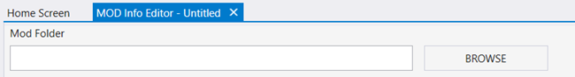
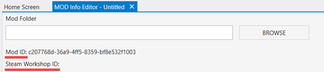

# Creating a Mod Package

After configuring a root folder, you can start to create mod packages.

To do that:

1. At the Home Screen tab of Excession, click CREATE.
1. This will open the new MOD Info Editor tab.
1. At the top, this tab displays the Mod Folder field with a BROWSE button. This field allows you to select the folder for your mod. After clicking BROWSE, you will see the standard Windows dialog that allows you to select an existing folder or, if necessary, create a new folder and select it as the mod folder.

Fig 1. View of the Mod Info Editor UI.

> [!WARNING] 
> You will ***not*** be able to change the mod folder after the creation of the mod. After the creation of the mod, the **Mod Folder** field will become read-only. So, please, choose the location for your mod carefully.

> [!NOTE] 
> If you select a mod folder that is outside the [root folder](../Setup/FolderStructure.md), its parent directory will be automatically added to the system as a new root folder, for the system to be able to find your mod.

4. Below this field, this tab displays the two fields with identifiers:
    - **Mod ID** – displays the identifier of the mod that is used by Excession and will be used by the target Halo title of the mod.
    - **Steam Workshop ID** – will be used to identify this mod package in Steam Workshop. At first, it is undefined, it will be displayed after upload of the mod package to Steam Workshop.

Fig 2. View of the identifiers within the Mod Info Editor UI.

5. To specify the mod properties, fill in other fields on the **MOD Info Editor** tab:

- **Title** – The title of your mod package.

- **Description** – The description of your mod package.

- **Mod Version** – The version of your mod in the following format: *\<Major_version>*.*\<Minor_version>*.*\<Patch_version>*. For example, **1.2.0**

- **Min. Game Version** – The minimum version of the *game* (target Halo title) required to use your mod, in the *\<Major_version>*.*\<Minor_version>*.*\<Patch_version>* format.

- **Max. Game Version** – The maximum version of the game (target Halo title) that can be used with your mod, in the *\<Major_version>*.*\<Minor_version>*.*\<Patch_version>* format. 

> [!NOTE]
> Values of the **Min. Game Version** and **Max. Game Version** fields will be used to check compatibility of the mod with the target game. Please note that correctness of these values will be checked during the identification of the mod (after its creation) by Excession and, also, using the same means, by the game itself. In case of the incorrect values, you will not receive any error during the mod creation itself, but you will receive the "***Mod does not support this version of the product (app)***" error by Excession during the identification of the mod (after **REFRESH**).

- **Game Title (Optional)** – The target Halo title of the mod (e.g. "Halo 3" for a mod targeted at Halo 3).

> [!NOTE]
> **NOTE #1**: **The Game Title (Optional)** field is optional. I.e., you are able to either select a blank value in this drop-down (do not select any Halo title) or explicitly specify that your mod is not targeted at any Halo title by selecting "None" in this drop-down. The result will be the same – your mod will not be targeted at the particular Halo title, which can be useful for some mods.

> [!NOTE]
> **NOTE #2**: Some properties of a mod are available only for mods targeted at the particular Halo title. These properties can be filled in only when this title is selected in the **Game Title (Optional)** field. Moreover, using the value of this field, the game itself will be able to identify that the mod is appropriate for it.

- **Campaign** section – This section allows you to add the content of the regular campaign to your mod, see [creating a "Campaign" Mod Package](../CreatingModPackage/CampaignMod.md) for details.

- **Multiplayer Maps** section – This section allows you add multiplayer maps to your mod, see [creating a "Multiplayer Maps" Mod Package](../CreatingModPackage/MPMapsMod.md) for details

- **Firefight Maps** section – This section allows you add Firefight maps to your mod, see [creating a "Firefight Maps" Mod Package](../CreatingModPackage/FirefightMapsMod.md) for details.

Additional information on specifying the properties of a map can be found [here](../CreatingModPackage/SpecifyingProperties.md).

> [!NOTE]
> You need to add content in one or more sections above (e.g. **Campaign**, **Multiplayer Maps**, etc.), since in these sections you will add the main content of the mod itself (maps, and so on).

- **Advanced panel** – This panel allows you to specify the advanced settings of the mod package.

- **Disabled** – No source components are required. I.e., this means that all shared files are expected to be local to the mod.

6. To save your changes, select **File > Save** or **File > Save All** from the main menu of Excession. 
