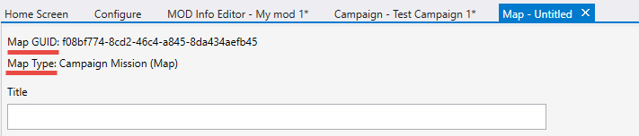
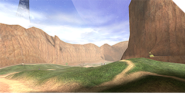
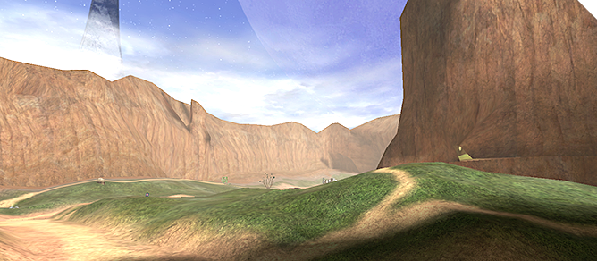
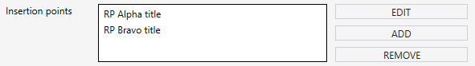
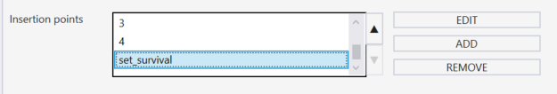

# Specifying Properties of a Map

When you add a map to a mod package (e.g. as a campaign map; or, as a multiplayer map; etc.) you do it in a unified way.

Particularly, when you initiate this process, the tool opens a new **Map** tab where you can specify map properties.

Most of the main properties of the map are the same regardless of its type. However, some properties do differ and are specific for maps of particular type.

Two fields at the top of the **Map** tab are read-only. Particularly, you cannot change:

- **Map GUID** – The automatically generated identifier of the map.

- **Map Type** – The type of the map. This type is also defined automatically, based on whether you are adding this map as a campaign map, or as a multiplayer map, or as a Firefight map.

    

    Fig 1. View of the Multiplayer Maps button in the Mod Info Editor.

Below go the main properties of the map that are the same for all types of the maps:

- **Title** – The title of the map.

- **Description** – The description of the map.

- **Scenario File Name** – The name and path to the of the ***.scenario*** *tag file* that was compiled to obtain the **.map** file of the level. This path needs to be specified relative to the **tags** folder (where all tag files are located in the Halo Editing Kit), without the **.scenario** file extension. Please note that the value of this field is neither the name of the **.map** file itself nor the path to it, it is the name and path to the **.scenario** tag file used for the **.map** file creation, and this difference is important.

    - Let's illustrate this difference and the process itself of an example:

        - During the process of your level creation (i.e. the creation of its tag files), you have created the **…/tags/levels/my_campaign/my_campaign_map1.scenario** tag file. It is the main tag file of your level.

        - After you have finished the level creation, you compile it (e.g using **tool.exe** or **tool_fast.exe**) to the **.map** file. After the compilation, you receive the **my_campaign_map1.map** file.

        - When you are creating a mod package in Excession and adding this map to it, you need to:

            - Put the **my_campaign_map1.map** file to the **maps** subfolder of your mod folder.

            - In Excession, when specifying properties of this map in the **Map** tab, specify "**levels/my_campaign/my_campaign_map1**" (without quotes) as the value of the **Scenario File Name** field.

            > [!NOTE] 
            > The current version of Excession does not check the existence of .map file or correctness of the Scenario File Name value. During the upload, Excession simply uploads all contents of the mod folder to Steam Workshop, without any validation of these aspects. So, please check the existence of all .map files and correctness of Scenario File Name values manually.

Below, you can add some images to the map properties:

- **Image for Thumbnail** – The image that will be used as thumbnail of the map. The recommended file size of this image is around 900KB. You can use the image below as a template for the thumbnail.

    

- **Large Image** – The image that will be used as the large image of the map. The recommended file size of this image is around 900KB. You can use the image below as a template for the large image.

    

- **Image for Loading Screen** – The image that will be shown as the loading screen for the map. The game needs to be able to display this image in the resolution of the game (when loading the map itself), and, because of that, it should be a high-resolution image (e.g. 1920x1080).

    > [!NOTE]
    > **NOTE #1**: To create a correct mod package and include all images in it, all images related to the mod must be located within the mod folder. I.e., you are not permitted to use images from other folders – in this case you will receive an error. Typically, all images of the mod package are stored in the **images** subfolder of the mod folder.

    > [!NOTE]
    > **NOTE #2**: All these images must be stored in the PNG (.png) format.

    > [!NOTE]
    > **NOTE #3**: For multiplayer maps and Firefight maps, you can also add an **Image for Top Down View**, see below.

Below that, Excession displays the set of expandable panels with properties that are specific for particular map types:

- **Multiplayer Map**

- **Firefight Map**

- **Campaign Mission (Map)**

Depending on the type of the map, the corresponding panel will appear expanded (automatically), all others will be locked and closed. See descriptions of these panels in the subsections below:

[Multiplayer Map properties](#multiplayer-map-properties)

[Firefight Map properties](#firefight-map-properties)

[Campaign Mission (Map) properties](#campaign-mission-map-properties)

[Adding Insertion Points](#adding-insertion-points)

To save your changes (after you have specified map properties), select File > Save or File > Save All from the main menu of Excession.

## Multiplayer Map Properties

The **Multiplayer Map** panel allows you to specify the following properties of a multiplayer map:

- **Allow Saved Films** – This option enables or disables the ability of players to save videos of their games on this map.

- **Image for Top Down View** – In the future versions of MCC, the specified image will represent this map in the list of the maps in the menu of the game. However, this functionality is currently in the development and is not publicly available. The recommended file size of this image is around 900KB.

- **Max Teams All Up (Applies across the board)** – The maximum total amount of teams that can play on the map. If you set this value to "**4**", then the maximum amount of teams will be 4 regardless of the selected game type. See **Max Team Category (Applies per category)** below also.

- **Max Team Category (Applies per category)** – (*Optional, see the note below*) This section contains a lot of fields corresponding to particular multiplayer game types (**Slayer**, **CTF**, and so on). Every such field allows you to specify the maximum total amount of teams that can play on the map in this *particular game type*.

    > [!NOTE]
    > You should limit the maximum total amount of players either by the **Max Teams All Up…** field or by the **Max Team Category…** fields. If you specify both the **Max Teams All Up…** and **Max Team Category…** values, then the **Max Teams All Up** value will have priority and the maximum total amount of players will be defined by it regardless of the selected game type.

- **Default Primary Weapon** – This drop-down allows you to select the default primary weapon that will be given to all players on the map. The names of the values in this list (starting with the ***damage_reporting_type*** prefix) are related to the internal mechanics of the game and define how the weapons are identified in the game and how they influence the statistics of the player. This drop-down list contains the full list of values, i.e. all values that are possible for this field in the game. Please note that these values are the *code names* (various e_damage_reporting_type values) and the specific *display names* can be different between each Halo title (e.g. Pistol vs Magnum). Values that can be used in practice (for particular Halo titles) are visually divided from unused values. (Actually, experienced modders may repurpose unused e_damage_reporting_type values in one of the Halo titles for their own new weapons.) And, even if you select one of the unused values here, nothing really bad will happen. 

    > [!NOTE]
    > **NOTE #1**: If you are creating a mod package for **Halo: CE**, then the **Default Primary Weapon** will be displayed not as a single drop-down list, but as a set of drop-down lists, allowing you to specify different default primary weapons for different modes of the game.

- **Default Primary Weapon in Forge** – This drop-down allows you to select the default primary weapon for all players on the map in Forge mode. See **Default Primary Weapon** above for details.

- **IMPORT MULTIPLAYER OBJECT TYPES** – This button allows you to import data from the **multiplayer_object_types.bin** file. This file contains an array of indices of tags that are used/available on the map. Different game variants require different resources (tags), so the data in this file affects the game variants (e.g. Slayer, Oddball, CTF, King Of Hill, Infection, and so on) that will be available for this multiplayer map. See Appendix B for details on the multiplayer_object_types.bin file and its generation using the modding tools.

> [!IMPORTANT]
> This field is only relevant when modding Halo Reach, Halo 2 Anniversary, and Halo 4.

> [!NOTE]
> **NOTE #1**: The name and the extension of this file must be exactly "**multiplayer_object_types.bin**" for the successful importing. **NOTE #2**: The **multiplayer_object_types.bin** file may be located outside the mod folder, since it won't be added to the mod package as the file – Excession will simply import values  **NOTE #3**: If the **multiplayer_object_types.bin** file is empty or undefined for the map, only the Infection game variant will be available for the multiplayer map.

## Firefight Map Properties

The **Firefight Map** panel allows you to specify the following properties of a Firefight map:

- **Allow Saved Films** – This option enables or disables the ability of players to save videos of their games on this map.

- **Image for Top Down View** – In the future versions of MCC, the specified image will represent this map in the list of the maps in the menu of the game. However, this functionality is currently in the development and is not publicly available. The recommended file size of this image is around 900KB.

- **Insertion Points** section – This section allows you to add information of insertion points of your Firefight map.

    > [!NOTE]
    > **NOTE on Insertion Points**: In Halo, the player can start playing on the map not from the very beginning, but from the particular point of the mission (e.g. "Alpha", "Bravo", and so on). The Firefight mode of the game also allows you to start from different starting locations on the same map. Thus, insertion points of the map specify these locations where players start their game on the map.

    > [!NOTE]
    > If your Firefight map is for **Halo 3: ODST**, you will need to set up an **Insertion Point** for Firefight specifically, you can also choose whether or not your Firefight map will record a saved film here. Halo: Reach, you do ***not*** need to set up **Insertion Points**.

    Adding an insertion point is performed in a unified way, see [Adding Insertion Points](#adding-insertion-points) below for details.

    After the properties of the insertion point are saved, it will appear in the **Insertion Points** section of the Firefight map.

    

    Fig 2. View of the current insertion points within the map.

After that, if necessary, you can edit the properties of the added insertion point. To do that, select it in the list and click **EDIT**. Or, you can remove it from the map (select it and click **REMOVE**).

- **Default Primary Weapon** – This drop-down allows you to select the default primary weapon that will be given to all players on the map. The names of the values in this list (starting with the ***damage_reporting_type*** prefix) are related to the internal mechanics of the game and define how the weapons are identified in the game and how they influence the statistics of the player. This drop-down list contains the full list of values, i.e. all values that are possible for this field in the game. Please note that these values are the *code names* (various e_damage_reporting_type values) and the specific *display names* can be different between each Halo title (e.g. Pistol vs Magnum). Values that can be used in practice (for particular Halo titles) are visually divided from unused values. (Actually, experienced modders may repurpose unused e_damage_reporting_type values in one of the Halo titles for their own new weapons.) And, even if you select one of the unused values here, nothing really bad will happen. 

## Campaign Mission (Map) Properties

The Campaign Mission (Map) panel allows you to specify the following properties of a map within the campaign:

- **Allow Saved Films** – This option enables or disables the ability of players to save videos of their games on this map.

- **Insertion Points** section – This section allows you to add information of insertion points of your Campaign map.

    > [!NOTE]
    > **NOTE on Insertion Points**: In Halo, the player can start playing on the map not from the very beginning, but from the particular point of the mission (e.g. "Alpha", "Bravo", and so on). The Firefight mode of the game also allows you to start from different starting locations on the same map. Thus, insertion points of the map specify these locations where players start their game on the map.

    Adding an insertion point is performed in a unified way, see [Adding Insertion Points](#adding-insertion-points) below for details.

    After the properties of the insertion point are saved, it will appear in the **Insertion Points** section of the Campaign map.

    

    Fig 3. View of the current insertion points within the map.

After that, if necessary, you can edit the properties of the added insertion point. To do that, select it in the list and click **EDIT**. Or, you can remove it from the map (select it and click **REMOVE**).

## Adding Insertion Points

To add an Insertion Point to the map properties:

1. In the **Campaign Mission (Map)** panel of a campaign map or in the **Firefight Map** panel of a Firefight map, in its **Insertion Points** section, click **ADD**.

2. In the appearing **Insertion Point** tab, specify the following properties of a new insertion point:

    - **Title** – The title of the insertion point.

    - Description** – The description of the insertion point.

    - Zone Set** – The identifier of the zone set of the insertion point (within the level itself). The format of this value depends on the target Title of the mod package:
        
        - For insertion points of **Halo 3** and **Halo 3: ODST** maps: this value is a number.

        - For insertion points of maps for ***all other Halo titles***: this value is a textual ID.

        > [!NOTE]
        > All resources of the level may be combined into different groups. The zone set defines the particular group of resources of the level. When the game switches between different parts of the level, the loading/unloading of the corresponding resources occurs. Thus, the zone set of the insertion point defines the resources that are necessary for loading to this location. Scenarios have a collection of zone sets. And every zone set has a corresponding id (or index) in this collection. For example, if you use a Halo 3 Editing Kit, you can view all zone sets of the level in Sapien – they are listed in the **Switch to zone set** drop-down (**Edit** > **Switch Zone Set** in the main menu, after opening of the level).

    - **ODST only** section – The properties if this section (listed below) are applied only in case of the ODST.

        - **Is Firefight** – If enabled means that this insertion point is related to Firefight mode.

        - **Return from Map GUID** – *(Optional field; not supported yet, see the Warning below)* This value sets the GUID of the map, from which the players return to this insertion point. During the campaign progress, the game can switch players from one map to another (perform a "flashback"). When the player is returned from the flashback (returns back from another map), they can be returned to the particular insertion point. This is possible if the **Return from Map GUID** value of this insertion point is equal to the Map GUID of the map the player returns from.For example, if there are two maps: A and B, and the player is switched to B after A and, after that, should return from B to A (to the particular insertion point within A), then you will need to set **Return from Map GUID** of this insertion point to the Map GUID of map B.

        > [!IMPORTANT]
        > If your Firefight Map doubles as a Campaign mission, you will need to add any **Campaign Insertion Points** that are indexed *before* the **Firefight Insertion Points** or else your map will fail to load properly.  

        > [!WARNING]
        > Currently, the support of this field by Halo titles is in the development and this field will not work for them. The support of this field will be added in the next versions of MCC.

3. To save your changes made in the **Insertion Point** tab, select **File** > **Save** or **File** > **Save All** from the main menu of Excession.
