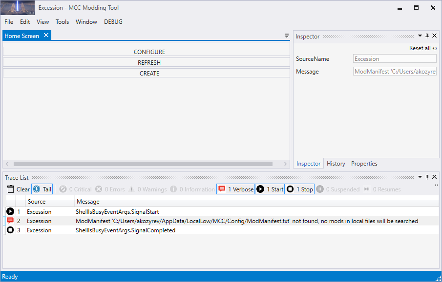
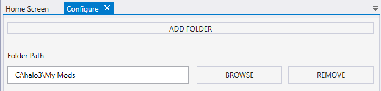

# Configuring Map Folder in Excession

Initially, at the first launch of Excession, it will not display any list of the mods. At the **Home Screen** tab, it will display only three buttons: **CONFIGURE**, **REFRESH**, and **CREATE**.

Fig.1. The UI of Excession at the first launch

The **CONFIGURE** button allows you to configure folders where Excession will look for mods.

You can configure them by doing the following:

1. Click **CONFIGURE**.

1. To add a root folder (see [folder structure](../Setup/FolderStructure.md)) with mods to Excession configuration, click **ADD FOLDER**.

1. After that the new list entry corresponding to a new root folder will appear. To assign it to particular root folder with mods, click **BROWSE** next to this list entry and select the target root folder in the appearing dialog. After that, the path to this folder will be displayed within this list entry.

Fig.2. View of the configure option ui.

4. By clicking **ADD FOLDER** (and selection of the folder via **BROWSE**), you can add as many root folders as you like. For example, you can add a root folder for your mods for Halo 3 and a separate root folder for your Halo CE mods.

5. If you want to remove some of root folders, click **REMOVE** next to them.
To save your changes to the tool configuration, select **File > Save** or **File > Save All** from the main menu.

> [!NOTE]
> **NOTE #1**: When the tool identifies and displays mods, it searches for them within the configured root folders. During this process, it assumes that all mod folders are contained directly within the root folder (i.e. not below the 1st level of folders within the root folder). If they located deeper in the folder hierarchy, the tool will not find them. 

> [!NOTE]
> **NOTE #2**: During the process of [creating of a mod package](../CreatingModPackage/CreatingHome.md), if you select a mod folder that is outside the root folder, its parent directory will be automatically added to the system as a new root folder, for the system to be able to find your mod.
