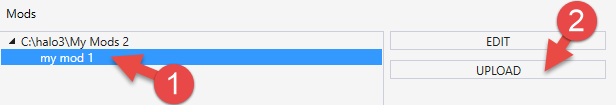

# Uploading a Mod Package

> [!WARNING]
> To be able to upload a mod to Steam Workshop, you need to be logged into your Steam client and have Steam client up and running. If you are not logged into it or it is not launched, you will not be able to upload mods via Excession – the **UPLOAD** button will be dimmed in this case and you will see a corresponding message in the UI of Excession.

After you have finished the creation of your mod package, you can upload it to Steam Workshop.

To do this:

1. In the **Home Screen** tab, select the necessary mod package in the **Mods** list.

2. Click **UPLOAD** next to the list of mods.

    

    Fig 1. View of the your selected mod and the Upload button.

3. In the appearing **Upload** tab, do the following:

    - Ensure that the **Title** and **Description** of the mod package are correct. If you need to edit them, stop the uploading process and correct them while editing the mod package.

    - If necessary, in the **Choose Image for Mod…** field, select the image that will represent your mod in Steam Workshop. (This image is optional).

    > [!NOTE]
    > This image must be in a PNG or JPG format. Its size must be not greater than 1MB. However, this image can be stored outside the mod folder, since it will not be included into contents of the mod package and will be uploaded separately.

    - Select the "**I have read and accept the terms of the Steam Workshop Contribution Agreement**" option once you have read the documents. You can view the FAQ and the Agreement by clicking the corresponding buttons below this option.

4. Click **UPLOAD**. (If it is dimmed, launch Steam client and log into it, see **WARNING** above.)

5. After that, Excession starts uploading your mod package to Stream Workshop. After the uploading is finished, you will be able to find it in Steam Workshop. For example, you can locate it within the list of your mods at **[Your Profile] > Workshop Items > Halo: The Master Chief Collection**.
