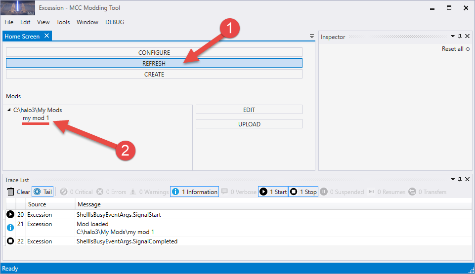

# Viewing and Editing a Mod Package

After you have finished the creation of your mod package and have saved all its contents, you can click the **REFRESH** button in the **Home Screen** tab of Excession.

This will refresh the list of mods visible to the tool and, if your mod package is correct at least partially, it will be displayed there.

Fig 1. View of the Home screen of the Exession Tool, highlighting the Refresh button and the list of your mods.

Along with that, you can check the list of errors, warnings, and notification messages displayed in the log within the **Trace List** panel. If your mod was not found by Excession or has any issues, there will be errors or warnings there.

To view the detailed information about a log entry, select it within the **Trace List** panel and view the information displayed in the **Inspector** panel.

To edit a created mod, select it in the **Mods** list, and click **EDIT** next to the list of mods. The hierarchy of tabs corresponding to various components of a mod package and their UI during editing is absolutely the same as during their creation.
