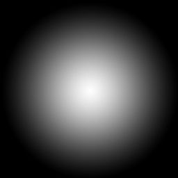
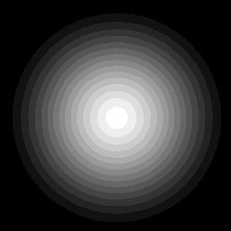
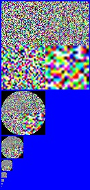

# Bitmaps

A bitmap is any image file used in the game. On the data side, the image file must be in a TIF (.tif) format. It gets converted into a .bitmap tag which can be used in a variety of ways in the game - 2D textures, 3D textures (height or bump maps), cube maps (environment maps), sprites or interface bitmaps.

Bitmap data must be:

- TIF format

- dimensions in powers of two except sprites and interface bitmaps

- does not have to be square (ie, can be 32x512 or any other dimensions that are powers of two)

- 4x4 pixels or greater (2x2 causes Tool to assert)

- no layers

- in folder named “bitmaps”

- other types of bitmaps (.psd, .jpg, etc) will be ignored

- subfolders will be ignored as well as the contents (even if it is a .tif file)

Bitmap tags must be created before the type, compression or usage can be set. You can create a new tag in Guerilla or you can simply import the bitmap and then you can set it's attributes. Either way, you then have to import (or re-import) the bitmaps for any of the settings to take effect.

- **The settings in the tag only affect the bitmap as it is imported; it has no effect on a tag except at time of import.**

Unlike other Tool commands, you must specify the actual bitmaps directory and not just the parent folder. This is because there can be multiple bitmaps in a folder and you want them to retain their own unique names.

## BITMAP TYPES OVERVIEW

**2D Textures** - Ordinary image file for textures and height maps (sometimes called bump or normal maps).

Fig 1. Flat 2D Texture

**3D Textures** - Used for plasma effects and spherical light falloff. 3d textures are a “stack” of bitmaps that describe a volume:

Fig 2. "stacked" 3D Textures

**Cube Maps** - Environment or reflection maps.

Fig 3. A cubemap.

**Sprites** - Sequence of images for creating bitmap 'movies' - usually used in effects.

**Interface Bitmaps** - Bitmaps used in the UI.

## COMPRESSION

Bitmaps are compressed using one of six compression formats. Each one has benefits and drawbacks. You want to have the smallest file size possible while still achieving the intended visual effect.

**DXT Compression**

In all of the DXT compression schemes the colors are compressed the same way - the only difference is in how the alpha channel is dealt with. DXT compressed textures are divided into 4x4 pixel blocks and then each block is reduced independantly to two colors. Those two colors are combined to create (as closely as possible) each of the 16 pixels in the block.

 

Fig 4. Original 8 x 8 pixel .tif (left) and DXT compressed (right).

**Compression Examples**

Here's the sample file used in the following examples:

 

Fig 5. original .tif file - RGB (left) and Alpha (right) **250kb**

**Compressed with color-key transparency: DXT1**

With DXT1 the alpha channel is compressed to simple black and white and used to create a key color (0) in the RGB. This means that anywhere the alpha = 0 (black), the diffuse color = 0, too.

**DXT1 is good for solid blocks of simple colors without alpha information.**

 

Fig 6. with DXT1 compression 42kb

> [!NOTE]
> Anywhere the alpha channel = 0, the diffuse channel will be BLACK.

**Compressed with explicit alpha: DXT2/3**

DXT2/3 adds 4-bit (16 color) alpha to DXT color compression (see above).

**DXT2/3 is good for solid blocks of simple colors with sharply contrasting alpha information.**

 

Fig 7. with DXT2/3 compression 85kb

**Compressed with interpolated alpha: DXT4/5**

DXT4/5 adds 4-bit gradated alpha to DXT color compression (see above). It uses 3-bit alpha (8 colors) and then gradates between those colors using a fourth bit.

**DXT4/5 is good for solid blocks of simple colors with smoothly gradated alpha information.**

 

Fig 8. with DXT4/5 compression 85kb

**16-bit color**

Uses 16 bits per pixel. If there is no alpha, the color is: red = 5-bit (32 colors), green = 6-bit (64 colors) and blue = 5-bit (32 colors). With 1-bit alpha (simple black or white), the color is: alpha = 1-bit (2 colors), red = 5-bit (32 colors), green = 5-bit (32 colors) and blue = 5-bit (32 colors). With greater than 1-bit alpha (grayscale), the color is: alpha = 4-bit (16 colors), red = 4-bit (16 colors), green = 4-bit (16 colors) and blue = 4-bit (16 colors).

**16 bit color is good for strongly contrasting color and alpha that does not compress well.**

 

Fig 9. 16-bit color 170kb

**32-bit color**

Uses 32 bits per pixel, the same as a standard Photoshop file. Note that the alpha channel uses up 8 bits whether you use it for anything or not. Alpha = 8-bit (256 colors), red = 8-bit (256 colors), green = 8-bit (256 colors) and blue = 8-bit (256 colors).

**32 bit color is the most expensive setting and should be used sparingly. Used for height maps, which are then internally converted to a special palletized format.**

 

Fig 10. 32-bit color 341kb

**Monochrome**

Monochrome assumes a gray-scale “color” map with or without alpha. Uses either 8 or 16 bits per pixel, depending on the presence of an alpha channel.

**Monochrome is good when you have fine gray-scale information that you need to display. Check out DXT4/5 also, which can produce similar results at a lower cost.**

 

Fig 11. monochrome 170kb

## USAGE

Usage determines how mipmaps are generated.

**Alpha Blend**

Use for alpha-blended textures. Zero alpha pixels are ignored in the downsampling so that the transparent color doesn't bleed (the border between zero and non-zero alpha pixels stays the same).

 

Fig 12. Alpha Blend

**Default**

Normal downsampling for mipmaps

 

Fig 13. Default

**Height Map**

Height maps use colors to represent vectors so downsampling has to be handled in a different way.

 

Fig 14. Height Map

**Detail Map

Color fades to gray, set by “detail fade factor” in tag. In this example detail fade factor= .75; if it was set to “1” then the first mipmap would be all gray.

 

Fig 15. Detail Map

**Vector Map**

Similar to Height Maps.

 

Fig 16. Vector Map

## More information on bitmaps can be found in these additional pages.

### [Bitmap Plates](../Bitmaps/BitmapPlates.md)

### [Import Bitmaps into the Game](../Bitmaps/BitmapImport.md)
