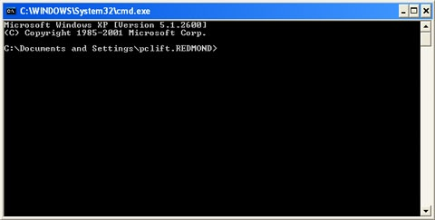
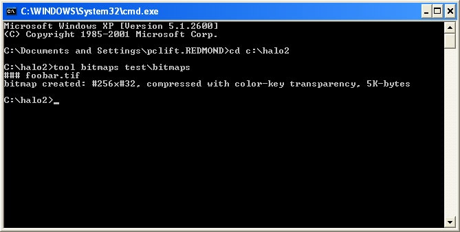
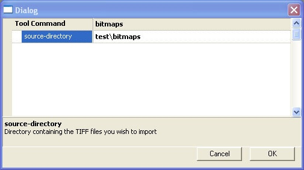
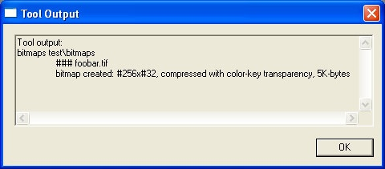

# Bitmaps - Importing Bitmaps Into the Game

This page will show you how to import bitmaps into the game using either a command line interface or Guerilla and show you how to take advantage of the various compression schemes and formatting available.

> [!IMPORTANT] 
> Screenshots are taken from the developer build of Halo 2, some menus will be slightly different in the H2EK.

## Importing Bitmaps Using a Command Line Interface
Bitmaps are imported using Tool. You can use the guerilla’s interface to run Tool, but it's still running the following steps.

In this example, we're going to import the bitmaps that are in the directory **halo2\data\test\bitmaps**.

Open a command prompt by going start -> run and typing “cmd” in the open window.



Fig 1. Command Prompt Window.

Navigate to your working game directory by typing “cd c:\halo2” (if your directory is named differently or located on a different drive change this accordingly).

We're going to use the “bitmaps” function of tool.exe (which is in your Halo 2 directory) on all of the bitmaps in the folder **halo2\data\test\bitmaps**.

Type in the command:

```
tool bitmaps test\bitmaps
```

...and hit any key named “enter”.



Fig 2. tool bitmaps command.

Tool found one valid bitmap, named foobar.tif, in the folder. It successfully created a bitmap that was 256 pixels wide by 32 pixels high and compressed it with color-key transparency. It created a tag called foobar.bitmap in the halo2\tags\test\bitmaps folder.

## Importing Bitmaps Using Guerilla’s Interface

In this example, we're going to import the bitmaps that are in the directory **halo2\data\test\bitmaps**.

Open Guerilla.

Under “File”, click on “Run Tool” (ctrl+shift+T)


Fig 3. Run Tool option in Guerilla.

A Dialog box will come up. Set the Tool Command to **bitmaps** and source-directory to **test\bitmaps**.

Click on the “OK” button.



Fig 4. Run Tool dialog window.

You'll see a command prompt appear on your screen and automatically run through the same steps as in the previous example. When it's finished it will leave a Tool Output window which lists what tool actually processed, as well as any errors that it might have encountered.



Fig 4. Run Tool output window.

In this case, Tool found one valid bitmap, named foobar.tif, in the folder. It successfully created a bitmap that was 256 pixels wide by 32 pixels high and compressed it with color-key transparency. It created a tag called **foobar.bitmap** in the **halo2\tags\test\bitmaps** folder.
