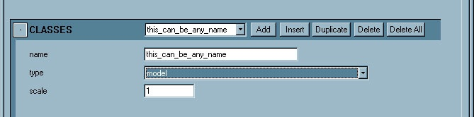
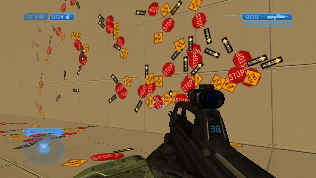

# H2 Decorators - Floating Decals

A **floating decal** is a sprite that is placed on the surface of BSP geometry in Sapien. Source is from bitmap only - there is no user-defined geometry. The default size of the final sprite in game is 256 pixels per world unit.

- Source: .tif bitmap file (sequenced sprite plate)

- Import: use tool: bitmaps (set .bitmap = sprite, sprite_usage for blend function)

- Creates: .bitmap tag (.decorator_set must be created or edited seperately)

- Shader: use

    - decorator_decal_paint.shader_template for alpha blended effects

    - decorator_decal_paint_additive.shader_template for additive

    - decorator_decal_paint_multiply.shader_template for multiplicative

- Lighting: lit by lightmaps from underlying object (uses ovelay), lit by dynamic lighting from underlying object (uses ovelay)

- LOD: fade w/distance

> [!NOTE]
> Will accept decals

## SETTING UP THE SPRITE PLATE

A plate is a specially set up .tif file which creates a single .bitmap tag that can contain multiple images. These images are in a single sprite sequence and can be accessed from the .decorator_set tag by using the **sprite index**.

Sprites can be any size - dimensions do not have to be in powers of two. Remember, the default size of the final sprite in game is 256 pixels per world unit.

For this example, we're going to use a plate which includes three images and an associated alpha (click image to see it magnified, for clarity):

|Diffuse|Alpha|
|---|---|
||

Note that the blue background is essentially one-bit alpha, plus there is alpha blending in the alpha channel.

The .tif file can be imported as a .bitmap tag using the regular Tool or Guerilla process.

## EDIT THE .BITMAP TAG IN GUERILLA

Once the .bitmap tag has been created, open the tag in Guerilla and set **type = “sprites”**. Re-import, and the .bitmap tag will look like this:

Fig 1. .bitmap Tag in Guerilla.

You can view the **sprite index** near the bottom of the .bitmap tag. The only way to relate the index to the image is to count them - there is no visual feedback for which one is which.

Fig 2. The Sprite Index in the .bitmap Tag.

In this case, the DEAD END sign is index #0, the STOP sign is index #1 and the ONE WAY sign is index #2.

> [!NOTE]
> This is **NOT** the order of the original plate!

## SETTING UP THE .SHADER TAG

To create the .shader tag: in Guerilla select **File -> New** and set **Group = “shader’**. This will create an empty .shader tag.

For decorator templates, use only those tags in shaders\shader_templates\decorators. For floating decals, use:

- decorator_decal_paint.shader_template for alpha blended effects

- decorator_decal_paint_additive.shader_template for additive

- decorator_decal_paint_multiply.shader_template for multiplicative

For this case, we’ll use **decorator_decal_paint**. Once you have set up the .shader tag, add the reference to the .bitmap tag set up in the previous step. Then it will look like this:

Fig 3. Shader tag with the decorator_decal_paint Template.

> [!NOTE]
> None of the standard parameters apply to decorators.

## SETTING UP THE .DECORATOR_SET TAG

To create the .decorator_set tag: in Guerilla select **File -> New** and set **Group = “decorator_set’**. This will create an empty .decorator_set tag.

### SHADERS BLOCK

In the SHADERS block, choose **Add** and then reference the .shader tag.

Fig 4. Shaders Block.

Next, you’ll need to add at least one **decorator class**. Decorator sets can contain multiple classes but for this example we’ll make just one class: **floating decal**.

### CLASSES BLOCK

In the CLASSES block, choose **Add**. The **name** field is what this set of decorator models will be shown as in Sapien.

Fig 5. Classes Block.

Next we’ll add one entry in the PERMUTATIONS block for each sign. Let’s start with the **DEAD END** image, which is index # 0.

### PERMUTATIONS BLOCK

In the PERMUTATIONS block, choose **Add**. The **name** field is what this particular instance will show as in Sapien. Note that the flags “align to normal” and “upright” do not apply to floating decals. The **shader** field will allow you to pick any shader defined at the top of the tag in the SHADERS block. For this example, **dead_end** will fade at a close distance. It is referenced by index #0. It has a distribution weight = 1; this will be compared to the weight of the other permutations when we are putting down the **foo** decorator set in a random application.

Fig 6. Permutations Block.

Repeat this process for **STOP** (index #1) and **ONE WAY** (index #2). Remember that you can use the “Duplicate” button to make this process easier.

## READY FOR PLACEMENT!

This decorator set is now ready to be placed in Sapien.

Fig 7. Decals visible in Sapien.
