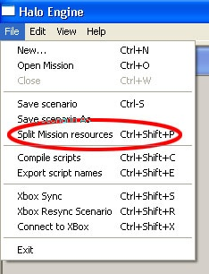
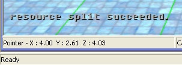
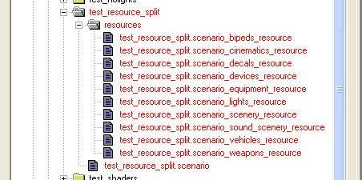

# How-To - Split Scenario Resources

A .scenario file can be split up into components so that several people can work on different sections of the game at the same time. For example. with a split mission one person could be working on placing characters while another was working on placing scenery.

This article shows you how to split up a scenario file into 11 scenario resource files.

Fig 1. A single scenario resource file.

1. Open the scenario in Sapien.

2. Under the File menu you'll find a command for Split mission resources. Click on that to split the scenario.

Fig 2. File > Split Mission Resources.

After a second you should see a message indicating success in the lower left corner.

Fig 3. Resource Split Succeeded message.

In the directory that contains the scenario you'll see a new folder called resources. This contains all of the new resource files.

Fig 4. Newly created resource files.

MAKE SURE YOU ADD THE RESOURCE FILES TO THE DATABASE - don't check in the converted .scenario file without adding the new resource files, too.

> [!WARNING]
> Once a file has been split it cannot be reassembled!

### **scenario_biped_resource**

palette and instances of bipeds

### **scenario_cinematics_resource**

palette and instances of flags, camera points and recorded animations

### **scenario_decals_resource**

palette and instances of decals

### **scenario_devices_resource**

palette and instances of all device groups, machines, controls and light fixtures.

### **scenario_equipment_resource**

palette and instances of equipment

### **scenario_lights_resource**

palette and instances of lights (does not include light fixtures).

### **scenario_scenery_resource**

palette and instances of scenery

### **scenario_sound_scenery_resource**

palette and instances of sound scenery

### **scenario_vehicles_resource**

palette and instances of vehicles

### **scenario_weapons_resource**

palette and instances of weapons
