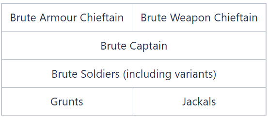

# Leadership

The aim of the leadership system is to show the player a more rigid command hierarchy within the AI characters. The majority of this will be manifested in Covenant troops, but it is applicable for all characters, for example the marines. The leadership system looks to formalise the combat cycle somewhat, and provide variation from standard encounters with no leadership present. Additionally it introduces a new set of behaviours which indicate that an encounter has been broken, again increasing the variety of encounter mechanics without requiring increased variations in character types.

## **Who's in charge?**

When a group of characters shares an objective, the highest ranked character in that group will be assigned the leadership of all the other characters in that objective. This assignment is decided based on rank levels specified by designers, and typically the hierarchy looks something like this.

If any of the higher levels are present, they will take command. If more than one of the highest level is present, one will be chosen as the leader and the other will be considered "peers". Everyone else will be considered "followers".

The following table lists the leadership rank and scariness value assigned to all of the .character tags.

Rank and Scariness

|Character|Leadership Rank|Scariness|
|--|--|--|
|Brute|50|4|
|Brute Chieftain|100|6|
|Brute Jumppack|NA|NA|
|Brute Major|75|5|
|Brute Soldier|0|3|
|Brute Stalker|NA|NA|
|Brute Tracker|NA|NA|
|Bugger|0|0|
|Cortana|0|0|
|Dervish|NA|NA|
|Elite|0|4|
|Elite Councilor|NA|NA|
|Elite Honor Guard|NA|NA|
|Elite Major|NA|NA|
|Elite Ranger|NA|NA|
|Elite SpecOps|NA|NA|
|Elite SpecOps Commander|NA|NA|
|Elite Stealth|NA|NA|
|Elite Stealth Major|NA|NA|
|Elite Ultra|NA|NA|
|Elite Zealot|NA|NA|
|Flood Infection|0|0|
|Flood Pureform|0|4|
|Flood Pureform Ranged|0|4|
|Flood Pureform Stalker|0|4|
|Flood Pureform Tank|0|4|
|Flood Carrier|0|4|
|Flood Carrier Major|NA|NA|
|FloodCombat Elite|0|8|
|FloodCombat Elite Shielded|NA|NA|
|FloodCombat Elite Weak|0|8|
|FloodCombat Human|NA|NA|
|FloodCombat Human Weak|NA|NA|
|Grunt|0|0|
|Grunt Heavy|NA|NA|
|Grunt Major|NA|NA|
|Grunt SpecOps|NA|NA|
|Grunt Ultra|NA|NA|
|Guardian|0|16|
|Hunter|0|16|
|Hunter Shielded|0|20|
|Jackal|0|0|
|Jackal Major|NA|NA|
|Jackal Sniper|NA|NA|
|Marine Crewman|0|0|
|Marine|0|3|
|Marine Dress|NA|NA|
|Marine Female|NA|NA|
|Marine Johnson|100|3|
|Marine Johnson Boss|NA|NA|
|Marine Johnson Dress|NA|NA|
|Marine Massive|NA|NA|
|Marine ODST|0|4|
|Marine |50|3|
|Marine Wounded|NA|NA|
|Masterchief|0|7|
|Miranda|0|4|
|Monitor|0|0|
|Prophet of Truth|0|4|
|Sentinel Aggressor|0|4|
|Sentinel Aggressor Eliminator|NA|NA|
|Sentinel Aggressor MajorNA|NA|
|Sentinel Aggressor MP|0|4|
|Sentinel Constructor|0|0|
|Sentinel Enforcer|0|16|

## **Leadership Role**

When a character is in a leadership role, their basic aim is to stick near the back of the encounter and direct the action until all the followers are dead, at which point the player will engage the leader providing a mini boss battle. Typically the leaders will be Brute Chieftains, who will have special attacks and exciting weapons.

It should be possible to identify which character is the leader not only by their appearance but also by their positioning and the positioning of their followers with respect to them. The leader is given a specific subset of firing positions which he uses for his movement, which should be towards the back of the encounter and near any "objectives" that the group of enemies are protecting, such as the door through which the player must progress. Followers should form up in front of the leader, spreading out in a fan protecting them from attack.

Having a leader also formalizes the combat cycle of the group somewhat. There will be a pause before engaging, waiting for the leader to order his minions to attack. Similarly the leader will order his followers to search for the target, and to uncover the target using a barrage of grenades.

## **Breaking the Encounter**

One of the key features of the leadership behavior is the ability to break a pack of enemies. Should the player succeed in killing the leader prematurely, his followers should let out wails and then break. This "breaking" is indicated in different ways depending on the character type.

- **Brutes**, *Scatter*. Any Brutes who are broken should flee for cover, or if in close proximity to the target they will charge and melee the attacker. After a few seconds they will emerge from cover and continue attacking as normal.

- **Grunts**, *Flee*. Broken Grunts will turn tail and flee for their lives, searching for cover or in the absence of cover they will just continue bumbling around wildly. Once they are no longer threatened they will calm down and continue attacking as normal.

- **Jackals**, *Huddle*. Jackals will form a huddle when broken, in which they will gather round a single central position and crouch down behind their shields firing. Given the concentrated firepower these huddles are potentially very dangerous to a careless target, but a single well placed grenade or a quick meleeing spree will sort everything out. Once they are no longer threatened they will break the huddle and continue attacking as normal.

## **Squad Patrol**

If you have a group of different units who are patrolling as a group, and some of those units are faster than others, this AI feature will have the faster units slow their pace so they don't get too far ahead of the slower units.
