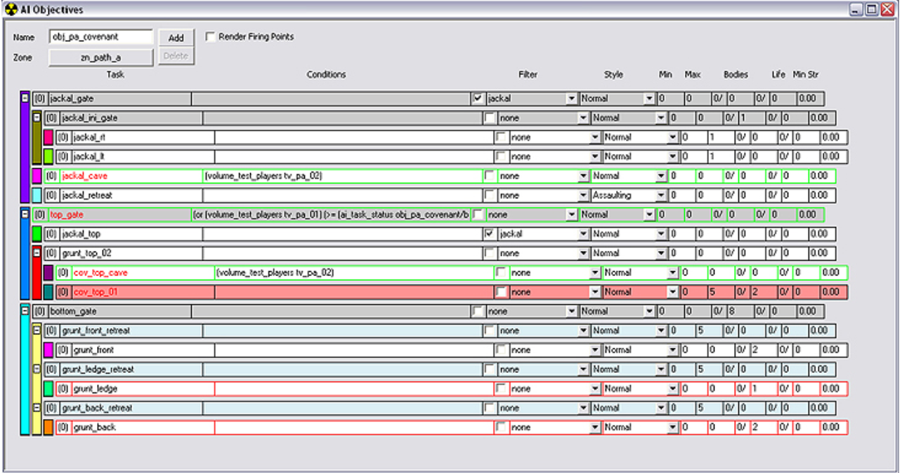

# Objective Window Color Key

Below is an explanation of what all of the various colors in the Objective window (see Figure 1) mean:

- **Red Background:** task is DISABLED
- **Blue Background:** task is a single-use task
- **Grey Background:** task is a Gate Task
- **Red Outline:** task is flagged as Latch Off
- **Green Outline:** task is flagged as Latch On

Figure 1 - The Objective Window.
