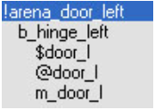
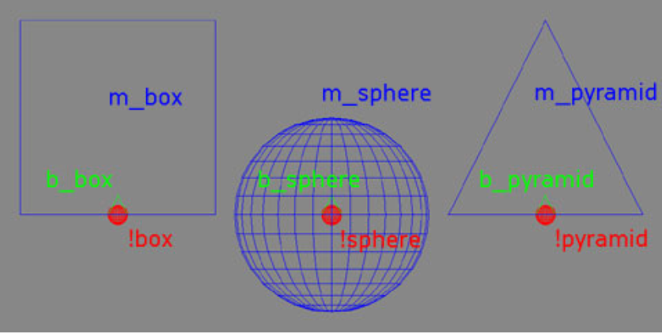

# Bulk File Import and Export

Using the bulk file export and import tools is a quick way to export all the pieces of a model from 3ds Max and then import and/or create the tags for them in Guerilla. In addition, the bulk file tools allow you to set up multiple objects within a single 3ds Max file and export (and import) them all at the same time.

The process looks something like this:

Node naming conventions

- !name— Bang Node/World Node
- b_— Frame node
- bip_— Frame node
- frame_— Frame node
- bone_— Frame node
- @name— Collision
- $name— Physics
- name (no symbol)— Render

Models are created in 3ds Max using our standard node structure: A world node (bang node, !), a root (or frame) node (named with a b_ ), render geometry, collision geometry (specified by using the @ symbol in the name), and physics geometry (specified with a $ in the name). See Figure 1 for an example.



Figure 1 - The correct node structure for an object in 3DS Max

More than one model can be created in the same 3ds Max file using our standard node structure. Each model needs to have its own world node (bang node) for the .jmi file to sort them into the correct .jms files and sub-folders. See Figure 2 for an example.



Figure 2 - A 3DS Max file with multiple models correctly named

Once the models have been created, they are exported to a .jmi file. Inside the .jmi are instructions as to where the separate .jms files should be located for each model and part.

> ![Note]
> You can export a single model from a bulk file by selecting the bang node (named with a !) of the model you want to export, and then choosing **Export Selected** from the file menu in 3ds Max.

## Bulk Export from 3DS Max and converting to .jms

### Step-by-step bulk file export

1. Create a model in 3ds Max with several separate structures for the Render model, Collision (@ symbol in front of name), and Physics ($ in front of name).
2. Be sure you have a world node (! symbol in front of name) for the object that is named what you want the object to be named after the import.
3. From the 3ds Max File menu, select **Export**.
4. Navigate to the location you want to export the files to and select .FBX as the type.

### Convert to .jms using Tool

1. Launch the Tool.
2. Run the following command:

```
tool fbx-to-jms render "[file path to .fbx file]" "[file path to save].jms"
```

- For example: tool fbx-to-jms render " F:\,masterchief.fbx" "F:\masterchief.JMS"

There are additional tool command associated with this listed below:

- render,collision,physics-or-all - Sets the type of geo this FBX is for. Use either render, collision, physics, or all only. The geo class set will determine what geometry gets exported from the JMS
- fbx - An absolute filepath to a valid FBX file.
- jms - An absolute filepath that includes name and extension to write the output to.

## Bulk Import Using Tool

### General information about importing bulk files using Tool (within Guerilla):

- Files are most easily imported using the bulk-import-model-folder command. However, there are a few other tool commands that you may find more useful depending on what you're trying to do. See the bottom of this document for a complete list of commands.
- When a .jmi file is imported, Tool creates render_model, physics_model, collsion_model, and .model tags for the new object. In most cases, you'll have to create the type tag yourself (whether it's .crate, .scenery, etc). See below for a complete list of the bulk import commands and what they do.
- When the files are imported, Tool automatically gives the new tags the same name as the subfolder they are located in.

### Step-by-step bulk file import:

- Export your bulk files from 3ds Max.
- Launch Guerilla.
- From the Tools menu, select Run Tool Command (or press shift-ctrl-t).
- Select the bulk-import-model-folder command from the All commands list.
- Go to the Source Directory box of the dialog, click on the ellipses button (...) and choose the location of your .jmi file.
- Click the Run Tool button. The import process will create .render_model, .physics_model, .collsion_model, and .model tags for the new object.

## Bulk import tool commands

- **Bulk-render** — Imports all render models from a specified .jmi file.
- **Bulk-physics** — Imports all physics models from a specified .jmi file.
- **Bulk-collision** — Imports all collision models from a specified .jmi file.
- **Bulk-import-model-folder** — Imports all model files from a specified folder. Converts .jms files for render, collision, and physics models and opens or creates .model tag and links everything up correctly.
- **Bulk-import-scenery-folder** — Imports all model files from a specified folder. Converts .jms files for render, collision, and physics models and opens or creates .model tag and links everything up correctly then opens or creates .scenery tag and links everything up correctly.
- **Bulk-import-crates-folder** — Imports all model files from a specified folder. Converts .jms files for render, collision and physics models and opens or creates .model tag and links everything up correctly then opens or creates .crate tag and links everything up correctly.
- **Bulk-import-models** — Imports all model files from a specified .jmi file. Converts specified .jms files for render, collision, and physics models and opens or creates .model tag and links everything up correctly.
- **Bulk-import-scenery** — Imports all model files from a specified .jmi file. Converts .jms files for render, collision, and physics models and opens or creates .model tag and links everything up correctly then opens or creates .scenery tag and links everything up correctly.
- **Bulk-import-crates** — Imports all model files from a specified .jmi file. Converts .jms files for render, collision, and physics models and opens or creates .model tag and links everything up correctly then opens or creates .crate tag and links everything up correctly.
