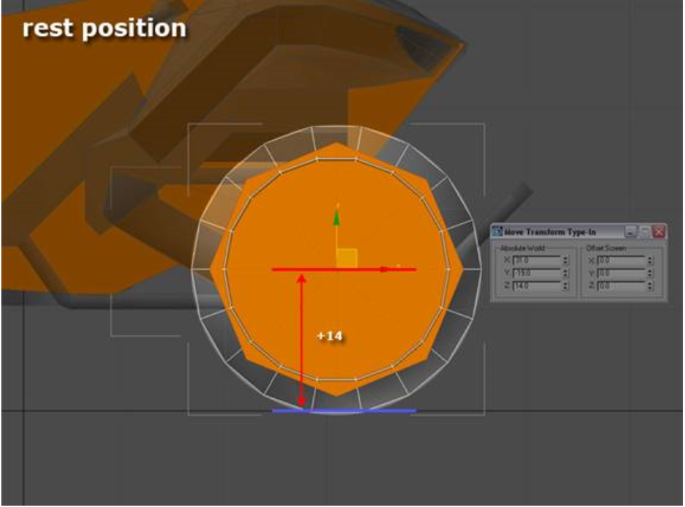
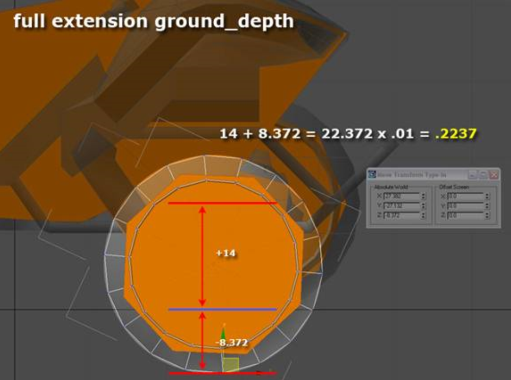
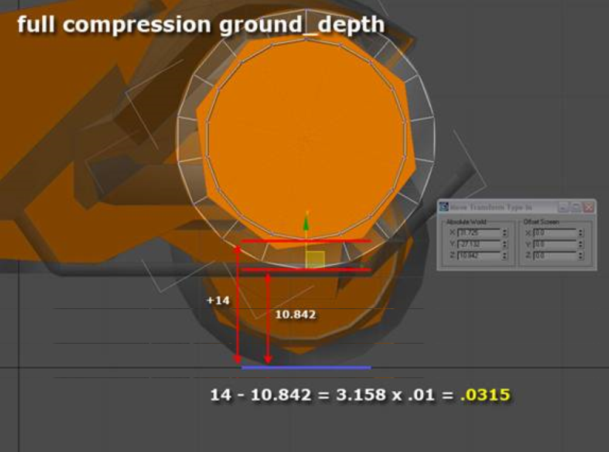
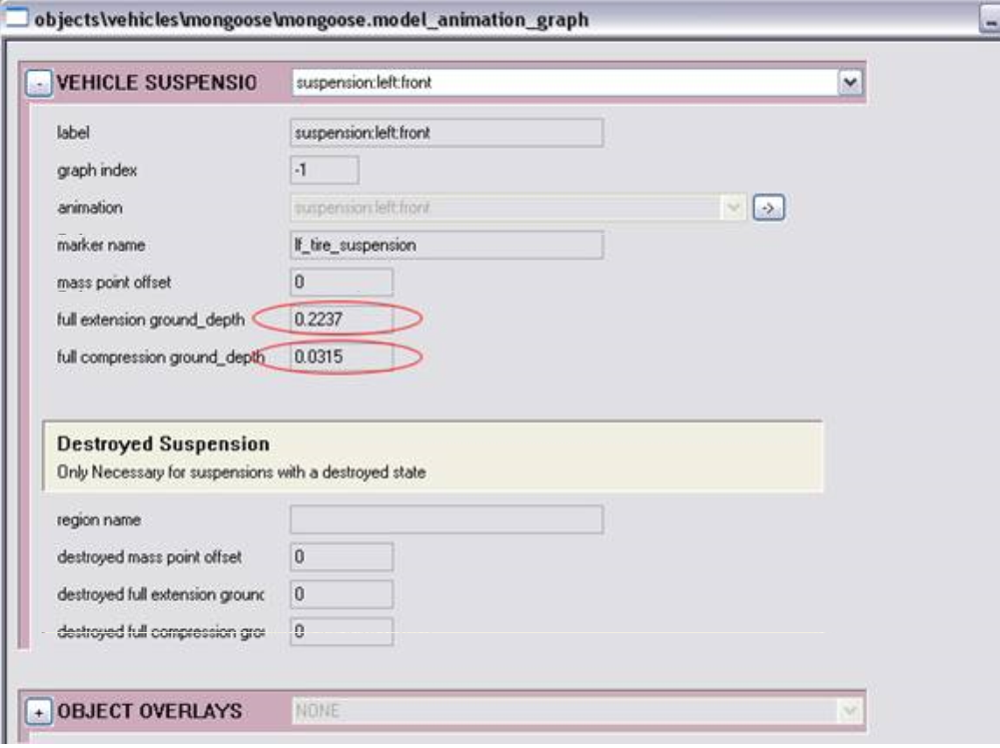

# Vehicle Animation

This article contains descriptions of the various types of vehicle animations used in the Halo engine and instructions on how to set up each one. All vehicles can be set up to use the animations described below— but vehicles don't need to have any of them to function in the engine.

> [!IMPORTANT]
> This section is built from the original documentation and is tailored for use in 3DS Max, but the important principles can be used in any 3d program.

## **General Instructions**

- Only place keyframes on nodes you plan to animate
- Export all animations to an animations directory for each vehicle
- All animations should be exported as .jmo files
- Create one 3ds Max file and .jmo for each animation

## **Vehicle Animations**

Halo 3 has nine distinct classes of vehicles (10 if you include turrets), each with their own set of animations.

### **Common Animations**

All vehicles may use these animations regardless of their class.

- *Suspension* — A vehicle may have any number of suspension animations setup in its animation graph

    - Example: suspension:left:back — .jmo animation, shows the tire or suspension part traveling from full compression to full extension. Additional data entry is also needed in the Vehicle Suspension section of the graph

- *Acceleration Screens* — Any vehicle may use acceleration screens to depict its reaction to accelerating. Typically only used for secondary motion on mounted turrets

    - Example: combat:acc_front_back — .jmo animation, shows the vehicle accelerating from one axis extreme to another

- *Opening and Closing* — Any vehicle may open and close as an operator enters and leaves. A vehicle is open when empty and closed when an operator is inside. Therefore, when a player gets into a vehicle it may close around him and then later open to let him out. Unmanned vehicles then remain open on the battlefield waiting for a new operator

    - Example 1: combat:closing — .jma animation, shows the vehicle closing around a driver. The last frame will be held to keep the vehicle closed

    - Example 2: combat:opening— .jma animation, shows the vehicle opening around to release a driver. The last frame will be held to keep the vehicle open

### **Prowler**

- *Steering* — Shows the vehicle turning left or right

    - Example: combat:steering— .jmo animation, shows the vehicle turning left to right

### **Ghost**

- *Steering* – Shows the vehicle turning left or right

    - Example: combat:steering— .jmo animation, shows the vehicle turning left to right

### **Chopper**

- *Steering* – Shows the vehicle turning left or right

    - Example: combat:steering — .jmo animation, shows the vehicle turning left to right

- *Ground Speed* — Shows the vehicle traveling forward

    - Example: vehicle:ground_speed— .jmo animation, shows the vehicle moving forward (usually one revolution of tires or treads).

### **Hornet**

- *Lift Aim Screens* — Aim screens for the left and right turbines

    - Example 1:combat:l_lift_aim — .jmo animation, aim screen for left turbine

    - Example 2:combat:r_lift_aim— .jmo animation, aim screen for right turbine

### **Warthog**

- *Steering* — Shows the vehicle turning left or right

    - Example: combat: steering — .jmo animation, shows the vehicle turning left to right

- *Ground Speed* — Shows the vehicle traveling forward

    - Example: vehicle:ground_speed — .jmo animation, shows the vehicle moving forward (usually one revolution of tires or treads)

- *Ground Speed Rear*— Shows the rear of the vehicle traveling forward (for dual axle vehicles)

    - Example: vehicle:ground_speed— .jmo animation, shows the vehicle moving forward (usually one revolution of tires or treads)

## **Vehicle Marker Keyframe Naming Conventions**

Vehicle markers placed for biped hand and foot IK follow this naming convention:

- #(seat name)\_(marker_name)\_(optional biped name)

For example:

- mauler_p_l_left_foot_brute

- wraith_g_left_hand (if all characters use the same hand position)

Also, seat names are based on the vehicle and seat type and are the same as the marker the seat animations are exported relative to.

## **Vehicle Suspension Animation**

To author suspension animation for a vehicle, you must determine the compression and extension of the tire required to make the animation function correctly.

First you need to author the animation. It's a simple three frame animation with the following:

- **Frame 0** — Rest position

- **Frame 1** — Full extension

- **Frame 2** — Full compression

Now determine the proper compression data for the tire— otherwise your animation won't work. See the steps below to do this...

### **Step 1**

Determine the rest position height from the ground. This is done by measuring the distance from the ground to the center of the tire marker. (typically, tire markers are located at the origin of the tire).

As you can see in Figure 1, the front right tire of the Mongoose is 14 Max units above the ground plane— .14 world units (or wu).

Figure 1 - Rest Position.

### **Step 2**

Determine the full extension of the tire:

1. Move to frame 1 of your animation and select the tire.

1. Choose a vert on the bottom of the tire.

1. Take the distance of this vert from the ground plane (for example, 8.372 Max units) and add this to the rest position value (e.g. 14), then take that value and multiply by .01 to get the world unit value. In this example, the full extension of the tire is .2237 wu from the rest position.

Figure 2 - Full Extension.

### **Step 3**

Determine the full compression of the tire:

1. Move to frame 2 of your animation.

1. Select the tire and choose a vert on the bottom of the tire.

1. Take the distance of this vert from the ground plane (for example 10.842 Max units) and subtract this from the rest position value (e.g. 14), then take that value and multiply by .01 to get the world unit value. In this case, the full compression of the tire is .0315 wu from the rest position.

Figure 3 - Full Compression.

### **Step 4**

After you have those two values, you need to plug them into the vehicle's animation graph. Scroll down to the vehicle suspension block to find this data. Enter the values in the appropriate fields circled in Figure 4.

You also need to input the marker name for that tire so the code has a proper reference point for the true rest position of the tire.

After you have completed this, you will need to calculate the values for the other tires.

Figure 4 - Vehicle Animation Graph.

## **Vehicle Seat Names**

|Vehicle|	Seat|	Seat Name|
|--|--|--|
|Banshee	|Driver	|banshee_d|
|Banshee	|Boarding D	|banshee_b_d|
|Banshee	|Boarding Left	|banshee_b_l|
|Banshee	|Boarding Right	|banshee_b_r|
|Banshee	|Boarding Front	|banshee_b_f|
|Brute Chopper	|Driver	|ghost_d|
|Brute Chopper	|Boarding	|ghost_b_l|
|Brute Chopper	|Boarding	|ghost_b_b|
|Brute Chopper	|Boarding	|ghost_b_g|
|Brute Chopper	|Boarding	|ghost_b_h|
|Brute Hovercraft	|Driver	|warthog_d|
|c_turret_ap	|Gunner	|c_turret_ap_d|
|Cov_Guntower	|Driver	|c_turret_ap_d|
|Creep	|Driver	|creep_d|
|Creep	|Gunner	|creep_g|
|Creep	|Passenger Left	|creep_p_l01|
|Creep	|Passenger Left	|creep_p_l02|
|Creep	|Passenger Left	|creep_p_l03|
|Creep	|Passenger Left	|creep_p_l04|
|Creep	|Passenger Left	|creep_p_l05|
|Creep	|Passenger Right	|creep_p_r01|
|Creep	|Passenger Right	|creep_p_r02|
|Creep	|Passenger Right	|creep_p_r03|
|Creep	|Passenger Right	|creep_p_r04|
|Creep	|Passenger Right	|creep_p_r05|
|Creep	|Small Cargo	|creep_sc01|
|Ghost	|Driver	ghost_|d|
|Ghost	|Boarding	|ghost_b_l|
|Ghost	|Boarding	|ghost_b_h|
|Ghost	|Boarding	|ghost_b_g|
|Ghost	|Boarding	|ghost_b_b|
|Gravity Throne	|Driver	|throne_d|
|Gravity Throne	|Boarding left	|throne_b_l|
|Gravity Throne	|Boarding right	|throne_b_r|
|h_turret_ap	|Driver/Gunner	|h_turret_ap_d|
|Insertion Pod	|Passenger	|insertion_pod_d|
|Longsword	|Driver	|longsword_d|
|Mongoose_x	|Driver	|mongoose_d|
|Mongoose_x	|Passenger	|warthog_p|
|Pelican	|Driver	|pelican_d|
|Pelican	|Passenger	|pelican_p_l01|
|Pelican	|Passenger	|pelican_p_l02|
|Pelican	|Passenger	|pelican_p_l03|
|Pelican	|Passenger	|pelican_p_l04|
|Pelican	|Passenger	|pelican_p_l05|
|Pelican	|Passenger	|pelican_p_r01|
|Pelican	|Passenger	|pelican_p_r02|
|Pelican	|Passenger	|pelican_p_r03|
|Pelican	|Passenger	|pelican_p_r04|
|Pelican	|Passenger	|pelican_p_r05|
|Pelican	|Gunner	|pelican_g|
|Pelican	|Large Cargo	|pelican_lc|
|Pelican	|Entry	|pelican_e|
|Phantom	|Driver	|phantom_d|
|Phantom	|Large Cargo	|phantom_lc|
|Phantom	|Creep	|phantom_lc_creep|
|Phantom	|Passenger	|phantom_p_a01|
|Phantom	|Passenger	|phantom_p_a02|
|Phantom	|Passenger	|phantom_p_a03|
|Phantom	|Passenger	|phantom_p_b01|
|Phantom	|Passenger	|phantom_p_b02|
|Phantom	|Passenger	|phantom_p_b03|
|Phantom	|Passenger	|phantom_p_c01|
|Phantom	|Passenger	|phantom_p_c02|
|Phantom	|Passenger	|phantom_p_c03|
|Phantom	|Small Cargo	|phantom_sc01|
|Phantom	|Small Cargo	|phantom_sc02|
|Scorpion	|Driver	|scorpion_d|
|Scorpion	|Passenger (right-front)	|scorpion_p_rf|
|Scorpion	|Passenger (right-back)	|scorpion_p_rb|
|Scorpion	|Passenger (left-front)	|scorpion_p_lf|
|Scorpion	|Passenger (left-back)	|scorpion_p_lb|
|Scorpion	|Boarding (driver-left)	|scorpion_b_d_l|
|Scorpion	|Boarding (driver-right)	|scorpion_b_d_r|
|Scorpion	|Boarding (back)	|scorpion_b_b|
|Spectre	|Driver	|spectre_d|
|Spectre	|Passenger (left)	|spectre_p_l|
|Spectre	|Passenger (right)	|spectre_p_r|
|Spectre	|Boarding (driver)	|spectre_b_d|
|Spectre	|Boarding (passenger-left)	|spectre_b_p_l|
|Spectre	|Boarding (passenger-right)	|spectre_b_p_r|
|VTOL	|Driver	|warthog_d|
|VTOL	|Boarding	|banshee_b_d|
|VTOL	|Boarding	|banshee_b_f|
|VTOL	|Boarding	|banshee_b_l|
|VTOL	|Boarding	|banshee_b_r|
|Warthog	|Driver	|warthog_d|
|Warthog	|Passenger	|warthog_p|
|Warthog	|Boarding	|warthog_b_d|
|Warthog	|Boarding	|warthog_b_p|
|Warthog	|Boarding	|warthog_b_b|
|Warthog	|Boarding	|warthog_b_h|
|Wraith	|Driver	|wraith_d|
|Wraith	|Boarding	|wraith_b_l|
|Wraith	|Boarding	|wraith_b_r|

## **Vehicle Variant Names**

Below are lists of all of the variant names for each vehicle in Halo 3.

|Vehicle Name|	Variant|
|--|--|
|banshee|	default|
| 	|damaged|
| 	|heretic|
|brute_chopper|	NA|
|brute_hovercraft|	NA|
|c_turret_ap|	default|
|capital_ship|	NA|
|civilian\bus|	blue_green_bus|
| 	|green_white_bus|
| 	|tan_orange_bus|
| 	|yellow_black_bus|
|civilian\hotrod|	NA|
|civilian\mlx|	dark_blue_mlx|
| 	|red_mlx|
| 	|black_mlx|
| 	|yellow_mlx|
| 	|white_mlx|
| 	|dark_blue_mlx_destroyed|
|civilian\new\car_all_purpose|	default|
|| 	truck|
|civilian\new\forklift|	NA|
|civilian\new\truck_cab_large|	NA|
|civilian\panel_truck|	red_panel_truck|
| 	|white_panel_truck|
| 	|brown_panel_truck|
| 	|panel_truck_destroyed|
|civilian\piglet|	NA|
|civilian\streetbike|	NA|
|civilian\uberchassis|	default|
| 	|destroyed|
| 	|burning|
| 	|fuxored|
|creep	|default|
| 	|cargo|
|ghost	|default|
| 	|damaged|
|gravity_throne	|NA|
|h_turret_ap	|default|
|insertion_pod	|default|
| 	|open|
|longsword|	NA|
|mongoose_x|	NA|
|pelican|	default|
| 	|attack|
| 	|unarmed|
|pelican_x|	default|
|phantom|	default|
| 	|noturret|
| 	|long_lift|
|scorpion|	default|
| 	|damaged|
| 	|multiplayer|
|spectre|	default|
|| 	damaged|
|vtol|	default|
|warthog|	default|
|| 	troop|
|| 	damaged|
|| 	gauss|
|warthog_x|	NA|
|wraith|	default|
|| 	damaged|
|| 	multiplayer|
