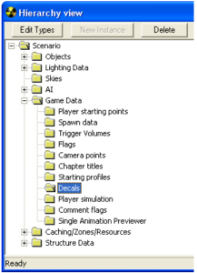
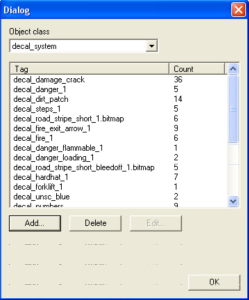
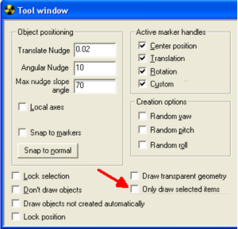
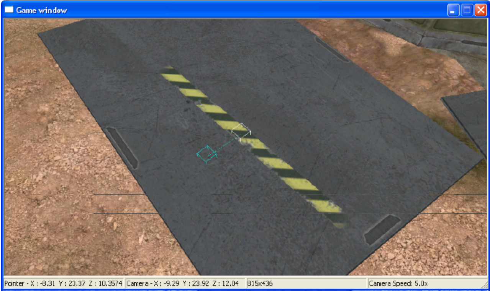
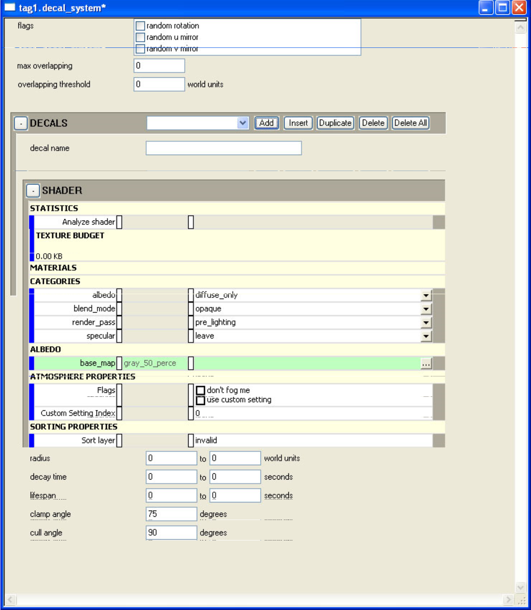

# System

Decals are graphics placed in maps and are often used for decorative features like bullet holes, cracks, and signs.

Decals are textures that are applied directly to shapes. Before decals, the way to apply, for example, a sign to a wall was to make a distinct object with the texture of a sign and then place that object very very close to the surface of the wall. This is a very an expensive way to put a sign into a map. Decals are free-floating textures that apply themselves to the surface of an object instead of being a distinct object in the level. Decals are inexpensive by comparison.

## Place a Decal

1. Open Sapien.

2. Open the scenario you plan to edit.

3. Use Decal Viewer to find the decal you want.

4. In Sapien, go to the Hierarchy view and expand Game Data.

5. Click Decals.

Figure 1 - Hierarchy View.

6. Click the Edit Types button (See Figure 1).

7. Ensure that decal_system is selected in the Object Class pulldown (see Figure 2).

Figure 2 - Edit Types Dialog.

> [!NOTE]
> Count indicates how many of that decal have been placed on the map.

8. Click Add.

9. Navigate to your decal using the path noted in Decal Viewer.

10. Click Add Tag. **NOTE: Only click this button once**.

11. Click Done.

12. Click OK in the dialog box that appears.

13. Right-click in the game window where you would like the decal to appear.

> [!NOTE]
> Keep an eye on the Output window to make sure you're not placing too many decals.

14. Save your scenario.

15. Press ctrl+shift+f to see the decals directly in Sapien.

It's easier to place decals if the checkbox only draw selected items is checked (see Figure 3). This will hide all the gizmos of the decals in the level. Hover over a decal to show its gizmo.

Figure 3 - Only Draw Selected Items option.

## Decal gizmo

- White gizmo— Placement (see Figure 4). Click and drag the white box to move the decal.

- Blue gizmo— Rotation (see Figure 4). Click and move the blue box to rotate the decal. Rotation defaults to 45° increments— hold the alt key to free rotate.

Figure 4 - Decal Gizmo.

## Notes

- **Important**: The delete key will delete your decal— there is no undo.

- If you see a black rotating square in the upper left corner of your map, this is an error message that indicates that the decal is too expensive for the level and won't display correctly.

- Curves are the most expensive surfaces to apply decals onto so take care when you're placing decals. Use cull angle and clamp angle (see below) to reduce this expense.

- There's a limit to the number of decals a map can have—this number varies from map to map.

- If only draw selected items is checked, hover your mouse over a decal until the gizmo appears to adjust the decal.

- If you lose track of a decal, double-click its name in the hierarchy view. Decals are listed in the order they were placed.

- If your decal ghosts, this is a bug. The only way to fix it is to reset the map (press alt+r).

- To experiment with a decal, Avalanche is a good map to practice on.

## Vector decals

Use vector decals when you need scalability with crisp edges.

## Creating decals

When creating or editing decals, there are some tags that require further explanation.

Figure 5 - Decal System.

The following items from Figure 4 are relevant to decals:

**Decals**

- **decal name**— Name of the decal.

**Shader**

- **blend mode**— Multiply adds darkness to the decal, Additive adds light to the decal, and Alpha forces the decal to use just the alpha channel for the decal.

- **specular**— Experiment with this tag to see if the decal looks better or worse after applying this item.

**Sorting Properties**

- **Radius**— The range the decal will expand or shrink to. Some decals will resize according to the surface they're applied onto. This variable affects the limits of how small or large that radius will be. A good rule of thumb is to pick a range of 20 to 30.

- **Decay time**— Used for special effects.

- **Lifespan**— Used for special effects.

- **Clamp angle**— If a decal is applied to an angled surface the decal may stretch to fill the surface, thereby looking terrible. Clamp angle sets the angle at which the decal will not stretch.

- **Cull angle**— If a decal covers a surface that has two faces, say the top and side of a cube, this value sets the angle at which the decal will not continue its coverage. For example, if the cull angle was set to 90° and the decal was placed on top of a cube, the decal wouldn't spread out over the side of the cube and only cover the top of the cube.
