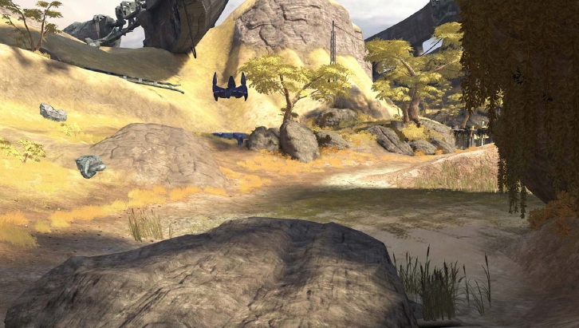

# Decorators

Decorators are a special type of object that are relatively inexpensive to render and have no collision. Decorators are often used for small plants, but can also be used to add clutter to an area or add skybox like elements in the distance.

There are three  articles concerning decorators:

## [*Modeling*](Modeling.md)

## [*Texturing*](Texturing.md)

## [*Painting*](Painting.md)

Figure 1 - Example of Decorators.
