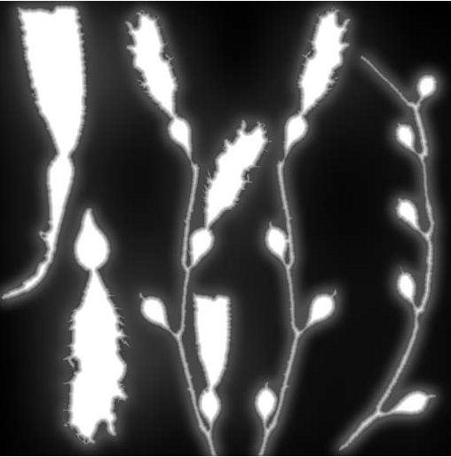
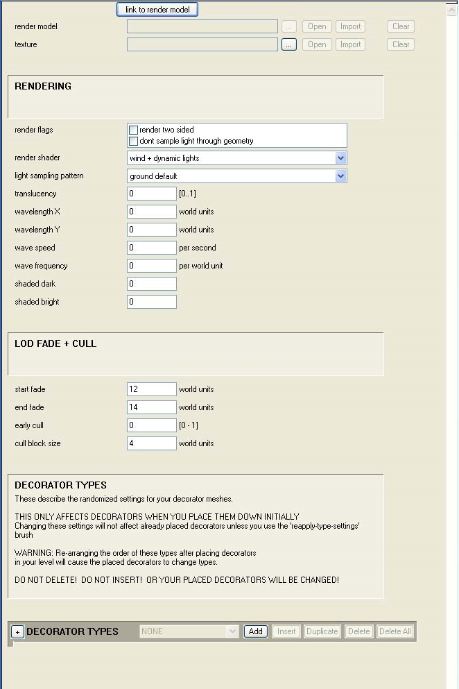
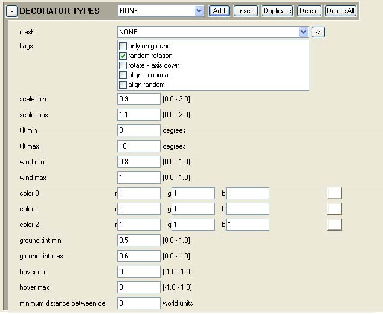

# Texturing

Each decorator set can use one texture, this texture should consist of a 32-bit image (though you should opt for DXT3 compression if at all possible). Decorators are always alpha tested so re-using bitmaps with a specular channel is not possible.

## Color Issues With Decorators

Because decorators can be tinted later it's best to try to keep the textures somewhat unsaturated and generally fairly light. This allows more flexibility in the long run. Generally, it works better to use a background slightly darker than the elements that will be visible on the decorator. Because no specular highlight is present it's often good to add a somewhat generic highlight and edge out elements.

## Alpha and Decorators

Alpha testing works in a particular manner in decorators and is used when fading out decorators. If you start with anything brighter than 33% then brightness will appear. As you move farther from the decorator in game the percent climbs higher. Because of this it's ideal to create the base map then apply a layer style that feathers the transparency— this also will help with mip related issues.

The feather can be achieved using layer effects on a basic solid white cutout with minimal work (see Figure 1).

Figure 1 - Alpha and Decorators.

## Editing the decorator_set tag

The decorator_set tag defines a group of decorators that can be painted down and contains a link to a render model and a texture. The set itself has a number of settings and also includes several options that can be set for each mesh in the set.

Figure 2 - Decorator_set Tag.

## Set Level Settings

Following are set level settings and their functions.

Some settings have descriptions ending with a question mark, which indicates their best-known function. More information about these settings is forthcoming.

- render flags

    - render two sided — Causes both sides of any polygons in the mesh to be rendered

    - dont sample light through geometry — (there is currently no information on this setting)

- render shader

    - wind + dynamic lights — Affected by wind (per BSP) and dynamic lights

    - still + dynamic lights — Only affected by dynamic lights

    - still + no lights — (there is currently no information on this setting)

    - still + sun light only — Still and lit by the sun setting

    - wavy + dynamic lights — Affected by a per-set wave setting (for underwater plants)

    - shaded + dynamic lights — Best lighting option

- light sampling pattern

    - ground default — Samples down from the center of the bounding box

    - hanging — Samples up from the center of the bounding box?

- translucency — Defines the percent of light passed from one side of a card to another (.5 generally gives a good result)

- wavelengthX — Used for the wavy + dynamic lights shader?

- wavelengthY — Used for the wavy + dynamic lights shader?

- wave speed — Used for the wavy + dynamic lights shader?

- wave frequency — Used for the wavy + dynamic lights shader?

- shaded dark — Used for the shaded + dynamic lights shader?

- shaded bright — Used for the shaded + dynamic lights shader?

- start fade — The distance, in world units, to start fading out the decorator

- end fade — The distance, in world units, where the decorator fades completely

- early cull —  Starts culling of verts sooner than they would otherwise

- cull block size — The more sparse the decorators the larger this should be

## Mesh Level Settings

Figure 3 - Mesh Level Settings.

- mesh — This pull down sets which mesh is used for this type

> [!NOTE]
> The type takes on the name of the mesh. If you wanted a particular mesh to appear more frequently then you can set more than one type to use that mesh

- flags

    - only on ground — Decorators with this setting will not be placed on surfaces whose angle is greater than ~45 degrees from flat

    - random rotation — randomly rotates the decorator on its Z axis

    - rotate x axis down —  rotates the decorator X axis to face toward the ground

    - align to normal — aligns the decorator's Z axis to the face normal of the surface it is painted on

    - align random — randomly aligns the decorator's Z axis  

- scale min — Sets the minimum scale value for the decorator

> [!NOTE]
> A setting of 0 or a small fraction will cause the decorator to be hard to see

- scale max — Sets the maximum scale factor up to 2.0x the base size. When painted the decorator is scaled to a value somewhere between the min and max

- tilt min — The minimum value in degrees the decorator may be tilted on its X or Y axis

- tilt max — The maximum value in degrees the decorator may be tilted on its X or Y axis

- wind min — The minimum percent that wind affects the decorator (unused for non-wind shaders)

- wind max — the maximum percent that wind affects the decorator (unused for non-wind shaders)

- color0 — The first of three possible colors to tint the decorator when painted down

- color1 — The second of three possible colors to tint the decorator when painted down

- color2 — The third of three possible colors to tin the decorator when painted down

- ground tint min —  The minimum amount of tint taken by sampling the diffuse color of the ground under it

- ground tint max — The maximum amount of tint taken by sampling the diffuse color of the ground under it

- hover min — The minimum amount to hover a decorator over a surface

- hover max — The maximum amount to hover a decorator over a surface

- minimum distance between decorators — Does not affect anything

## General Notes on the tag

Decorator types are based off of indexes — your painted decorators will work as long as you have the same or a greater number of decorator types. If you re-link your tag to a different render model it may cause phantom meshes to appear. It's possible to remove these by setting Guerilla to expert mode opening the tag and deleting unwanted model instances. This may cause problems. Often the better solution is to just create a clean tag and start over.
