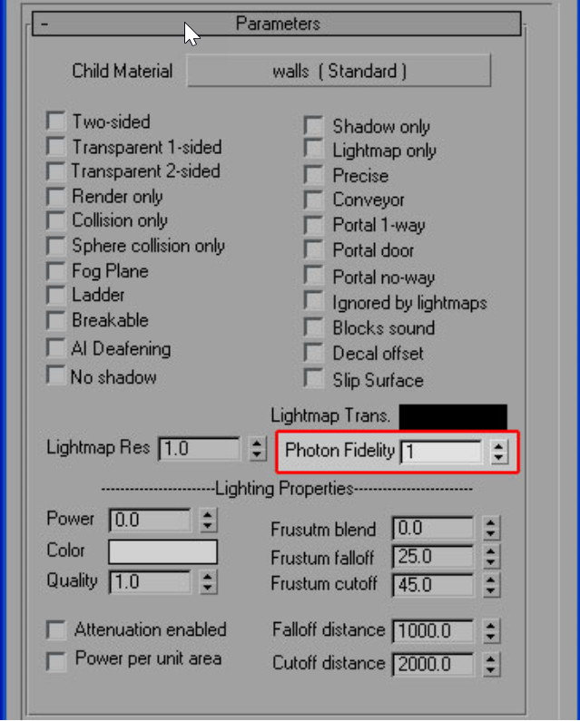

# Lightmap Photon Fidelity

> [!IMPORTANT]
> This section is built from the original documentation and is tailored for use in 3ds Max, but the important principles can be used in any 3d program.

Adjust the photon fidelity in 3ds Max (see Figure 1). The settings are:

- 0: Don't cast photons off this surface (useful for large outdoor areas on the edges of maps, like deltatemple)

- 1 (default): Normal photons cast off this surface

- 2: Dim photons (so more photons per unit light) cast off this surface. good for darker-than-normal spaces

- 3: Really dim photons cast off this surface. Good for extremely dark spaces with lots of bounced light

Figure 1 - Photon Fidelity.
