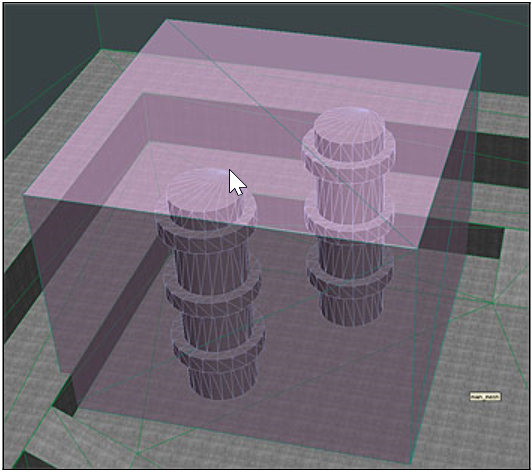
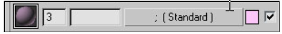
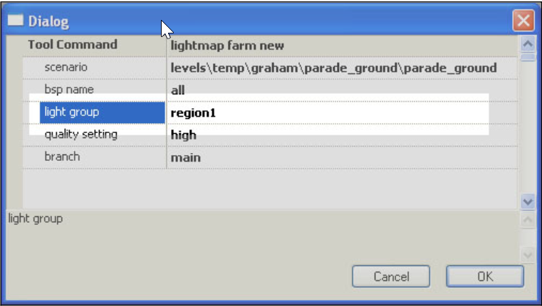

# Lightmap Lighting Regions

Lighting regions are regular nodes in your 3ds Max hierarchy, like poops (instanced geometry), except their shaders are irrelevant (only the geometry is exported) and their names must be marked with the special light region prefix of &. When you import your BSP, the light regions are updated in the structure_lighting_info tag.

The parameter after the bsp name (the light region name) can be either all or some sequence of light region substrings separated with commas. If you supply all, then the regions are ignored and the entire level is re-rendered. The lightmapper will only render the pixels that fall inside the supplied region name, and everything else will be automatically matched from the last valid lightmap set. Rendering a region that is 1/X of your total BSP size will generally render about X times faster.

> [!IMPORTANT]
> This section is built from the original documentation and is tailored for use in 3ds Max, but the important principles can be used in any 3d program.

## **Step-by-Step**

Here is a step by step walkthrough of setting up a light region:

1. Open a scenario in a 3D Program.

2. Use a simple shape (boxes work best) to encompass an area of your geometry that you want as a single light region (see Figure 1).

Figure 1 - The pink section is a light region in 3DS Max.

3. Name the new object you created (your light region) with an & (ampersand) at the front of the name.

4. For the material type/name of your new region, use a ; (semicolon). You should also set the opacity of the region so that you can easily see through it to your geometry. See Figures 1 and 2.

Figure 2 - Name the material assigned to the light region with a semicolon.

5. Save and Export/import your BSP.

6. Make the light region name the name of the region surrounding the area you just changed and set it to the lightmap in the tool command in Guerilla. See Figure 3

Figure 3 - Set the lightmap regions you want to lightmap in the tool command menu in Guerilla.
