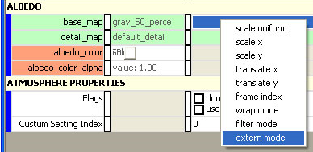
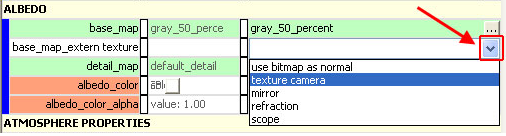

# Maya

## **Cinematic Texture Camera Notes**

The texture camera allows any bitmap in a shader to be replaced by a real-time rendering of the scene. The placement of the texture camera itself is handled through HS Scripting.

Of course it's expensive.

## **Set up the texture camera**

Any bitmap reference can make use of the texture camera.

Right-click on any bitmap reference then choose extern mode (see Figure 1).

Figure 1 - Extern mode

Once the extern mode has been set, one of the pull-down options is texture camera (see Figure 2).

Figure 2 - Texture camera pull-down.

## **Set up the HS scripting**

The texture camera is attached to a named object's marker (the object can be named in Sapien) through HS Scripting.

- texture_camera_set_object_marker \<object> \<string_id> \<real> — Sets the render texture camera to a given object marker

- texture_camera_off — Turns off the render texture camera

- render_debug_texture_camera \<boolean> — Toggles displaying the texture camera in the corner of the screen

## **Additional notes**

- This is only expensive because you actually have to render the texture camera

- Once you've rendered it, you can source it everywhere. If you wanted it copied to 100s of displays on a display wall, it's not any more expensive than putting it on one TV and using default bitmaps on the rest

- Aspect ratio can't be set — it always assumes square pixels and a square bitmap.

- When you map the texture, it needs to be mapped in the ratio 640×480, but once you have that mapped you can crop it however you want to fit your monitor, screen, etc.

- You need to set the scale of the shader as well. So you need to right-click and put in base_map_scale_x and base_map_scale_y and enter those values
