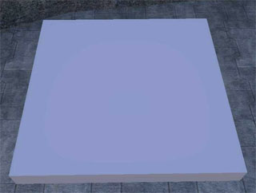
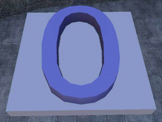
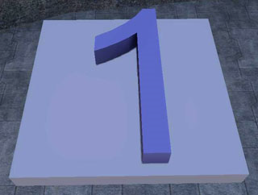
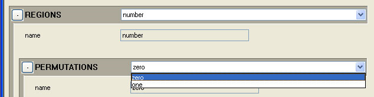
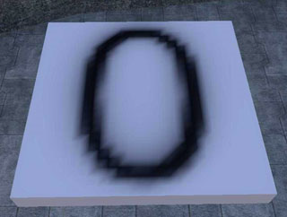
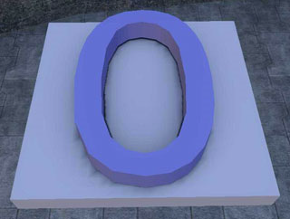
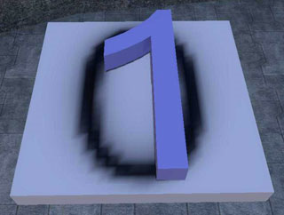
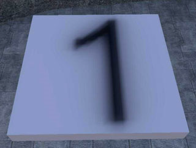
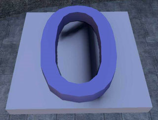

# Region Shadowing

By default, **PRT** (Pre-computer Radiance Transfer) uses the first permutation of a region to cast shadows on all the other regions. Because you don't have any control over which is the first permutation (the assignment is random) the **Shadow Cast Override** parameter has been added to the .model tag, which allows you to set which (if any) permutation for a given region will cast shadows over the other regions. Only one permutation can cast shadows.

## **PRT Console Commands**

You can disable PRT by using the console command render_disable_prt true. You will also find this in the debug menu under **4 Graphics -> 1 Lighting -> 9 Object Lighting -> 1 disable PRT**.

## **Default PRT Region Shadowing**

Here's a simple object with two regions: **box** with no permutations and **number** with two permutations: **zero** and **one** (see Figure 1).

||||

Figure 1 - Boxes

By default, PRT uses the initial permutation for a region to cast shadows on all permutations of all of the other regions. There is no way to set which is the initial permutation. In this case, the initial permutation for the region number is zero. You can see this in the .render_model tag:

Figure 2 - Region set to zero

So the **zero** permutation of the **number** regions casts a shadow on the **box** region. Note that this shadow is baked into the **box** region and is visible whether the number region is set to permutation \<none>, **zero** or **one**.

||||

Figure 3 - Shadow Example

## **Overriding the Default PRT Region Shadowing**

You can override the default PRT region shadowing by using the **Shadow Cast Override** in the .model tag. Enter a region and the permutation name you want to be shadow casting. The names **must** match existing region and permutation names - check the .render_model tag if you are unsure.

Figure 4 - Shadow cast override

||||

Figure 5 - Shadow Example

You can make it so no permutations for a given region cast shadows by leaving the permutation field blank (see Figure 6).

Figure 6 - Blank permutation field
