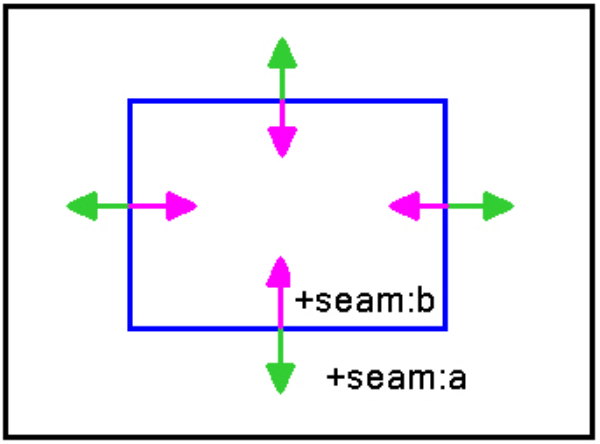

# BSP

## **Multiple BSP Environments**

It's important to set up a large environment with multiple BSPs to conserve resources when the map's in play. For example, if a player goes from area A to B then to C, area A can drop out saving resources.

Here are some important notes to consider when setting up an environment with multiple BSPs.

### **Create a Selection Set**

A best practice is to create a selection set that includes geometry, seams, and the .ASS files.

### **Facing and Naming**

BSPs inside another face in two directions, both out and in. Those that are facing out need to be named +seam:a, and those that face in +seam:b. See Figure 1 which shows a bsp (blue) inside an outer bsp (black).

Figure 1 - Naming and Facing

## **Seams**

### **Workflow Pattern**

- Make seam changes and ensure:

    - The seam is in the relevant BSP selection set

    - The normals point into the BSP

    - Edge verts line up with edge BSP geometry

    - The tessellation is the same as its immediate seam neighbor

    - The seam geometry has the name of the BSP relevant to it in the

        - Object name

        - Material

- Delete extraneous .ass files from the structure directory

- Export changed BSPs

- Check out structure_seams and scenario tags

- Run the tool command structure_seams

    - The output log should tell you that you have some number of matching seams.

- Re-import changed BSPs

### **BSP creation glossary**

**Matching Seams**

- Every seam has a matching seam — the two matching seams need to have the same triangulation

- The seams need to be coincident with BSP vertices with opposite facing normals

**Sub Material Naming**

- Each seam that defines a BSP will have its own submaterial

- The seam material name must match the eventual BSP name

    Example:

    - +seam:030_BSP_000

        Apply the above material name to the seams that define BSP_000 and when you export the ASS file make sure to name it 030_BSP_000

**Poop Exporting**

- Each poop should be exported only once

- Choose a BSP to associate the poop with and export it with that BSP only

> [!NOTE]
> A poop that straddles a BSP seam cannot penetrate into the second cluster of a BSP from that seam as defined by your portals

**Structure_Seam Tags**

- *.structure_seams files are a compiled version of the structure seams for a level.  When a structure imports it uses this tag for mapping the seams of structures to seam in the *.structure_seams file.  Then when two structures match the same seam in the *.structure_seams file we know that they are connected by that seam.” (it should be noted that the tag, structure_seams, for the relevant scenario, needs to be checked out).

**Debugging**

If your debug output reports seam leakage you will need to fix that before debugging.

- Any BSP edges outside of your exported BSP (remember you can have an organic terrain that stretches outside of your defined BSP) that are not directly connected to the BSP will generate open edges

- Seams do not make a manifold BSP and therefore the importer does not throw out triangles outside of the BSP— it's a surface walking process instead

**Commands**

- debug_structure_seams is on by default. This will show you mismatched clusters across seams and error geometry from the import of the structure_seams tag

- debug_structure_seam_edges is useful for rendering the recognized edge border between BSPs

- structures_from_scenario imports all relevant/changed BSPs for that scenario for you – getting around the incredibly manual nature of this process.  Obviously, you need the relevant BSP files (ass, structure_BSP, structure_lighting_info) files checked out for this to work.

>[!NOTE]
> Reimporting structure_seams invalidates the seams in your current structure_BSP tags. Therefore it should be done before importing BSPs. In fact you only need to run this if the seam geometry between BSPs changes. If seams are mismatched you will see error geometry by setting the debug_structure_seams hs variable, which is now on by default.
