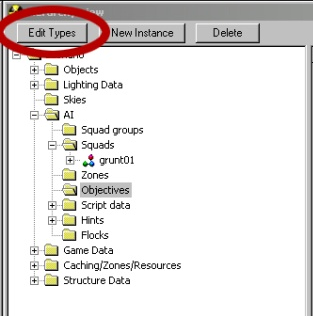
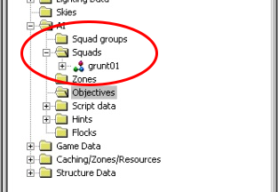

# Section 1

This part of the Designer Boot Camp teaches you how to gather weapons, characters, and objectives to create a playable scenario.

## Step 1: Add weapons

Lets add some weapons to the palette.

1. Use Sapien to open scenario your scenario tag

2. Click [edit types] in the Hierarchy View panel.

Figure 1 - Edit Types and Hierarchy View.

3. Change the Object Class (in the pulldown menu) to weapons.

4. Click the [add…] button.

5. Double-click pistol.

6. Double-click plasma_pistol.

7. Double-click plasma_pistol.weapon and notice that it added the pistol to the menu below, under Tag.

8. Navigate up two levels to weapons.

9. Double-click rifle.

10. Add the assault_rifle and spike_rifle (follow similar steps to adding the plasma pistol, above).

11. Navigate up to weapons again.

12. Add the brute_shot in the support_low section.

13. Add the gravity_hammer in the melee section.

14. Click [Done].

## Step 2: Add characters

Next, add some characters to the palette. The steps below continue the steps to add weapons, above.

1. Change the Object Class (in the pulldown menu) to character.

1. Click the [add…] button.

1. Double-click grunt.

1. Double-click ai.

1. Double-click grunt.character.

1. Navigate up two levels to character.

1. Add a brute.character.

1. Add a brute_chieftain_armor.character.

1. Click [Done].

1. Click [OK].

We added those weapons and characters to the palette so that you can now place them in your scenario. Any weapons, objects, vehicles, characters, equipment and device machines (animated objects) that you want to place in the scenario must be in the palette first.

> [!NOTE]
> The larger your palette the longer your level will take to load, so deleting unused items is a good thing.

## Step 3: Place grunts

Now it's time to place some grunts.

1. Select Squads under AI in the Heirarchy View.

Figure 2 - Squads in Hierarchy View.

2. Click [new instance] and note that a squad named squads_0 is placed under Squads.

3. Select squads_0 and look at your Properties Palette.

4. Rename it to grunts01.

5. Check the flag initially placed in the squads_0 Properties Palette.

> [!NOTE]
> Something that is initially placed will spawn when the level is loaded and does not need to be placed via scripting.

6. Change the team to covenant and skip the rest of the pull down options for now.

7. Expand the options for grunts01 in the Heirarchy View.

8. Select the Fire Teams folder under grunts01.

9. Click [new instance].

10. A fire team named none has appeared under Fire teams. Select none.

11. Check your Properties Palette and change the character type pulldown menu to grunt. The name of your fireteam has  changed from none to grunt— it will change to the type of AI you place as the default team in the fire team.

12. Change the initial weapon pulldown menu to plasma_pistol.

13. Leave the rest unchanged.

14. Expand the options for your new fireteam (named grunt in the Heirarchy View).

15. Select Starting points.

16. Right-click on the world mesh in the Game window view in Sapien. Notice that a square is placed on the ground that has 3D coordinates, rotation arrows, and text associated with it. The text defines what is spawned in that location. In this case it should be a Grunt with a Plasma Pistol.

> [!NOTE]
> The white line on the starting location is the direction the Grunt will face when spawned.

17. You can change this direction with the yellow arrow. Click the yellow arrow and rotate it around.

18. Place eight starting locations.

19. If you need to reposition a grunt, click the white box at the center of its origin and move it around.

20. Select fire team grunt.

21. Change normal diff count from 0 to 6. This defines the number of guys in that fireteam to spawn when the Squad is placed.

> [!NOTE]
> You placed eight spawn locations but only have a count of six guys that should spawn. This means that each time the squad is called it will randomly pick six of the eight locations to place a grunt. This is a good way to vary your encounters by having more spawn locations than spawn count causing a different makeup of guys and locations each time.

22. Press alt+r to reset your map. Six grunts should spawn into the level and they should also have green arrows over their heads. Green arrows mean they do not have any firing points to go to. So let's give them some firing points in the next section.

## Step 4: Zones and firing points

Before we add firing points, let's get rid of the grunts (for now).

1. Right-click grunts01 under Squads.

2. Select erase squads.

> [!NOTE]
> You can select place squads to place the squad as well.

3. Select the Zones folder in the Heirarchy View.

4. Click [new instance] — a zone, named zones_0, is placed under Zones.

5. Expand the options for zones_0 in the Heirarchy View.

6. Select areas under zones_0.

7. To assign the zone to a firing point, select the firing point in the hierarchy and change the area dropdown in the Properties Palette.

> [!NOTE]
> Additional firing points created in the Game Window will take on the area of the previously selected firing point.

## Step 5: Objectives

This step assigns an objective to the area.

1. Select the Objectives folder in the Heirarchy View.

2. Click [new instance] — new objective called ai_objectives_0 is created under the Objectives folder.

3. Select ai_objectives_0. An entirely new window opens called AI Objectives.

> [!NOTE]
> The AI Objectives window is likely quite small at this point. Scale it up so you can see all of the text.

4. Click the [NONE] button next to Zone on the AI Objectives window. A new window pops up called Assign Zone.

5. Assign zones_0 and click [OK].

6. Click [Add] in the AI Objectives window. A spread sheet cell appears in the AI Objectives window. This is a task and it is where the magic happens. More specifically, it's where we assign AI to areas and define the locations the AI should populate during an encounter.

7. Select tasks_0.

8. Rename it task_front.

9. Click on the firing points you created earlier in the Game window..

> [!NOTE]
> The firing points are all empty now and become filled when you click them.

10. Select grunts01 under the Squad folder in the Heirarchy View.

11. In the Properties palette change initial zone from none to zones_0.

12. Change initial objective from none to ai_objectives_0.

## Step 6: Spawn the grunts

Time to spawn the grunts!

1. Right-click grunts01 under the Squads folder in the Heirarchy View and select Place Squad.

1. Select ai_objectives_0 under Objectives in the Heirarchy View. Notice that the Grunts walked over to your area and are milling around. They mill around because they are in the walk movement speed and are in a passive mode. If they are alerted by an enemy they will enter an alert stance and take up more static positions.

1. Select task_front in ai_objectives_0.

1. Change the movement speed from default to run in the Properties palette. This sets them to have a run movement speed, which will default them into an alerted stance. The grunts will take up positions and look in different directions around the area. If they are not given a direction they will attempt to spread out their facing to cover multiple directions.

1. Select task_front in ai_objectives_0.

1. Hold down the alt key and left- then right-click on the terrain in the Game window. A red line with a red ball is created where you clicked. The red ball defines the forward direction of the line (it's an arrow). The grunts in your task are now facing in the direction the arrow is facing.

1. Hold down the alt key and click with either the left or right mouse buttons and notice the arrow changes with your clicks. The grunts will now face in the new directions.

> [!NOTE]
> You can delete the direction facing for a task by scrolling down the Properties palette until you find the section called Direction. You will see something like 0. task_direction_block and a [delete] button to the right of it. Click the [delete] button and the red arrow will go away and the Grunts will begin looking all around again (it may take a while for them to reorient themselves).

## Step 7: Create more areas

Make two new areas that are a part of zones_0.

1. Select zones_0.

2. You should now have three areas, named: areas_0, areas_1, and areas_2.

> [NOTE]
> Make sure you have generated the firing points for the areas!

The next steps update your objective with the new areas. Lets use those two new areas to show how to make the grunts fall back from areas_0 to areas_1 and then all the way back to areas_2.

3. Select ai_objectives_0.

4. Click [add] two times to make two new tasks.

5. Rename tasks_1 to task_mid.

6. Rename tasks_2 to task_back.

7. Set task_mid's and task_back's movement speed to run.

8. Select task_front.

9. Hold the control key and press the down arrow — keep holding the control key through the next step. The pink bar to the left of task_front joined task_mid and created a longer bar. don't worry about this yet, we will go into more detail how the different organizations of tasks is accomplished.

10. Keep holding the control key and press the down arrow until task_front is at the bottom of your new tasks.

11. Select task_mid and move it to the middle.

12. Make sure all three tasks have their own separate colored bar to the left of the task.

13. Select task_front.

14. Hold the control key down and press the right arrow key. The task will move to the right and become a child of task_mid.

15. Select task_mid.

16. Hold the control key down and press the right arrow key. task_mid will become a child of task_back. The grunts placed into ai_objectives_0 will enter task_back and then move their way down the task that is closest to the top and then farthest to the right. In this case it should be task_front.

17. If your grunts are not spawned in the map, right-click on their squad and place them.

18. They should run to correct area.

19. Set the Bodies field (found on the task in the AI Objectives window)for task_mid to 4.

20. Set the Bodies field for task_front to 2.

Bodies is a field that causes that task to close down when that number of enemies are killed when in that task. In this case task_front will close down (and not allow new enemies to enter the task when two of the Grunts are killed). Task_mid will then close when two more Grunts are killed. Anyone killed in children tasks are added to the parent tasks. So four grunts need to die in total (two in task_front and two in task_mid) to equal the four bodies to close task_mid.

## Step 8: Place a player starting location

Test your magic.

1. Expand Game Data in the Heirarchy View.

2. Select the Starting profiles folder.

3. Click [New Instance].

4. Click the […] next to primary weapon in the Properties Palette.

5. Navigate to \objects\weapons\rifles\assault_rifle\assault_rifle.weapon and double-click it.

6. Set primaryrounds loaded to 32.

7. Set primaryrounds total to 96.

8. Select Player starting points in the Heirarchy View.

9. Right-click the Game window to place the players starting location on your map.

10. Move the white line to point towards the direction you want them to spawn.

## Step 9: Play!

Time to play your scenario!

1. Press alt+r to reset the map.

1. Press tab to change from navigation mode to first person mode.

1. Jump down into the area with the grunts and kill a couple of them They will fall back to the second position.

1. Kill a couple more. They will fall back to the third position.

> [!NOTE]
> Select ai_objectives_0 when you are playing the game and watch the tasks update while you kill the grunts and move through the map.

## On to Part 2

Congratulations! You have completed Designer Boot Camp Part 1. Now move on to [Designer Boot Camp Part 2](../DBC/Section2.md)).
