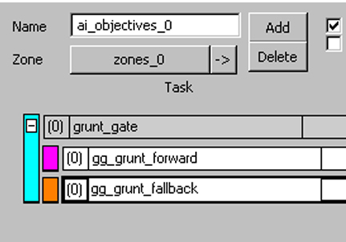
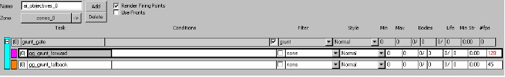
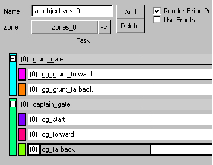
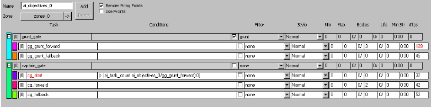
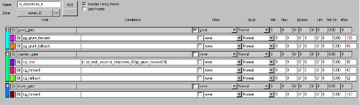
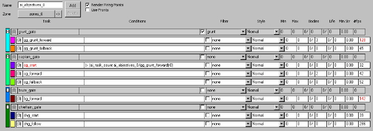
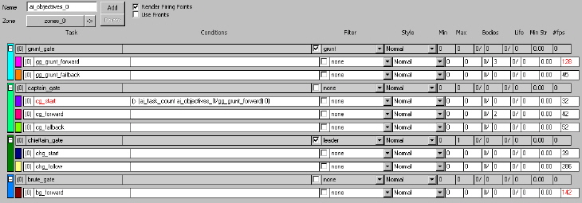

# Section 2

This part of the Designer Boot Camp teaches you how to set up objectives and scripts to create a playable scenario.

To begin this part of the boot camp, open your scenario.

## Step 1: Check your palette

Your palette should have the following in it (steps for adding things to a palette are described in [Designer Boot Camp Part 1](../DBC/Section1.md)):

### Weapons

- rifle/assault_rifle

- rifle/spike_rifle

- pistol/plasma_pistol

- pistol/excavator

- melee/gravity_hammer

- support_low/brute_shot

### Equipment

> [!NOTE]
> You will need to navigate from the equipment section back to weapons. Grenades are added in the equipment section of the palette, but are found in the weapons section of the file structure.

- weapons/grenade/plasma_grenade

- weapons/grenade/claymore_grenade

- weapons/grenade/frag_grenade

### Characters

- grunt

- brute

- brute_chieftain_armor

- brute_captain

Now you're ready to add more zones, areas, and firing points.

> [!NOTE]
> Make sure to add the firing points for each of the areas.

## Step 2: Place some dudes

Now it's time to make four squads.

1. Place one squad of four grunts wherever you would like. Arm them with plasma_pistols and name them squads_0.

2. Place one squad of one brute captain and two brutes in a separate area. Give the brutes spike_rifles and the captain a brute_shot. This will be squads_1.

There are two ways to place two different types of characters in the same squad:

-  Make two separate fire teams in the same squad
    - One fire team has two brutes and one has the captain. This is the more desirable option of the two, as it lets you create multiple starting locations for both fire teams and still spawn a predictable number of each team — for example one captain and two brutes.

- Make one fire team of brutes
    - Create three starting locations for the brute fire team. Select one of the starting locations and in the Properties palette change the character type from NONE to  brute_captain. In this situation if that starting location gets used it will spawn the brute_captain. If you ended up placing six starting locations and one of them was the brute_captain, and you set the spawn count to three, you would only get the brute_captain 50% of the time. This is why the first option is preferable, but this is a good place to set different character variants (like what weapons they are carrying).

3. Place one squad of two brutes. Give them one an excavator and one a spike_rifle.

    - Do this by creating two starting locations for the brutes and set one to have spike_rifle and the other to have an excavator. This is done in the same manner as #2 above, but instead of changing the character type change the initial weapon. This will be squads_2.

> [!NOTE]
> If the options in the starting locations are set to none, that AI will use the defaults set in at the fire team level.

4. Place one squad of one brute chieftain armor in different area. Give him a gravity_hammer! This will be squads_3.

5. Place all your squads in the level and see if it works! (If you don't have an objective set up, they will have green arrows over their head. No worries, we will fix that!)

6. Set all of your squads to the following settings in their individual Properties palette:

    - Team set to Covenant

    - Initial zone set to zones_0

    - Initial objective set to ai_objectives_0

    - Leave parent and initial task set to NONE.

## Step 3: Set up objectives

Before you begin following the steps below, create an objective (or delete the tasks in the objective if you are using your objectives from [Designer Boot Camp Part 1](../DBC/Section1.md)) and set zones_0 to your objective.

We are going to do some more complicated task setups to accomplish the following things:

- Player engages the grunts in the initial area.

- The grunts fall back when three of them are killed.

- The two brutes and captain stay in the pillars area until the three grunts are killed, then they move forward.

- The two brutes and captain fall back when two of them are killed.

- The chieftain rushes the player when the two brutes and captain fall back.

- The remaining two brutes and whatever is left of the remaining squads fight the player from a designated area.

Before we get into that, we need to set up the scripts for your level. When you do some of the magic with the objective system it will export a scripts_fragments file. The fragments file will be created automatically whenever you export scripts, but you will need to link your scenario to it first.

To link your scenario:

1. In Sapien, go to Scenarios at the top tool bar.

1. Select Split Mission scripts.

1. Go back to Scenarios and select Add Mission script.

1. This will bring up a windows navigation tool (that should point to your scripts files in the data directory automatically). If it does, select basic_#yourname#_fragments.hsc and click on open, then select basic_#yourname#_mission.hsc file and click on open. The basic_#yourname#_mission.hsc script is the script you will eventually use to write your own scripts. We will do that later, but we will attach it now to get ahead of the game.

### Objectives time!

We want the grunts to do the following:

- Spawn in an initial designated area, move to the area where the player spawns, and fall back to an area designated behind their spawn when three of them are killed.

To do this, follow these steps:

1. Create three new tasks in your ai_objectives_0 (remember to click on the [add] button in the AI Objectives window to create a task).

2. Make one of those tasks a gate task. This is done by checking the gate flag in the properties palette when the task is selected.

3. The task will turn gray. This means that no AI should ever live in this task. It is just used to manage other tasks. This will make sense later, so keep on trucking.

4. Name the gate task grunt_gate.

5. Name the other two tasks gg_grunt_forward and gg_grunt_fallback. You can use whatever syntax you like, but a useful setup is to start the names of your tasks with the initials for any gate tasks they are in. Both of these tasks will be a part of grunt_gate so they start with gg_. Follow this naming convention for now and figure out what works for you later.

6. Make the tasks gg_grunt_forward and gg_grunt_fallback children of grunt_gate. Make sure that gg_grunt_fallback is lower than gg_grunt_forward and is not a sibling (see Figure 1).



Figure 1 - Proper Hierarchy of gg_grunts.

7. Now set the filter flag for grunt_gate to grunt and check the box to the left of the filter. This makes it so that only grunts can live in this task. No other AI types will ever be allowed in this task. This is a useful way to keep one type of unit separate from the other types.

8. Set the areas for gg_grunt_forward to the areas closer to the player spawn.

9. Set the areas for gg_grunt_fallback to the areas behind the grunt spawn.

10. Set the body count for gg_grunt_forward to: 3. It should look like Figure 2.

> [!NOTE]
> Your #fps will likely not add up to the same number of firing points as this example, but it should be in the ballpark.



Figure 2 - #FPS Values.

11. Give both tasks a direction, facing towards where the player spawns.

12. Set your tasks to have movement set to run.

13. Reset the level by pressing alt+r, then press \<tab> to enter the game in first person mode and watch the grunts. They should spawn and move into the first are gg_grunt_forward and then when you kill three of them they should fall back to gg_grunt_fallback.

14. Now let's set up the first squad of Brutes. This will be the two Brutes with the Brute Captain (squads_1).
Squads_1 should follow this layout:

- They spawn in their initial spawn area.

- They should stay in the area nearby.

- They should move into the next designated area when the grunts fall back.

- They should move into the next designated area when their body count is two.

## Step 4: Set up squads_1

Squad groups are effective ways of organizing your AI into groups that can be used to filter them into tasks and also are very useful when you get deeper into scripting. For now, we are going to give squads_1 a squad group, which will allow us to give them some tasks that only they can use.

1. Create a squad group by selecting the Squad groups folder in the Hierarchy view.

2. Click the [New Instance] button.

3. A new element appears in the Heirarchy view called squad groups_0. Rename this (in the properties palette) to BruteCaptain.

4. Leave parent set to NONE and change initial objective to ai_objectives_0.

5. Select squads_1 and set parent in the Properties palette to BruteCaptain.

6. Create four new tasks in ai_objectives_0.

7. Rename one of the tasks captain_gate and check its gate flag.

8. Rename the other three tasks the following:  
    - cg_start
    - cg_forward
    - cg_fallback

9. Make them children of captain_gate. It should look something like Figure 3:



Figure 3 - Captain_gate.

10. Now let's use the squad group we set up earlier. Set captain_gate Squad group filter to BruteCaptain. You will find this in the Properties palette. Now only squads with BruteCaptain as their squad group can enter the gate task (and by definition any children tasks of that task).

11. Set cg_start to match the area you want for enemy spawns.

12. Set cg_forward to match the area you want for them to move to.

13. Set cg_fallback to match the area you want them to fall back to.

## Step 5: Your first script

Now for your first foray into scripting. We need the Brutes to stay in cg_start until three or more Grunts die (which forces them out of gg_grunt_forward). We will do that by setting up cg_start to only be active when there are Grunts alive in gg_grunt_forward. Do this with the following script:

```
(> (ai_task_count ai_objectives_0/gg_grunt_forward) 0)
```

Copy that script into the Conditions cell of cg_start. You will need to click on the conditions cell for that task and expand the size of the window.

What that script means:

- All operations (+, -, >, <, =, etc.) are placed at the beginning of a script.

- The two elements after the operation will be evaluated by the script.

- Anything in parenthesis is evaluated as one element.

In this case we are checking that the first element is greater than the second element. Ai_task_count is a script that checks the number of AI living in a task. Ai_task_count is passed the location of an objective/task and evaluates how many AI are in that task. In this case it's the task gg_grunt_forward. So as long as there are greater than 0 AI living in ai_objectives_0/gg_grunt_forward, cg_start will be open. Once there are no longer >0 AI living in gg_grunt_forward (which happens when the 3 body count in that task is reachecg_start will close and the Brutes/Brute Captain will move to the next available task.

> [!NOTE]
> Conditions for tasks are initially colored blue. This means that the script has not been compiled for this condition. Once it has been compiled the color of the text will turn black if it compiled properly and it will turn red if it failed compiling properly.

Next, perform these tasks:

1. Set cg_forward bodies to 2.

2. Set the tasks movement to run.

3. Give the tasks direction facings.

4. Compile your scripts by hitting control+shift+c.



Figure 4 - Compiled Script.

You will notice that cg_start is red. This means that it's closed to entry because the conditions are not met. There are no grunts in your level (assuming you have not set them to spawn automatically), so there is no one in task gg_grunt_forward, which means the script you wrote is not true. Right-click squads_0 and place them. Notice that cg_start turns black, meaning that it's open for AI to enter.

Now lets set up the other two Brutes, the AI from squads_2. These guys are easy— they hang in the back and stay there. We want them to occupy the designated space, and stay there.

To set up the other two brutes:

1. Create two tasks in ai_objectives_0.

1. Make one a gate task and name it brute_gate.

1. Name the other one bg_forward and make it a child of brute_gate.

1. Give bg_forward a run movement speed.

1. Assign the areas you want the squad to move towards to bg_forward.

Thats it! It should look something like Figure 5:



Figure 5 - Compiled Script.

Now for the Chieftain

The Chieftain is pretty easy too— he starts out in the back and waits for the Captain to fall back (who is waiting on the Grunts to fall back, then he charges).

Create three new tasks:

1. Rename one chieftain_gate and make it a gate task.

1. Name one chg_start (we used chg_ in order to not conflict with the cg_ task that refers to captain_gate).

1. Name the last one chg_follow.

1. Make chg_start and chg_follow children of chieftain_gate.

1. Set both tasks to have a run movement setting.

1. Assign the areas to each task.

1. In the Properties palette, set chg_follow to be a follow task, and have it follow the player.

1. Set the follow pull down option to be player. Now anyone in that task will follow the player, and in the case of AI who hates the player, it will follow him and try to kill him.

It should look something like Figure 6:



Figure 6 - Compiled Script.

Now try and spawn all four groups, and spawn them in order (squads_0, squads_1, squads_2, squads_3). Notice something bad happens. The chieftain enters bg_forward with the other two Brutes. We don't want that, we want him to enter on his own tasks. We could do this by setting another squad group (like we did for the captain), but try a new way...

1. Swap brute_gate with chieftain_gate (keeping the children tasks with their respective parents). Do this by selecting chieftain_gate, press the control key, and press the up arrow twice. The two tasks should swap spots.

1. Give chieftain_gate a leader filter and check the flag to the left of the filter.

1. Set Max on chieftain_gate to be 1. Min and Max are ways to control the numbers of AI that can be in a task. By setting chieftain_gate to be 1, we make it so that there and be no more than one AI in chieftain_gate at any time.

It should look like Figure 7:



Figure 6 - Compiled Script.

Now try spawning each squad (in order). They should filter into each task properly.

## Step 6: Test it out

1. Set all of your squads to be initially_placed.

1. Add a player starting point and starting profiles (both found in Game Data) if needed.

1. Reset your level (press alt+r).

1. Hit tab to enter first person mode.

1. Run around and see what happens. Have the ai_objectives_0 open while you are running around and killing things to watch the tasks updates (NOTE: There is a delay between the AI changing their tasks and the AI Objectives window getting updated. Should be less than a second in most cases.)

## Experiment

There are several ways to break this encounter. Play it some and find ways to make the AI behave in ways that you would not expect, or that react in a way that would make them seem smart.

Congratulations! You've completed Designer Boot Camp Part 2!
