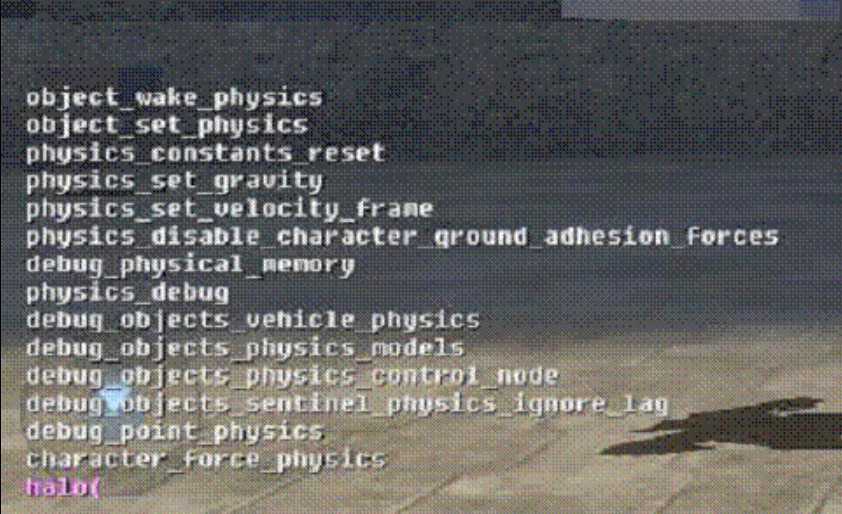

#  Find Console Commands

There is now a helpful console command which allows you to find other console commands!

- find \<string>

For example, typing find physic from the console would show you Fig 1:

Fig 1 - Find command result
