# Using Portals

In it's simplest form, Portals divide environments into smaller spaces (called "clusters") to make it easier for the game engine to handle the rendering and A.I. This article will show you how to set up and maximize portals. The goal is to be able to shut down as much stuff as possible - both for rendering and A.I.

## Types of Portals

There are four types of portals which can be set in the material tag of the portal:

- 2-way — Allows the player to see through to the other side of the portal from either side.
- 1-way — See only the way the triangles are facing. (For example, the one-way glass in Snowbound.)
- door — Only see through the portal when the door is in the open state.
- no-way — Cannot see through the portal in either direction.

## Merging

If two portal doors are close together, for example side-by-side, the system will try to merge them together into one portal. To avoid this, add a number after the +portal name. For example: +portal1, +portal2, +portal3 and so on.

## Portals in Detail

Here's a simple environment with two rooms (see Figure 1):

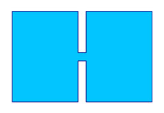

Figure 1 - Two Rooms

We can take that environment and subdivide it using a portal (see Figure 2):

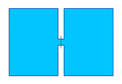

Figure 2 - Two Rooms with Portal

Which divides the environment into two clusters (see Figure 3):

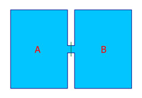

Figure 3 - Two Rooms with Clusters

Use the following commands in the console:

- switch_bsp 0— See the scenario without portals
- switch_bsp 1— See the scenario with portals
- visibility_debug_portals 1— See outlines of portals in the game
- debug_view 1— See through the walls (so you can see what's rendering) in the game

## Simple Portals

If we add scenery objects (represented here by the colored dots in Figure 4)

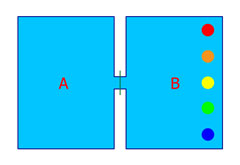

Figure 4 - Scenery Objects

The portals allow us to render only those objects that we can "see" (Figure 5):

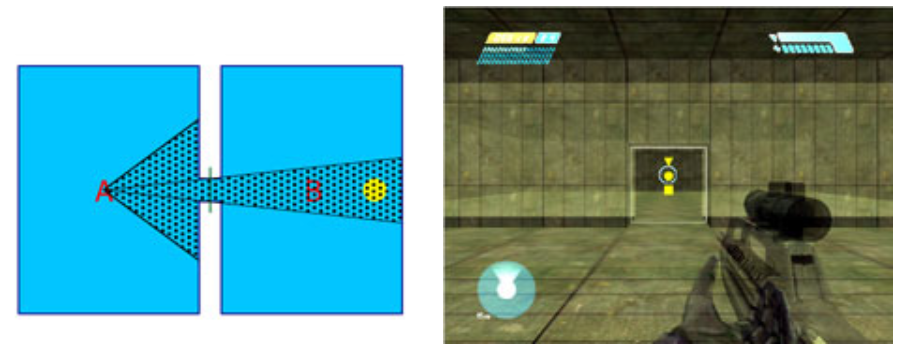

Figure 5 - Objects that can be seen

...start rendering objects that enter our field of view (see Figure 6):

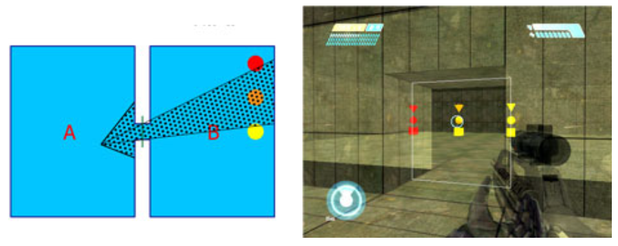

Figure 6 - Player Field of View

...and stop rendering objects that we can't (see Figure 7)

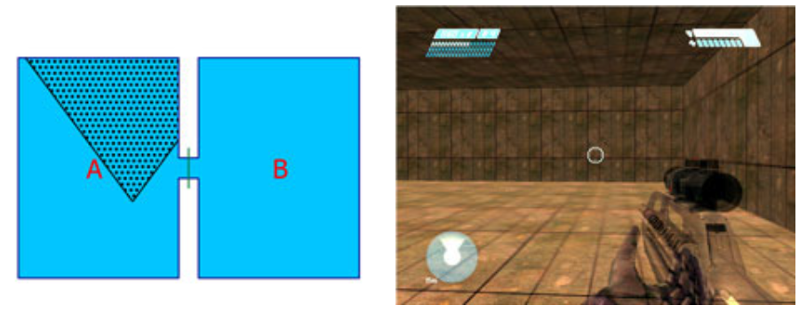

Figure 7 - Unseen Objects

## Multiple Portals

Here's another environment, broken into eight clusters with portals (see Figure 8):

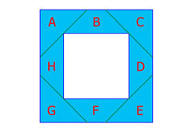

Figure 8 - Eight Clusters with Portals

If the player were standing in the top hallway on the letter B facing to the left they would be able to see into cluster A, but no other clusters. So we don't have to render the other six clusters (see Figure 9).

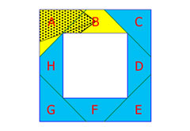

Figure 9 - Reduced Rendering while facing Left

If the player were facing to the right they would be able to see into cluster C, but no other clusters (see Figure 9):

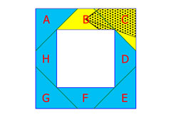

Figure 10 - Reduced Rendering while facing Right

If the player walks around the environment in a clockwise direction (to stand on letter C), they can now see into clusters D and E:

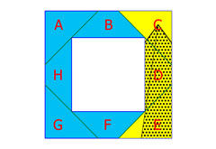

Figure 11 - Rendering if the Player stands in the C Cluster

...but other clusters "disappear" from view (see Figure 12):

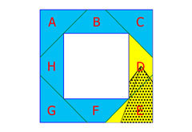

Figure 12 - Dissapearing Clusters

## How It Works: Runtime Visibility Check

While the game is running, the engine checks to see if any of the cluster's immediate portals overlap with other portals. This is called the Runtime Visibility Check. If they do overlap, then that next cluster is rendered.

Figure 13 shows a hallway with four portals, breaking it into five clusters:

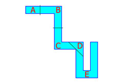

Figure 13 - Hallway with Four Portals

If the player were standing in cluster a, looking down the hall, it might look like Figure 14:

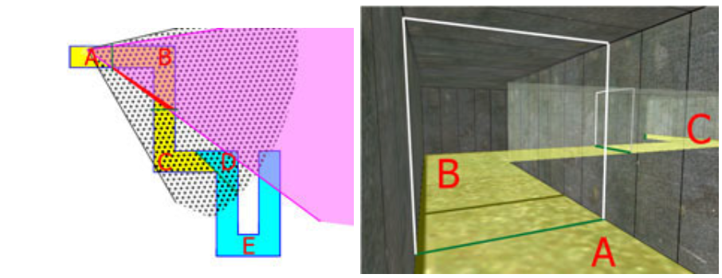

Figure 14 - Looking down the hallway

Remember that portals are not "hidden" by geometry. The Runtime Visibility Check only looks at portals, not geometry.

The player can "see" the portal between clusters B and C "through" the portal between clusters A and B.

Another situation is when the player is "behind" a portal as seen in Figure 15:

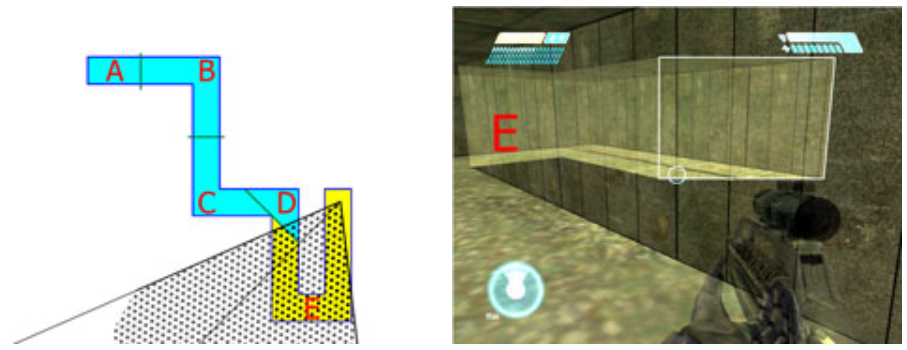

Figure 15 - Looking down the hallway

## Potential Visibility Set

When an environment in imported, it generates a Potential Visibility Set for each cluster. This is a list off all possible clusters that can be seen from anywhere inside of that particular cluster.

The PVS is used for object activation. It is mainly used for the A.I., which can be shut off for inactive clusters.

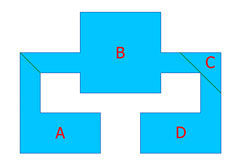

Figure 16 - Potential Visibilty Set Example

In this example, there are places in Cluster A, that can can see both Cluster B and Cluster C. There is nowhere in Cluster A where you can see Cluster D. So the PVS for Cluster A would include both Clusters B and C.

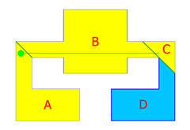

Figure 17 - Cluster D is not being rendered

Cluster B can see both Cluster A and Cluster C, but not Cluster D. Note that the portal arrangement on the right (separating B/C and C/D) works much better than the one on the left (separating B/A).

Figure 18 - Right vs. Left arrangement

Cluster D can only see Cluster C.

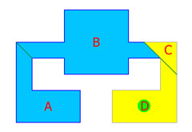

Figure 19 - Cluster D is not being rendered

Use debug_pvs 1 in the console to see the PVS (you must have debug_view turned on).

## Common Errors

- **Exposed Portal Edge** — A common error is when the portal does not contact one edge of the environment (see Figure 20).

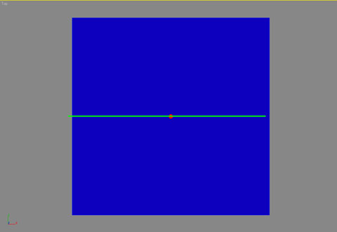

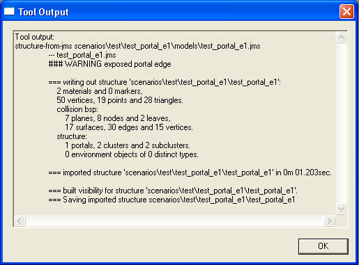

Figure 20 - Exposed Portal Edge Error

- **Portal Leakage** — A common error when the portal does not define two clusters.

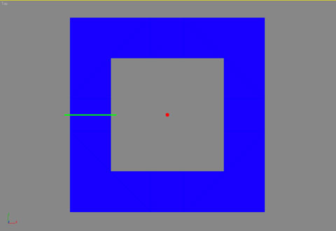

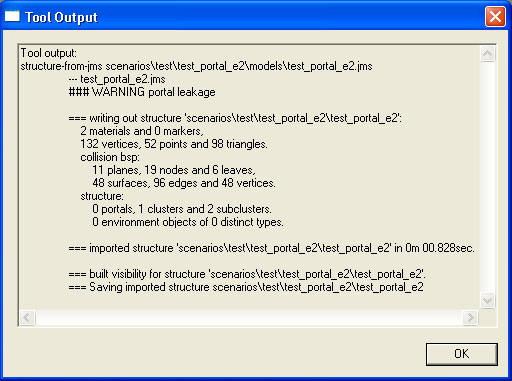

Figure 21 - Portal Leakage Error

- **Portal Couldn't Pick Cluster** — A common error when a single portal cannot be defined (see Figure 22).

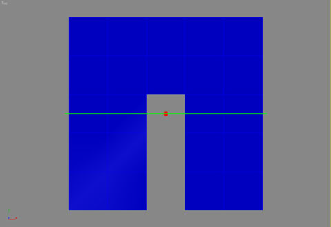

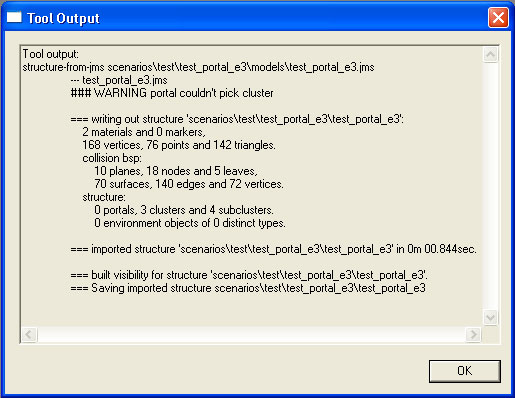

Figure 22 - Portal Couldn't Pick Cluster Error
