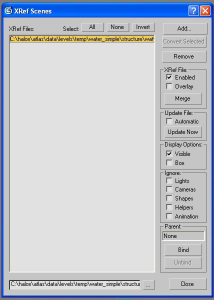
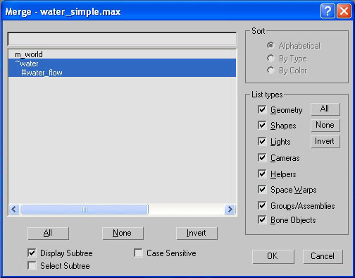
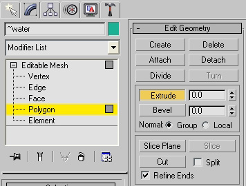
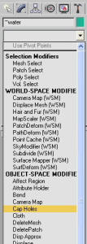
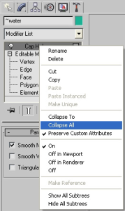
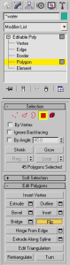
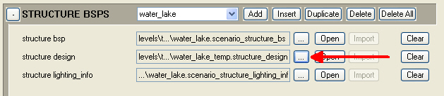

# Water Physics Volumes

## Overview

- Water physics volumes are placed in the structure design file.
- They don’t have a material assigned to them, but require a special naming convention (see below).
- The shape can be anything as long as the surface is lined up with the water placed in the structure file.

### Naming Convention

The naming convention for the water physics volume is:

~name— water physics volume, used to display water effects, allow objects to float in water.

#name— as a child of water physics volume, sets the direction of water flow inside the water physics volume. Water flows in (-) to (+) x direction.

## Build a Water Physics Volume

Let's begin by building a water physics volume.

1. First you will need to find a map with Halo 3 water in it. This is usually a plane with material type Halo 3 water in the 3ds Max structure file, such as: \halox\atlas\data\levels\temp\water_simple\
2. Though we have the structure file for the water map, we also need a structure_design 3ds Max file, the same kind used by designers for placing soft surfaces, kill volumes, etc. Having this file will allow you to continually modify the design volumes in the map without exporting the entire structure over and over again. Go up one directory and create a new folder: \halox\atlas\data\levels\temp\water_simple\structure_design\
3. Create a new structure in 3ds Max (File —> New) and select Perspective View.
4. Go once again to the File menu and choose File —> XRef Scene.

Figure 1 - XRef Scenes

5. Click the Add button in the top right corner of the window that pops up and navigate to \halox\atlas\data\levels\temp\water_simple\structure\water_simple.max. This should cause the structure of the map to appear in Max. You can now click Close.
6. Next, we must merge the water plane from the main structure file.
Because we are using XRef, none of the water_simple map is actually contained in our new structure design file, everything is just visible for reference. To gain the parts of the map for making the water physics volume, we need to merge parts of the structure file into our current one.
Go to File —> Merge and navigate once again to the water_simple.max file, then click OK.
7. In the pop-up window, select both the ~water and #water_flow objects and click OK. Now the water portions of the map are available for editing in our structure_design file.

Figure 2 - Merging

> ![Note]
> If you didn't name the water with the \~ or \# standards, change the names into \~\<name> for bodies of water and #\<name> for water flow objects.

8. At this point the structure_design file should be saved to your structure_design directory. Name the .max file the same as your normal structure file: \halox\atlas\data\levels\temp\water_simple\structure_design\water_simple.max
9. Normally you will need to make it a physics volume by turning the water plane into a box, but this has already been done in the water_simple map.

To do this yourself:

- 9a Select the all of the polygons in the top plane (ignore the bottom level).

- 9b Click the options box to the right of the Extrude button in the Edit Geometry section in the modifier tab.

Figure 3 - Extrude Button

- 9c Click and drag the downwards arrow next to the button until the plane extends down below the bottom of the map then click OK.

10. Your newly extruded shape now needs a cap. Select all of the polygons in your water plane, which should resemble a box without a top, and go to the Modifier List. Scroll down and select the option Cap Holes.

Figure 4 - Cap Holes menu item

11. Right-click the Cap Holes element above your Editable Poly element, and choose Collapse All. This will apply the cap to your water plane.

Figure 5 - Callapse All menu item

12. Finally, your water needs to have each poly facing outwards rather than inwards. Again select all the polygons in your water plane, go to your Edit Polygons modifier section and click the Flip button. All the polygons in your shape should now be facing outwards, making your water plane appear nice and solid.

Figure 6 - Flip button

13. Save the file and you're ready to export.

Congratulations! You've successfully built your first water physics volume. Now you need to export your file to an ASS file and import it into the game.

## Export a Water Physics Volume

1. Choose Export from the File menu, and save it in the structure_design folder.
1. Launch Guerilla and run the tool command structure_design.
1. Browse to the ASS file that you just saved and run Tool on it.

Once it's successfully imported, hook it up to the scenario tag:

1. Launch Guerilla and open your scenario tag.
2. In the Structure BSPS section, click the ellipses (see Figure 9). The structure design file should be in the root of the tags folder for the level.

Figure 7 - Structure Design

3. Save the scenario

> ![Note]
> This only puts water physics on the level with no direction to the flow of water. This is good for ponds and standing water but not good for rivers. To add direction to water, see below.

## Water Physics Direction

To add flow to your river, you will need to create an object and make it a child of your physics volume.

> ![Note]
> There is no way to set the flow speed, so only set the flow on moving bodies of water

1. Create a primitive object, like a simple box. The object can be placed wherever you like.
1. Name your object #waterdirection.
1. Make your object a child of your water physics volume.
1. Switch the view to local by selecting Local in the View pulldown near the top center of the 3ds Max window.
1. Rotate the object until the X axis is pointing in the direction you would like the water to flow. The water always flows in the +X axis direction.
