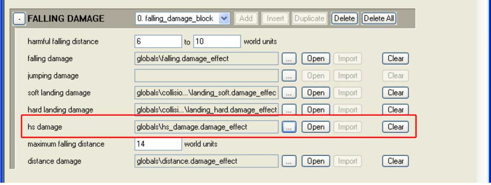

# Halo Script Damage_Object

damage_object is a Halo Script command that allows you to apply specific amount of damage to a named object in a scenario.

## **Use**

damage_object is executed from a command line:

damage_object \<object name> \<material name> \<damage amount>

- object name— Named object in scene

- material name— Collision material of named object

- damage amount— Deducted from object's vitality

## **Example**

- damage_object hog hull 100

This command will do 100 damage to the material hull on the warthog named hog on the active map.

## **Tag Info**

There is a hs_damage.damage_effect tag that is linked to the globals.global (see Figure 1).

Figure 1 - hs damage tag.
