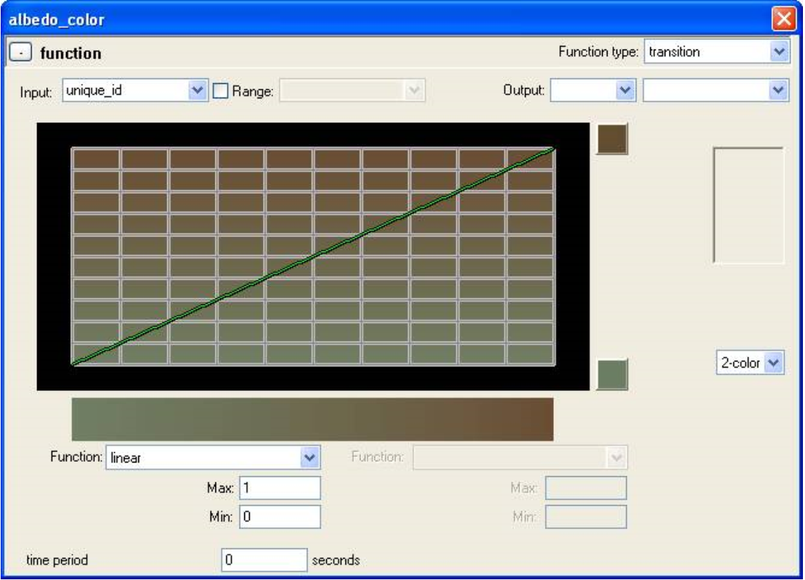

# Object Functions

There is only one object function that can be read by poops: unique_id, used so that each instance object will have a slightly different value.

Example: You could set a tint range in a poop .shader and then use unique_id to pick a value from that range (see Figure 1 for an example).

Figure 1 - Albedo Color.
