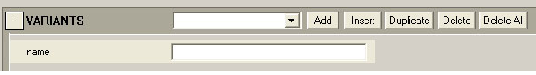
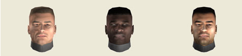
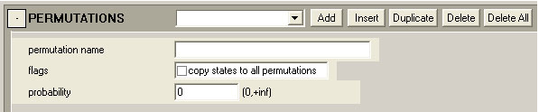
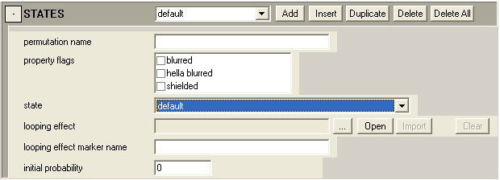

# Model Variants, Regions, Permutations, and States

This article covers Variants, Regions, and Permutations (for any type of object)

## **Variants**

A **Variant** is a unique form of a specific object (model). For example: We have marines but we also have the ODST and Sergeant Johnson variants of the general marine object. Having separate variants (within the same .model tag) allows you to give an object a unique look while it still shares all of the properties (damage sections, materials, etc.) of the standard version— thus saving you the time and effort of setting up a whole separate object for each type of marine (for example).

The **Variants** block of the .model tag (see Figure 1) is found near the top. It's the first block below the model and LOD information.

Figure 1 - The Variants tag block.

- **name** — The name of the variant you want to create.

> [!NOTE]
> If you name the variant default, that variant will always automatically be used by the game engine (unless you specify a different variant in Sapien). Otherwise, the engine will randomly pick variants to use when the object is placed (unless you set a specific variant within Sapien).

## **Regions**

A Region is a homogeneous and somewhat independent section of a model. Regions are set up so that different areas of the same model can have different properties (each region can have different permutations and states than other regions of the model — see below). For example, the head of a marine is one region, while the body is another — both of which have vastly different shapes, colorations, and features. Regions are predefined in 3ds Max before exporting/importing your render/collision/physics models (see Setting regions and permutations in 3ds Max for more information).

The Regions tag block (see Figure 2) is a sub-block of Variants, so if you want to set up regions (and then permutations and states) you first need to have at least one variant set up.

Figure 2 - The Regions tag block.

- **region name**— The name of a region you defined in 3ds Max before exporting the model (you need to enter it manually— this list is not created for you on import).

- **parent variant**— Drop down list which allows you to select the name of the variant you wish this region to inherit all of its properties from.

## **Permutations**

**Permutations** are different/unique versions of a single region within an object. For example, a Marine object's face is a single region, but we have many different permutations of the face (black, white, male, female, etc). Permutations for each object are created and defined within 3ds Max before the various .JMS files are exported/imported into the engine.

Figure 3 - Three different permutations of the face region on a marine model.

The **Permutations** tag block (see Figure 4) is a sub-block of *Regions*, so if you want to set up any permutations, you must first set up a variant and have at least one region defined.

Figure 4 - The Permutations tag block.

- **permutation name**— This is the name of a permutation you want to create for the model. This actually has nothing to do with the permutations you created for the model in 3ds Max— those are used in the damage states (see below).

- **copy states to all permutations** — Takes any states that are assigned to this permutation and copies them to all permutations of this variant of the model. However, it does not display the states when you select any other permutations.

- **probability**— You can set a probability for each permutation to be used when spawned in-game. For example, there are many permutations of marine faces. When a marine is spawned in during gameplay, the engine chooses which face permutation to use based on the probability set in this area of the tag.

## **States**

**States** are the current condition that any given variant/permutation is in — normally pertaining to a level of damage. Any single permutation can have multiple states. For example, the face of a marine could have a default, minor damage, medium damage, major damage, and destroyed state. These states can be different from the states for any other permutation of a marine face, or they can be same if "Copy states to all permutations" is selected under *Permutations* (flags). You need to set up a separate state for each permutation you set up in 3ds Max of the particular region you are working with.

To set a state for an object, you must first set up a variant, select a region, and set up a permutation.

Figure 5 - The States tag block.

- **permutation name**— This is the name of a permutation you specified for a particular region of the model in 3ds Max. If you haven't set up any permutations in 3ds Max, you won't be able to set up any damage states here.

- **property flags**

    - blurred— Visually blurs the permutation in the game. This can be effective when the state is partnered with an effect like smoke or fire, for example

    - hella blurred— More blurring than blurred

    - shielded— Sets the state as shielded

- **state**— A drop down list which allows you to choose from **default, minor damage, medium damage, major damage, or destroyed**. This is the name that will appear above in the heading of the States tag block (or in the drop down list).

- **looping effect**— Links to an effect tag that will coincide with the current state. For example, you could set up a sparking, burning, or smoking effect to go along with a damaged state.

- **looping effect marker name**— The name of the marker you set up in 3ds Max where the effect (looping effect) will emanate from on the model.

- **initial probability**— You can set up a probability for any state to for any permutation to appear initially. For example, if you sometimes wanted a slightly wounded marine to be automatically spawned into the game, you would set up a probability for that state (along with a probability for all of the other states of the marine).
