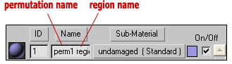
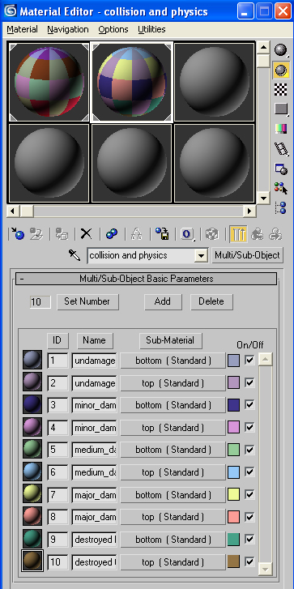

# Setting Up Regions and Permutations in 3DS Max

> [!IMPORTANT]
> This section is built from the original documentation and is tailored for use in 3ds Max, but the important principles can be used in any 3d program.

This article covers the things you need to know to set up an object with regions and permutations correctly in 3ds Max so that it can have variants and damage sections in the game.

## **Regions and Permutation**s

A Region is a homogeneous and somewhat independent section of a model. Regions are set up so that different areas of the same model can have different properties (each region can have different permutations and states than other regions of the model). For example, the head of a marine is one region of the model, while the body is another. Creating regions allows us to have variations between parts of the model (without having to load or create separate models). So, for the face region of the marine, we have many different permutations— male/female, different colors and shapes.

## **Notes**

Region and Permutations are set in the **Name** field of a multi-sub object material in 3ds Max (See Figure 1). The order is "permutation_name" followed by a space, and then "region_name." If it seems counter-intuitive for the sub-part of the hierarchy (the permutation) to be placed before its parent, think of them as being in alphabetical order rather than in hierarchical order.

Figure 1 - Naming Regions and Permutations in the Name field of a multi-sub object material.

- Each permutation of the object can (and probably should) have its own collision and physics models. Each collision section must be manifold (no open edges).

- Collision and Physics permutations should be set up with a separate multi-sub object material than the render materials. This is so that the "Materials" tag block of the .model tag will be populated correctly— with collision material names rather than the names of shaders (see Figure 2).

Figure 2 - The Collision and Physics multi-sub object material for a model with two regions (top and bottom) and five permutations.

## **Step-by-step setup**

1. Create the basic render geometry for your object in 3ds Max. Decide how many regions you want the object to have. Remember - for each region, you can have many different permutations. The geometry for each region must be manifold (no open edges), but the regions do not have to be part of the same mesh. For example, if you were making a box with a "top" region and a "bottom" region, you would really just make two separate boxes and place one on top of the other (but not attached to one another).

1. For each region of render geometry that you created in step 1, create two or more permutations. So, you might take region 1, make a copy of it, then move some vertices around (thus creating a different permutation). Then, the original geometry becomes permutation 1 and the new geometry with the moved vertices becomes permutation 2 (both are permutations of region 1).

1. Create a multi/sub-object material in Max. Assign at least one sub-material to each part of your mesh (as you would normally do). However, even if you are planning on using the same shader for different regions or permutations, you will need to assign each one a separate material ID (although they can have the same shader/sub-material name). In the name field of each sub-material, type the permutation name, then the region name for the part of the object that the material is assigned to. For example, if I have the undamaged top half of a box, I would place "undamaged top_half" in the name field (undamaged being the permutation, and top_half being the region). When finished, you should have at least one sub-material for each region/permutation combination in your model.

1. Now create collision (named with a @) and physics (named with a $) models for each permutation of each region of your geometry. Each collision model needs to be manifold unto itself. Make sure you link all of the geometry (collision, render, and physics) to a frame node (b_) in the max file.

1. Create a new multi/sub-object material for the collision and physics materials. Once again (like you did for the render models) create and assign at least one sub-material for every region/permutation combination. Again, place the permutation and region of each in the Material Name text field. Unlike the render model materials, the collision and physics materials will not become shaders. However, the names of the sub-materials will appear as collision materials in the .model tag later. See Figure 2 for an example.

1. Set up a frame node, bang node, (if you haven't already) and then export and import into guerilla.
