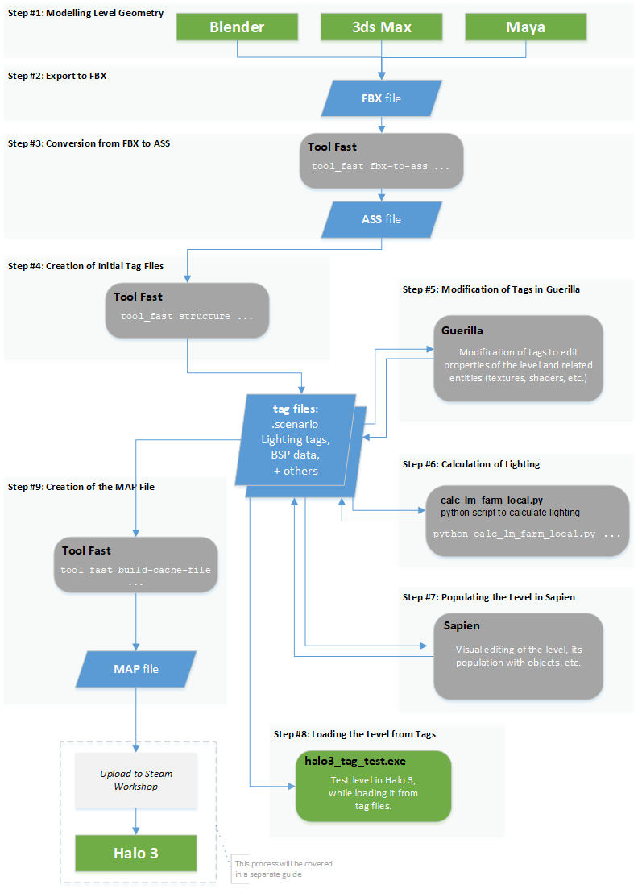

# Quick Start Process Overview

This guide is a step-by-step instruction for the creation of the simple level, which is intended to illustrate the general pipeline of custom level creation for you.

> [!NOTE]
> For the general description of the Halo 3 Modding Concepts, please refer to the [Quick Start Overview](../QuickStartOverview.md).

## Level Modding Pipeline: Basic Diagram

Fig 1. Main pipeline for the creation of a level.

The diagram above illustrates the general pipeline of level creation. All steps of the diagram are fully described in the subsequent sections: 

### [*Step 0: Prerequisites*](../Process/Step0.md)

### [*Step 1: Modeling Level Geometry in 3D Tool*](../Process/Step1.md)

### [*Step 2: Exporting Geometry to FBX*](../Process/Step2.md)

### [*Step 3: Conversion from FBX to ASS*](../Process/Step3.md)

### [*Step 4: Creation of Initial Tag Files*](../Process/Step4.md)

### [*Step 5: Modification of Tags in Guerilla*](../Process/Step5.md)

### [*Step 6: Calculation of Lighting*](../Process/Step6.md)

### [*Step 7: Populating the Level from Tags*](../Process/Step7.md)

### [*Step 8: Loading the Level from Tags*](../Process/Step8.md)

### [*Step 9: Creation of the MAP file*](../Process/Step9.md)
