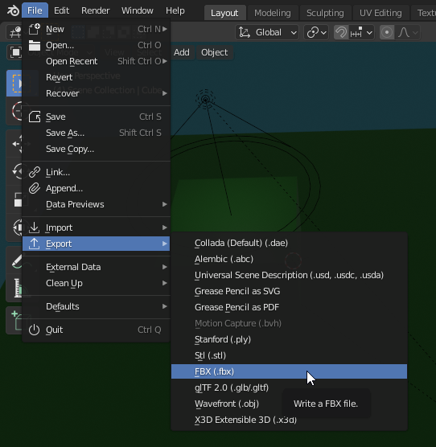
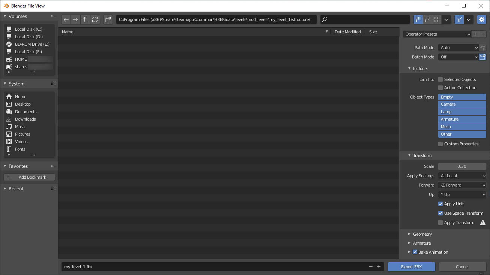
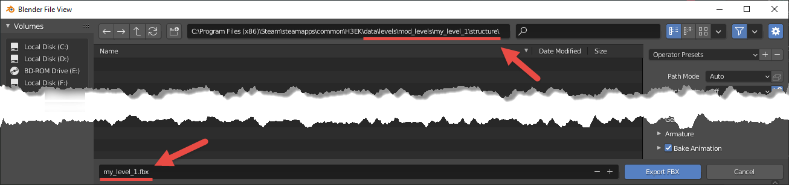
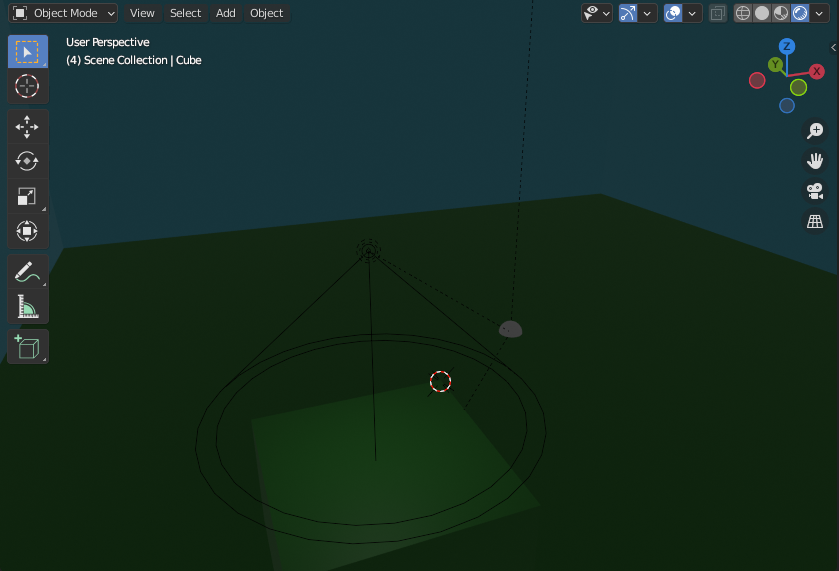
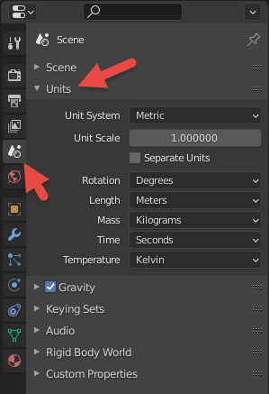
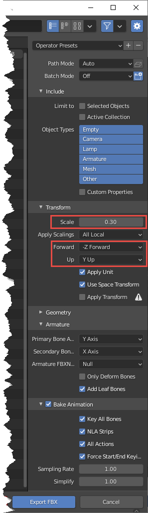

# Quick Start Process Step 2 - Exporting Geometry to FBX

In this step, we will export our scene from Blender to the FBX format.

In Halo 3 modding, this format is used as an intermediate format for all levels and models. If you are using Maya or 3ds Max, you will need to export the initial scene to this format too. However, in this guide, we will describe only export from Blender.

The general pipeline for exporting to FBX from Blender is very simple (see screenshots below). You need to:

1. Open **File > Export > FBX (.fbx)** from the main menu of Blender.

1. Specify the name/location of the target FBX file to be created and the export settings in the appearing dialog.

1. Click **Export FBX** to create the FBX file.

However, some aspects are important if you want to create a correct FBX, see subsections below for particular instructions.

> [!WARNING]
> If you simply perform export without specifying correct settings as described in the subsections below, this will not work well and will almost certainly result in the incorrect FBX file. After exporting with the correct settings, you will have the FBX file in the appropriate location.

In our case, the file will be the following:

**…\data\levels\mod_levels\my_level_1\structure\my_level_1.fbx**

Fig 1. File > Export > FBX option when Exporting your meshes.

Fig 2. Export FBX Dialog.

## **Correct Location and Name of the FBX File**

First of all, let's talk about the location of the target FBX file. You need to save your FBX to the **data** folder within the root folder of your Halo 3 Editing Kit directory.

> [!NOTE]
> For general details on the **data** and **tags** folders, please refer to the [Quick Start Overview](../QuickStartOverview.md) doc.

Particularly, you will need to save your FBX within the **…\data\levels\\** folder, within the **structure** subfolder of the folder of your level, which you need to create somewhere in **…\data\levels**.

For consistency and to keep all your level mods in one place, we recommend you to create a special folder for them in the **…\data\levels** folder. For example, you can name it **mod_levels**.

In this folder, you will need to create the folder of the level. E.g. **my_level_1**.

> [!NOTE]
> For uniformity, we recommend the **snake_case** for the names of files and levels.

In this folder, you must create the folder named structure, which will be the home for your target FBX.

> [!NOTE]
> You need to follow the strict folder structure for the files that participate in the modding process. Particularly, the folder structures of the **tags** and **data** folders must be similar for your custom files. This is necessary for the correct operation of the modding tools. Along with it, this will allow you to find your source files easily when you know their tag files and vice versa.

I.e., the final path to your FBX should be similar to the following:

**…\data\levels\\<folder_for_mods_of_levels>\\<name_of_level>\structure**

For example, for our FBX:

**…\data\levels\mod_levels\my_level_1\structure**

We recommend you to use the name of the level folder as the name of your FBX file. For uniformity, it is better when these names are the same. For example, you can specify **my_level_1.fbx** as the name of the target FBX file.

I.e., the name and location in the export to FBX dialog should be similar to the following:

Fig 3. File name and Location.

## **Correct Settings for Modelling: Directions of Axes, Triangulation, and Units**

### **Directions of Axes While Modelling**

During modeling, you need to take care of the orientation of the axes. Along with settings for the directions of these axes during the export, this is necessary for your level to have the correct orientation in the game.
The directions of axes while modelling should be the following:

- **X**-axis – should correspond to the **Forward** direction.

- **Y**-axis – should correspond to the **Leftwards** direction.

- **Z**-axis – should correspond to the **Up** direction.

For sure, you can rotate your viewport as you like during the modelling, but to take view what orientation your level will have, you can always change the directions of axes as described above to ensure that all is correct.

For example, for the level we have modeled in [Step 1](../Process/Step1.md), in this orientation of the axes in Blender the level will look like the following, which is what we need:

Fig 4. Axis Directions in Blender.

### **Triangulation**

If you are modeling something complex and smooth, you need it triangulated. Otherwise, the level can cause errors when opened by the engine.

Blender has multiple ways to do it. Particularly, there is a **Triangulate Faces** tool (in the **Edit Mode**, select the target mesh or part of its faces, then open the Face menu and select **Triangulate Faces**, see [official help](https://docs.blender.org/manual/en/latest/modeling/meshes/editing/face/triangulate_faces.html)) and, also, the **Triangulate Modifier** (see [official help](https://docs.blender.org/manual/en/latest/modeling/modifiers/generate/triangulate.html)).

> [!WARNING]
> Unfortunately, the triangulation of complex and smooth objects is a mandatory requirement. If you still want to make some surfaces as smooth as possible, use a larger number of triangles for them.

However, our simple level does not need this procedure, so we will just mention this as a starting point for your own experiments.

### **Units**

Along with other things, you need to take care of the unit system and units you use when you are modeling.

This is important since, depending on the units you use, your export settings (particularly, the **Scale**, see below) can vary – to obtain the correct dimensions of objects in the engine.

In this tutorial, we are using the **Metric** unit system and **Meters** for length, and we will need to apply a conversion coefficient for **Scale** in the export settings (see below).

In Blender, unit properties of the scene can be changed in the **Properties** panel > **Scene Properties** tab > **Units** section (see [official help](https://docs.blender.org/manual/en/latest/scene_layout/scene/properties.html?highlight=units#units) for details).

Fig 5. Units in the Scene Properties.

## **Correct FBX Export Settings**

When you open the export dialog, export settings for the transformation of the scene into FBX are displayed on the right side of the dialog.

If you have followed the previous steps of the tutorial, have a correct orientation of axes (see above), and have used a **Metric** system / **Meters** while modeling (see above), these settings will need to be the following:

Fig 6. View of the correct FBX export settings.

All export parameters should be set as displayed in the picture above.

> [!IMPORTANT]
> Please note that the correct **Scale** specified in these settings depends on the units system (length units) that were used during modeling.

Particularly, in this tutorial, we have used the **Metric** system and **Meters** while modeling. We recommend you to use the same unit system for passing this tutorial also.

Halo 3 uses its own units system. For simplicity, if you model in **Meters**, you can consider that 1 Halo length unit corresponds to **0.3048** of a meter. Because of that, we have specified **0.30** as the value of the **Scale** parameter.

Along with that, as you see, we have also performed a conversion for axes (have set **Forward** to "**-Z Forward**" and **Up** to "**Y Up**"). This conversion is valid since while modelling we had the orientation of axes as described in [**Direction of Axes While Modelling**](#directions-of-axes-while-modelling) above.

After exporting initial scene from Blender to FBX with correct parameters. you can proceed to the next step – [Conversion from FBX to ASS](../Process/Step3.md).
