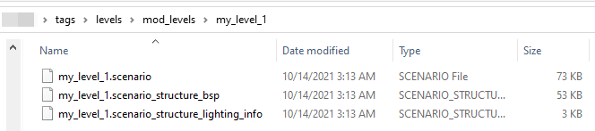

# Quick Start Process Step 4 - Creation of Initial Tag Files

After the creation of the ASS file, you can start building the Tag files of your future level.

> [!NOTE]
> For general info on Tag files, see the Halo 3 Modding - General Concept doc. 

Particularly, you can use the **structure** command of the **tool_fast.exe** tool to build the main scenario tag files (the **.scenario** tag file and others) of the level for Sapien from the **ASS** file.

The format of this command is the following:

```
tool_fast.exe structure <path to the .ass file relative to the "data" folder>
```
> [!NOTE]
> The path to the **.ass** file in this command is specified relative to the **data** folder. I.e., if the full path to the target file is "**C:\Program Files (x86)\Steam\steamapps\common\H3EK\data\levels\mod_levels\my_level_1\structure\my_level_1.ass**", you will need to specify **levels\mod_levels\my_level_1\structure\my_level_1.ass** as the path to the .ass file as the parameter of this command.

For example:

```
tool_fast.exe structure levels\mod_levels\my_level_1\structure\my_level_1.ass
```

After the execution of this command, the tool will display a few errors and warnings, but you can ignore them again.

[View of the command prompt output when running the structure command in the tool_fast.exe.](./media/H3_QuickStart_ProcessStep4_CMDStructure.png)

Fig 1. The command prompt output in tool_fast.exe when running the structure command.

Most importantly, this will command will generate three scenario tag files:

- **.scenario** – This contains most of your level's settings, such as which sky your level has, what weapons and items appear and where, what locations players spawn in, and so on. This is what you'll be editing in Sapien when you place weapons, items, scenery objects, etc.

- **.scenario_structure_bsp** – This is the actual architecture of your level. The geometry you export from the 3D Modelling tool eventually ends up here. Notice that this is separate from the .scenario file, which means that updating your level's geometry doesn't affect anything else you've placed within the level. Be careful when you move walls or modify your level's architecture that you find and fix any items that might end up outside the world or stuck inside a wall.

- **.scenario_structure_lightmap** – Eventually you'll want to light your level. This can take a long time to compute, but it's definitely needed if you want a truly finished product. When you do, you'll also have a **scenario_structure_lightmap** that contains all that lighting information. The **scenario_structure_lightmap** itself also requires a **.bitmap** file that's created alongside it.

These files will be located in the folder of your level in the ***tags*** directory. This folder will be created automatically.

For example, if your target ASS file was located at:

**C:\Program Files (x86)\Steam\steamapps\common\H3EK\data\levels\mod_levels\my_level_1\structure\my_level_1.ass**

then the generated scenario tag files will be located at:

**C:\Program Files (x86)\Steam\steamapps\common\H3EK\tags\levels\mod_levels\my_level_1**



Fig 2. New files output by the structure command.

You will need these files at the next steps of this guide.

Now, you can proceed to the [Modification of Tags in Guerilla](../Process/Step5.md) step.

> [!NOTE]
> Moreover, if you are eager to view the geometry of your level even without lighting and textures, you can simply open the generated **.scenario** tag file (e.g. **my_level_1.scenario**) using Sapien.
