# Quick Start Process Step 7 - Populating the Level in Sapien

Now, you can preview your level in Sapien (with textures and calculated lighting), add spawn points to it, and, if you like, add some other objects to it. See the subsections below for details.

## Previewing Your Level

To preview your level, you need to open its **.scenario** tag file (see [Step #4](../Process/Step4.md)) in Sapien.

To do this, launch **sapien.exe** (located at the root directory of Halo 3 Editing Kit) and, in the **Open** dialog, proceed to the folder of your level in **tags** (e.g. **…tags\levels\mod_levels\my_level_1**) and open your **.scenario** file.

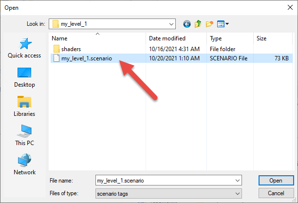

Fig 1. Open your .scenario in Sapien.

After that, your will see your level loading in the **Game Window** of Sapien, which will display a lot of debug info in the process. The loading of the level can take some time.

After your level is loaded, you will not see it. All that you see at the first glance will be the sky and the horizon (see below).

You will need to move your camera to your level to see it clearly. The controls for moving the camera in the **Game Window** are the following:

- **Pressing and holding the mouse wheel + moving the mouse** – rotates the camera.

- **W + holding the mouse wheel** – moves the camera forward.

- **S + holding the mouse wheel** – moves the camera backward.

- **A + holding the mouse wheel** – strafes the camera left.

- **D + holding the mouse wheel** – strafes the camera right.

- **R + holding the mouse wheel** – strafes the camera up.

- **F + holding the mouse wheel** – strafes the camera down.

- **SHIFT + holding the mouse wheel** – will toggle your movement speed.

- **CTRL + [W or S or A or D] + holding the mouse wheel** – will move the camera with the increased speed (only while you holding CTRL + mouse wheel).

Using these controls you will be able to locate your level. Particularly, since we have created our level in the origin of coordinates (relative to the location of the frame node), you will need to move your camera up a little bit and rotate it.

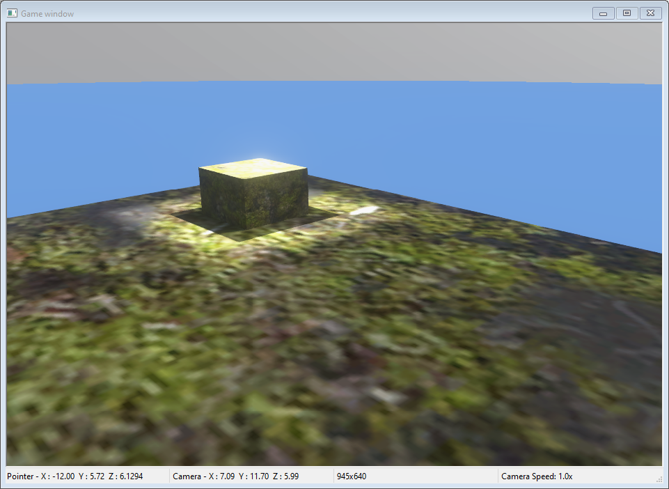

Fig 2. Your created level in Sapien.

Finally, you will see that the level looks as intended: there are no walls of the large cube (since we have assigned the **+sky** material to them), the floor has the assigned ground texture and there is a small cube with the light spot above and the shadows. And, if you look up, you will see a nice sky.

Now, you can press **TAB** to try to spawn a Master Chief on your level. As a result, you will get an error, since your level has no spawn points. So, it's time to add them.

## Adding Spawn Points

To add a spawn point:

1. In Sapien, go to the **Hierarchy View** window and click on the + symbol next to the **Scenario** folder to expand it.

2. Click on the + next to **Game Data** to expand that as well.

3. In the **Game Data** list in the Hierarchy View window, select **Player Starting Points** by clicking on it. This is the mechanism we will use to add a spawn location for the player.

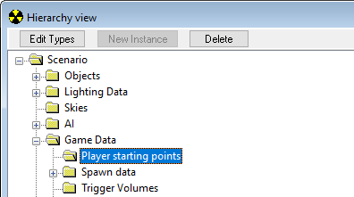

Fig 3. Player Starting Points folder.

4. Go to the **Game Window** and ***right-click*** to place a spawn location. You should see a **Manipulation Gizmo** appear for the Spawn Point (see below).

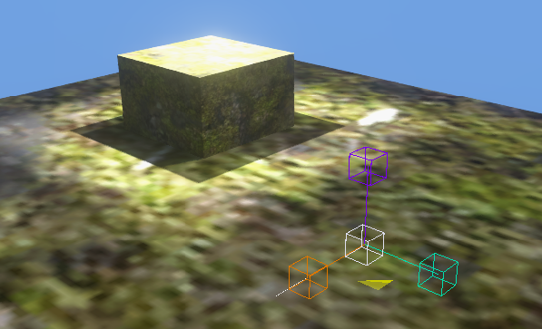

Fig 4. The object Manipulation Gizmo.

5. Also, look at the **Hierarchy View** window. Notice that a new item has appeared under the **Element** heading. This is the unique identifier for our spawn point. You can click on it at any time to select the spawn point.

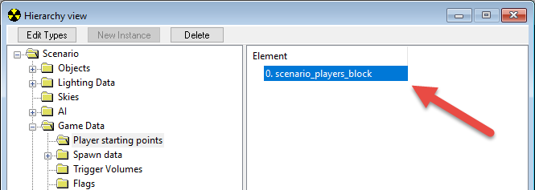

Fig 5. The newly placed object in the Sapien hierarchy view.

> [!NOTE]
> If you have an object with its type already selected in the **Hierarchy View** window and you right-click on the **Game Window**, a new instance of that object type will be created and selected.

6. We've got our first spawn location, but it may not be on the ground or in the exact location that we want it. This is where the **Properties Palette** comes in. Make sure the spawn point is still selected and then switch to the **Properties Palette**.

7. You should see an item labeled **Position**. For now, we don't care about the **X** and **Y** values, but change the **Z** value to 0 – this will ensure that the player starts out on the ground.

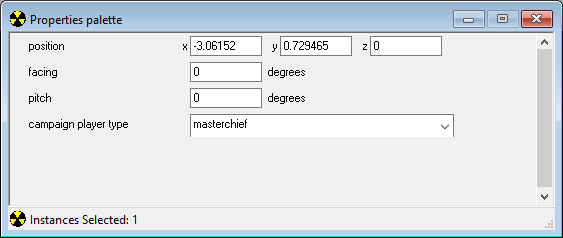

Fig 6. Set the z axis to 0 for the position.

8. To save your scenario, in the main menu select **File > Save** (or press CTRL + S).

After that, you can spawn Master Chief by pressing **TAB** in the **Game Window**. Pressing **TAB** again will switch you back to the free camera mode.

We could start the map like this, but what's a FPS without a weapon? Let's give our player a weapon to start with.

## Adding a Starting Weapon via Starting Profile

To add a starting weapon:

1. In the **Hierarchy View** under **Game Data** is an item called **Starting Profiles**. Click on it to select it.

2. At the top of the **Hierarchy View** is a button labeled **New Instance**. Click it. This will create a new instance of a starting profile for us to edit.

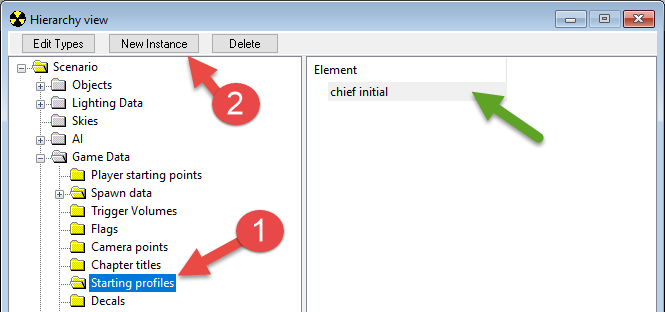

Fig 7. Create a New Instance in the Starting Profiles folder.

3. Now switch to the **Properties Palette**. You can change any of the values for the starting profile (including the name).

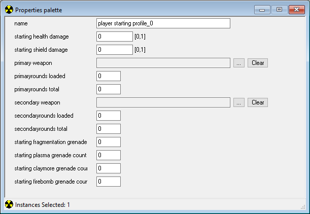

Fig 8. Starting Profile in the Properties Palette.

4. Click on the browse button () next to the **primary weapon** field. This will bring up a file browser dialog. Navigate to **tags\objects\weapons\rifle\battle_rifle\\** and select **battle_rifle.weapon**. Click **Open**. This assigns our starting profile a battle rifle for its primary weapon.

5. Be sure to place numbers in the **primaryrounds loaded** and **primaryrounds total** categories as well, or the weapon will not appear in-game.

6. To save your scenario, in the main menu select **File > Save** (or press CTRL + S).

However, if you have already spawned Master Chief before adding the starting profile using TAB, you will still be without a weapon and will probably wonder how to respawn with your modifications applied.

One of the ways to do it is to select **Scenarios > Map Reset** from the main menu (or press ALT + R) to reset the map and then press **TAB** again.

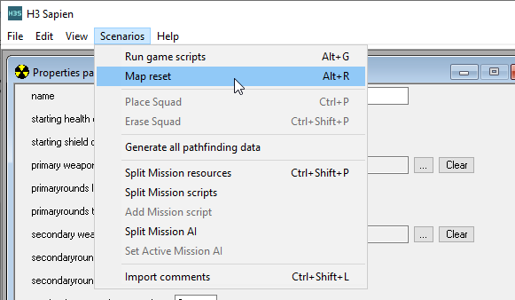

Fig 9. Map Reset option.

Yeah, the good old battle rifle is now in place.

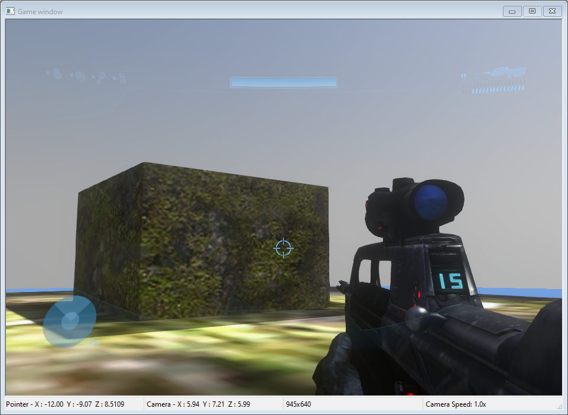

Fig 10. Now Spawning with the Battle Rifle.

## Adding an Object (Vehicle)

However, a vehicle would also be good for our level, would not it? Let's add it too. For example, let's add a Warthog.

> [!NOTE]
> If you have spawned Master Chief on your map using **TAB**, then, before adding the Warthog, switch back again to the free camera view by clicking **TAB** once again.

To add a Warthog:

1. In the **Hierarchy View** window, expand the **Scenario** folder, then the **Objects** folder. Click on the category of object (in our case **Units > Vehicles**) you want to add to highlight it.

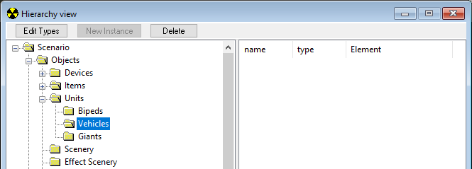

Fig 11. The Vehicles folder in the Hierarchy View.

2. In the **Hierarchy View** window, click the **Edit Types** button.

3. In the appearing dialog (asset type palette), from the **Object class** drop-down list, select the type of object you want to add (in our case **vehicle**). Click the **Add** button.

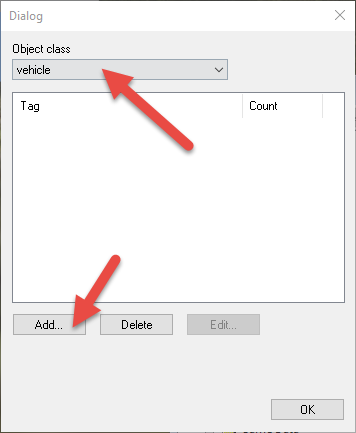

Fig 12. Set the Object Class to vehicle and press Add...

4. In the appearing dialog, find the tag file for the appropriate object. In our case, select the **tags\objects\vehicles\warthog\warthog.vehicle** file tag. Then, click **Add Tags**. You will see that this tag was added to the list of Tags at the bottom of the window.

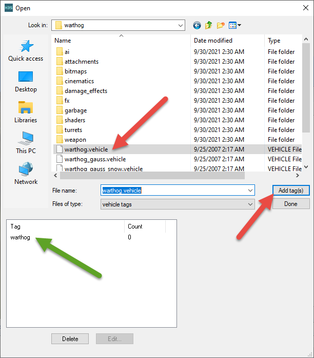

Fig 13. Add warthog.vehicle tag to the map.

5. Click **Done** to close the selection window. You will see that the **warthog** is listed in the asset type palette now. Then, click **OK** to close the asset type palette.

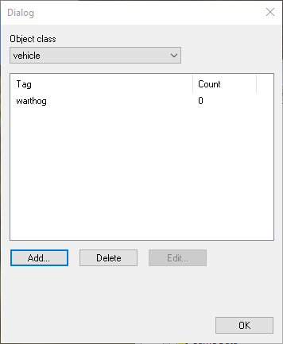

Fig 14. The warthog added to the vehicle object types.

6. Now that you've added the object (in our case, of the **warthog** type) to your scenario, it's time to place an instance of it. In the **Hierarchy View** window, click the category of object you just added to highlight it.

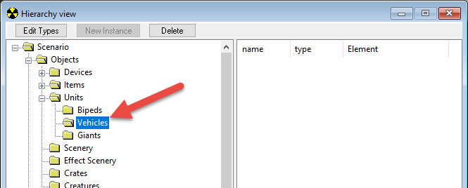

Fig 15. The vehicle folder in the Hierarchy View.

7. In the **Game Window**, right-click to place an object. You'll notice that when the object is placed, an entry appears in the **Hierarchy View** (with Type: None), but in the Game Window only the manipulate gizmo appears. This is because you still need to tell Sapien what the type of the object is you just placed.

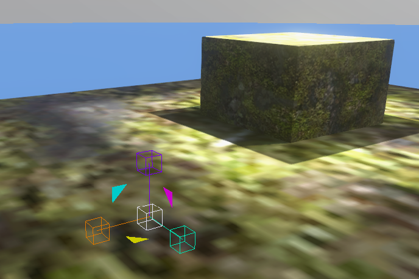

Fig 16. Object with no type in Game Window.

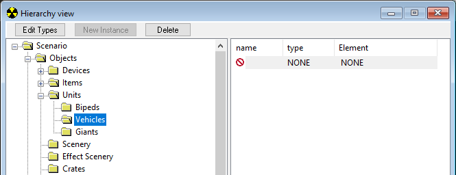

Fig 17. Object with no type in Hierarchy View.

8. With your object still selected (you can click on its entry in the **Hierarchy View** window to be sure), switch to the **Properties Palette** window. In the **Properties Palette** window, click on the **Type** drop-down menu and select the object you added to your palette. If your object doesn't appear in this drop-down, you most likely added an object from the wrong category in the **Hierarchy View**.

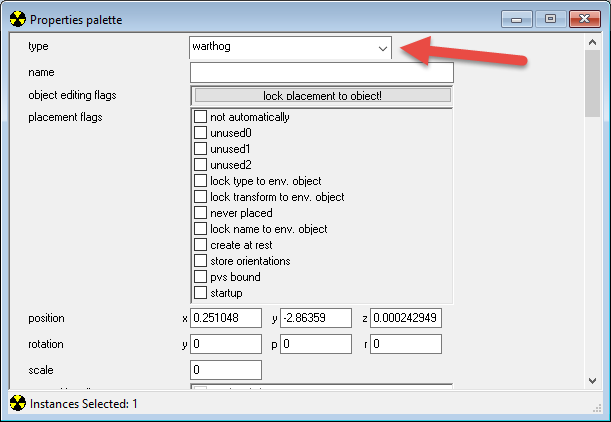

Fig 18. Changing the object type to warthog.

9. Once you've selected a type, you should see your object appear in the **Game Window**.

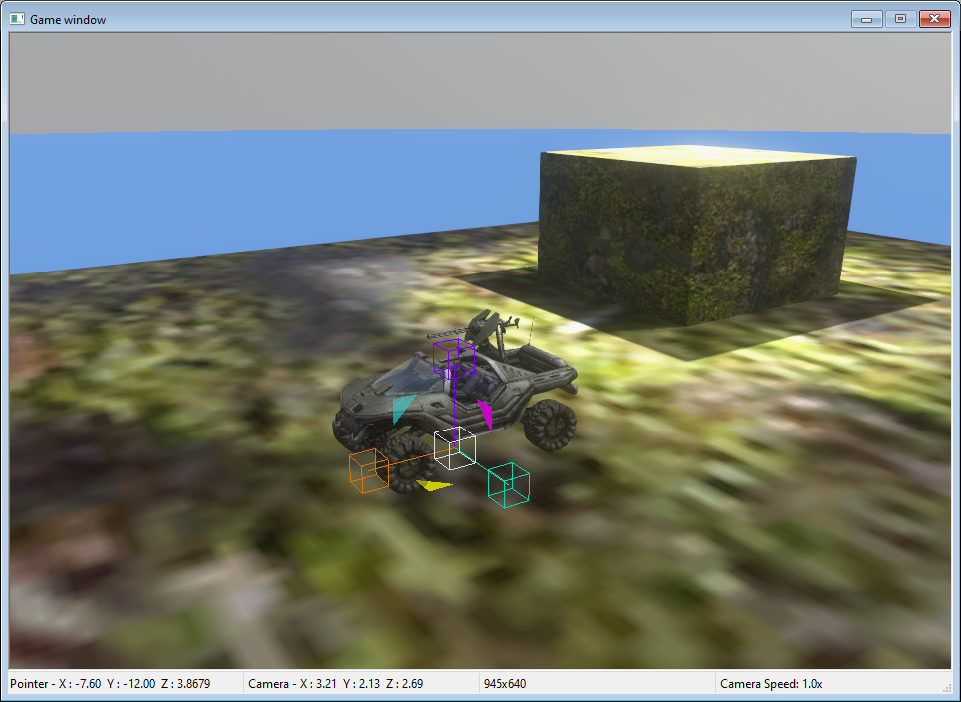

Fig 19. Warthog is now in your level.

10. If necessary, modify other properties of the object in the **Properties Palette** window (e.g. **z** coordinate in **position**, as before for the spawn points).

11.  To save your scenario, in the main menu select **File > Save** (or press CTRL + S).

> [!TIP]
> The procedure described above for the Hog is typical for adding other types of objects. You can use it to add weapons, equipment, and so on.

Now, you can test the added vehicle by spawning again as Master Chief (**TAB**) and using it (hold **E**, just as in the game).

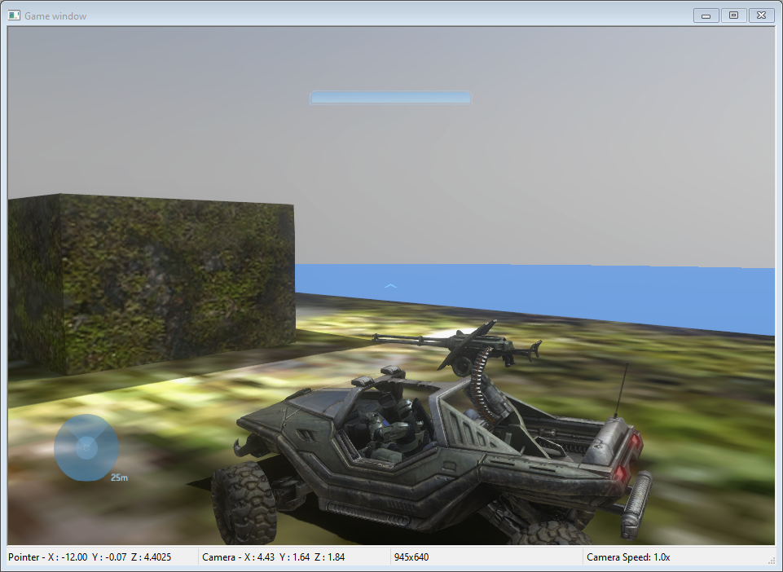

Fig 20. Warthog playable in your level.

After that, the level seems to be ready and you can proceed to the [Loading the Level from Tags](../Process/Step8.md) step to test it.
