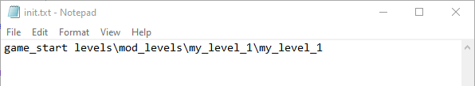
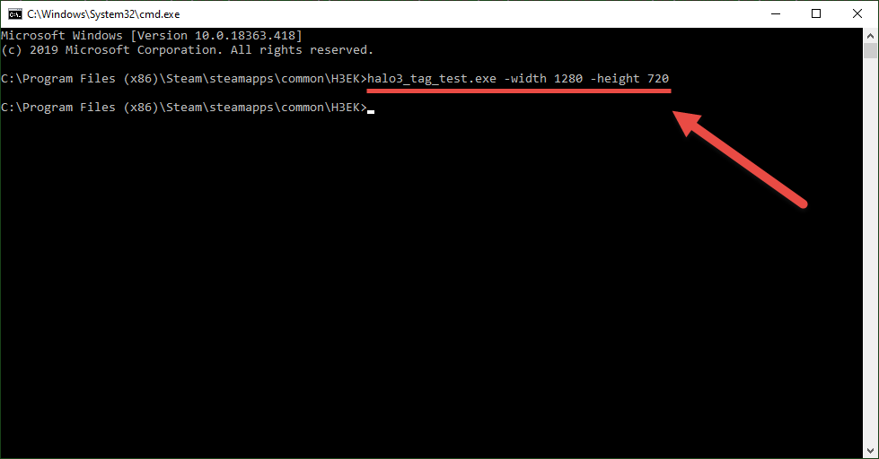
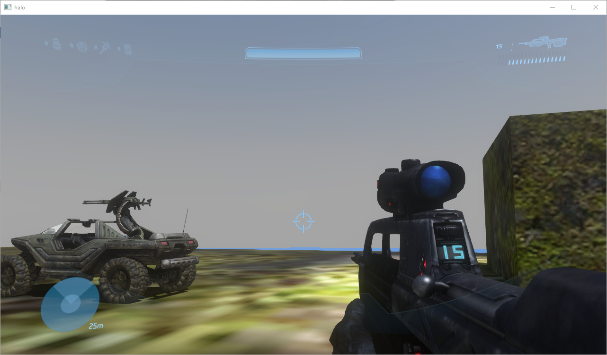

# Quick Start Process Step 8 - Loading the Level in Sapien

Now, the level is ready and you can start testing it.

As one of the options, you can load it with the help of the **halo3_tag_test.exe**, which is a specifically modified version of the Halo 3 game that allows you to fully load level from tag files you created.

> [!NOTE]
> For the general info on **halo3_tag_test.exe**, see the Halo 3 Modding - General Concept doc. 

To load your level in **halo3_tag_test.exe**, do the following:

1. In the root folder of Halo 3 Editing Kit (where **halo3_tag_test.exe** is located), create the **init.txt** text file.

2. Open this file with a Notepad, and set your level as the starting level for **halo3_tag_test.exe**, using the game_start <path_to_level_from_the_"tags"_folder> command written in this file.

    For example, in our case, we will need to add the following text to this file:

    ```
    game_start levels\mod_levels\my_level_1\my_level_1
    ```



Fig 1. Init.txt with the game_start line added.

3. Save the init.txt file.

4. Now, to load your level, you can simply launch halo3_tag_test.exe in the root folder of Halo 3 Editing Kit. However, in this case, the game will start with the default screen resolution, which can be too large. If you want to lower it, see the next step.

5. The resolution of the game can be changed by -width and -height parameters that can be specified in the command prompt.

    For example, to launch the game in the 1280x720 resolution, you should open Command Prompt, proceed to the root folder of Halo 3 Editing Kit there (see [Step #3](../Process/Step3.md) for details), and launch the following command in it: 

    ```
    halo3_tag_test.exe -width 1280 -height 720
    ```



Fig 2. Launch the Game.

> [!NOTE]
> You can omit one of these parameters (the default 16x9 ratio will be used in this case).

6. After that, the game will be launched in the specified resolution.



Fig 3. Your playable level!

7. Using standard game controls, you can test your level, ride the Hog, open fire from it, and so on – as if you were in the game.

After that, you can proceed to the creation of the cache file of your level – see the [Creation of the MAP file](../Process/Step9.md) step below.
